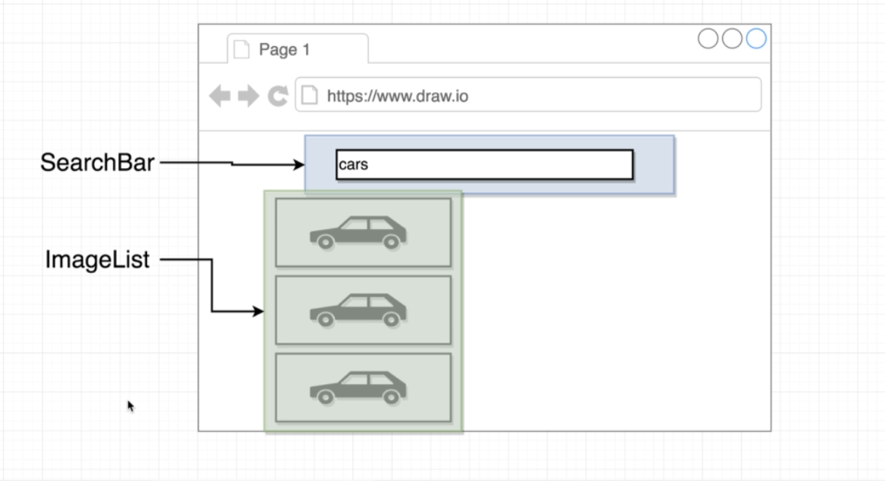

[TOC]

C:\Users\phuong\AppData\Local\Programs\Python\Python37\python.exe D:/Source/Source_All/python/Test/readfile.py
======== name dir ========

## 1. Let's Dive In!
### 1. How to Get Help
### 2. Small Required Update.html

In the next lecture we will be creating a very small and quick app using Codepen. There will be a link to a project boilerplate URL shown in the video here: https://codepen.io/sgrider/pen/yRWZEq

Codepen has made a change that requires a preprocessor setting that is causing many student's projects to fail. We updated the boilerplate project to reflect this change, however, for whatever reason, the project is only showing this update for **some** students.

To make sure your preprocessor is set to Babel do the following:

**1. Click the settings 'gear' icon to the left of JS:**


**2. Change the Preprocessor from 'None' to 'Babel':**


### 3. Our First App

goo.gl/T6zQ9q

```js
function transform(offset) {
  const cos = Math.cos(offset);
  const sin = Math.sin(offset);
  return { transform: `matrix3d(${sin}, ${-cos}, ${sin}, 0, ${-cos}, ${sin}, 0, 0, 0, ${cos}, ${cos}, ${sin}, 0, 0, 0, 1)` };
}
```


### 4. CodePen Solution!.html

If you are having trouble getting your CodePen app to look like how Stephen's does in the video lecture, we have added the solution code below to help with debugging.

If you are getting a blank white screen, the most common reason is that you have typed `ReactDom.render` instead of `ReactDOM.render`

The second most common reason is forgetting to enclose your return in parents, or leaving the return on a line by itself:

```js
    render() {
        return 
                <div onMouseMove={this.onMouseMove}>
                  <div className="panel" style={this.state.styleOne}/>
                  <div className="panel" style={this.state.styleTwo}/>
                </div>
    }
```

Do this instead:

```js
    render() {
        return (
            <div onMouseMove={this.onMouseMove}>
                <div className="panel" style={this.state.styleOne}/>
                <div className="panel" style={this.state.styleTwo}/>
            </div>
        )
    }
```


#### **Here is Stephen's finished Codepen:**


https://codepen.io/sgrider/pen/MxPKJE

#### **And here is the complete finished code example:**

**HTML**

```html
<div id="root" />
```

**CSS**

```js
div {
  height: 100vh;
  width: 100vw;
}
.panel {
  position: absolute; 
  box-shadow: 0 0 50px grey;
  background-image: url('data:image/svg+xml,%3Csvg xmlns="http://www.w3.org/2000/svg" width="100" height="18" viewBox="0 0 100 18"%3E%3Cpath fill="%239C92AC" fill-opacity="0.4" d="M61.82 18c3.47-1.45 6.86-3.78 11.3-7.34C78 6.76 80.34 5.1 83.87 3.42 88.56 1.16 93.75 0 100 0v6.16C98.76 6.05 97.43 6 96 6c-9.59 0-14.23 2.23-23.13 9.34-1.28 1.03-2.39 1.9-3.4 2.66h-7.65zm-23.64 0H22.52c-1-.76-2.1-1.63-3.4-2.66C11.57 9.3 7.08 6.78 0 6.16V0c6.25 0 11.44 1.16 16.14 3.42 3.53 1.7 5.87 3.35 10.73 7.24 4.45 3.56 7.84 5.9 11.31 7.34zM61.82 0h7.66a39.57 39.57 0 0 1-7.34 4.58C57.44 6.84 52.25 8 46 8S34.56 6.84 29.86 4.58A39.57 39.57 0 0 1 22.52 0h15.66C41.65 1.44 45.21 2 50 2c4.8 0 8.35-.56 11.82-2z"%3E%3C/path%3E%3C/svg%3E');
}
```

**JavaScript**

```js
function transform(offset) {
    const cos = Math.cos(offset);
    const sin = Math.sin(offset);
    return {transform: `matrix3d(${sin}, ${-cos}, ${sin}, 0, ${-cos}, ${sin}, 0, 0, 0, ${cos}, ${cos}, ${sin}, 0, 0, 0, 1)`};
}

class App extends React.Component {
    state = {styleOne: {}, styleTwo: {}};

    onMouseMove = (event) => {
        this.setState({
            styleOne: transform(-event.clientX / event.clientY),
            styleTwo: transform(event.clientX / event.clientY)
        });
    }


    render() {
        return (
            <div onMouseMove={this.onMouseMove}>
                <div className="panel" style={this.state.styleOne}/>
                <div className="panel" style={this.state.styleTwo}/>
            </div>
        )
    }
}

ReactDOM.render(
    <App/>,
    document.querySelector('#root')
);
```

  

Vào css chọn assert/ Pattern

### 5. Critical Questions!

  


### 6. Installing Node JS

`node -v`

### 7. Generating a React Project

  


### 8. Why Create React App


### 9. Exploring a Create-React-App Project

  

  

Nếu k SD Babel

  


### 10. Starting and Stopping a React App


### 11. Javascript Module Systems

  

  


### 12. Displaying Content with Functional Components
### 13. Link to Completed Github Repo.html

If you get stuck at any point in time in this course, you can always compare your code against the completed version of each project.

**The completed code for each project can be found here:** [**https://github.com/StephenGrider/redux-code**](https://github.com/StephenGrider/redux-code)

### 14. Common Questions About My Environment.html

Hi! I get many questions about the code editor, terminal, etc, that I use. Here's what I am using at present:

- Editor:

  - VS Code as my code editor - https://code.visualstudio.com/
  - I use 'Solarized Light' as my editor theme. This theme is built into VSCode by default.
  - In this course, you will frequently see my code 'jump', or reformat itself whenever I save a file. This is done automatically by https://prettier.io/

- Terminal:

  - I use Iterm2 as my terminal - https://www.iterm2.com/

  - Inside my terminal, I run the shell https://github.com/robbyrussell/oh-my-zsh with the default theme 'Robby Russell'

    

## 2. Building Content with JSX
### 1. What is JSX

https://babeljs.io/repl


### 2. Converting HTML to JSX

  

codepen.io

  

  


### 3. Inline Styling with JSX
### 4. Converting Styling to JSX Format
### 5. Class vs ClassName
### 6. Referencing JS Variables in JSX
### 7. Values JSX Can't Show

Khi truyền object


### 8. Finding Forbidden Property Names

```js
// Import the React and ReactDOM libraries
import React from 'react';
import ReactDOM from 'react-dom';

// Create a react component
const App = () => {
  const buttonText = { text: 'Click me' };
  const labelText = 'Enter name:';

  return (
    <div>
      // add htmlFor thay cho for
      <label className="label" htmlFor="name">
        {labelText}
      </label>
      <input id="name" type="text" />
      <button style={{ backgroundColor: 'blue', color: 'white' }}>
        {buttonText.text}
      </button>
    </div>
  );
};

// Take the react component and show it on the screen
ReactDOM.render(<App />, document.querySelector('#root'));
```


### 9. Exercise Introduction

### 10. Test Your Knowledge JSX Interpolation.html
### 11. JSX Exercise Solution
## 3. Communicating with Props
### 1. Three Tenets of Components


### 2. Application Overview

### 3. Getting Some Free Styling

https://github.com/StephenGrider/redux-code/tree/master/components

index.js

```js

import React from 'react';
import ReactDOM from 'react-dom';
import faker from 'faker';
import CommentDetail from './CommentDetail';
import ApprovalCard from './ApprovalCard';

const App = () => {
  return (
    <div className="ui container comments">
      <ApprovalCard>
        <div>
          <h4>Warning!</h4>
          Are you sure you want to do this?
        </div>
      </ApprovalCard>

      <ApprovalCard>
        <CommentDetail
          author="Sam"
          timeAgo="Today at 4:45PM"
          content="Nice blog post"
          avatar={faker.image.avatar()}
        />
      </ApprovalCard>

      <ApprovalCard>
        <CommentDetail
          author="Alex"
          timeAgo="Today at 2:00AM"
          content="I like the subject"
          avatar={faker.image.avatar()}
        />
      </ApprovalCard>

      <ApprovalCard>
        <CommentDetail
          author="Jane"
          timeAgo="Yesterday at 5:00PM"
          content="I like the writing"
          avatar={faker.image.avatar()}
        />
      </ApprovalCard>
    </div>
  );
};

ReactDOM.render(<App />, document.querySelector('#root'));
```

CommenDetail.js

```js
import React from 'react';

const CommentDetail = props => {
  return (
    <div className="comment">
      <a href="/" className="avatar">
        
      </a>
      <div className="content">
        <a href="/" className="author">
          {props.author}
        </a>
        <div className="metadata">
          <span className="date">{props.timeAgo}</span>
        </div>
        <div className="text">{props.content}</div>
      </div>
    </div>
  );
};

export default CommentDetail;
```

ApprovalCard.js

```js

import React from 'react';

const ApprovalCard = props => {
  return (
    <div className="ui card">
      <div className="content">{props.children}</div>
      <div className="extra content">
        <div className="ui two buttons">
          <div className="ui basic green button">Approve</div>
          <div className="ui basic red button">Reject</div>
        </div>
      </div>
    </div>
  );
};

export default ApprovalCard;
```

index.html

```html
  <link rel="stylesheet" href="https://cdnjs.cloudflare.com/ajax/libs/semantic-ui/2.4.1/semantic.min.css" />
<!-- change font -->
```

`npm install --save faker`

https://semantic-ui.com/introduction/getting-started.html

### 4. Naive Component Approach
### 5. Specifying Images in JSX
### 6. Duplicating a Single Component
### 7. Extracting JSX to New Components
### 8. Component Nesting
### 9. React's Props System


### 10. Passing and Receiving Props
### 11. Passing Multiple Props
### 12. Passing Props - Solutions
### 13. Component Reuse
### 14. Implementing an Approval Card
### 15. Showing Custom Children
### 16. Component Reuse
### 17. Exercise - Props
### 18. Test Your Knowledge Props.html
### 19. Props Exercise Solution
### 20. Exercise - Children
### 21. Test Your Knowledge Children Through Props.html
### 22. Children Exercise Solution

## 4. Structuring Apps with Class-Based Components
### 1. Class-Based Components


### 2. Application Overview

https://github.com/StephenGrider/redux-code/tree/master/seasons

### 3. Scaffolding the App


### 4. Getting a Users Physical Location

https://developer.mozilla.org/en-US/docs/Web/API/Geolocation_API

### 5. Resetting Geolocation Preferences

allow or block

Mở tab mới chọn new location


### 6. Handling Async Operations with Functional Components
### 7. Refactoring from Functional to Class Components
## 5. State in React Components
### 1. The Rules of State
### 2. Initializing State Through Constructors


### 3. Updating State Properties


### 4. App Lifecycle Walkthrough
### 5. Handling Errors Gracefully
### 6. Conditionally Rendering Content
## 6. Understanding Lifecycle Methods
### 1. Introducing Lifecycle Methods
### 2. Why Lifecycle Methods
### 3. Refactoring Data Loading to Lifecycle Methods
### 4. Alternate State Intialization
### 5. Passing State as Props
### 6. Determining Season
### 7. Ternary Expressions in JSX
### 8. Showing Icons
### 9. Extracting Options to Config Objects

index.js

```js
import React from 'react';
import ReactDOM from 'react-dom';
import SeasonDisplay from './SeasonDisplay';
import Spinner from './Spinner';

class App extends React.Component {
  state = { lat: null, errorMessage: '' };

  componentDidMount() {
    window.navigator.geolocation.getCurrentPosition(
      position => this.setState({ lat: position.coords.latitude }),
      err => this.setState({ errorMessage: err.message })
    );
  }

  renderContent() {
    if (this.state.errorMessage && !this.state.lat) {
      return <div>Error: {this.state.errorMessage}</div>;
    }

    if (!this.state.errorMessage && this.state.lat) {
      return <SeasonDisplay lat={this.state.lat} />;
    }

    return <Spinner message="Please accept location request" />;
  }

  render() {
    return <div className="border red">{this.renderContent()}</div>;
  }
}

ReactDOM.render(<App />, document.querySelector('#root'));

```


### 10. Adding Some Styling

SeasonDisplay.js

```js
import './SeasonDisplay.css';
import React from 'react';

const seasonConfig = {
  summer: {
    text: "Let's hit the beach!",
    iconName: 'sun'
  },
  winter: {
    text: 'Burr it is cold!',
    iconName: 'snowflake'
  }
};

const getSeason = (lat, month) => {
  if (month > 2 && month < 9) {
    return lat > 0 ? 'summer' : 'winter';
  } else {
    return lat > 0 ? 'winter' : 'summer';
  }
};

const SeasonDisplay = props => {
  const season = getSeason(props.lat, new Date().getMonth());
  const { text, iconName } = seasonConfig[season];

  return (
    <div className={`season-display ${season}`}>
      <i className={`icon-left massive ${iconName} icon`} />
      <h1>{text}</h1>
      <i className={`icon-right massive ${iconName} icon`} />
    </div>
  );
};

export default SeasonDisplay;

```


### 11. Showing a Loading Spinner

### 12. Specifying Default Props

Spinner.js

```js
import React from 'react';

const Spinner = props => {
  return (
    <div className="ui active dimmer">
      <div className="ui big text loader">{props.message}</div>
    </div>
  );
};

// default
Spinner.defaultProps = {
  message: 'Loading...'
};

export default Spinner;

```


### 13. Avoiding Conditionals in Render

### 14. Breather and Review

### 15. Class-Based Components.html

### 16. Exercise Solution - Class-Based Components

### 17. Updating Components with State.html

### 18. Updating Components with State

## 7. Handling User Input with Forms and Events
### 1. App Overview
### 2. Component Design

https://github.com/StephenGrider/redux-code/tree/master/pics



### 3. Adding Some Project Structure

SearchBar.js

```js
import React from "react";

class SearchBar extends React.Component {
  state = { term: "" };

  onFormSubmit = event => {
    event.preventDefault();

    this.props.onSubmit(this.state.term);
  };

  render() {
    return (
      <div className="ui segment">
        <form onSubmit={this.onFormSubmit} className="ui form">
          <div className="field">
            <label>Image Search</label>
            <input
              type="text"
              value={this.state.term}
              onChange={e => this.setState({ term: e.target.value })}
            />
          </div>
        </form>
      </div>
    );
  }
}

export default SearchBar;

```


### 4. Showing Forms to the User


### 5. Adding a Touch of Style
### 6. Creating Event Handlers
### 7. Alternate Event Handler Syntax
### 8. Uncontrolled vs Controlled Elements
### 9. More on Controlled Elements

### 

### 10. Handling Form Submittal

### 11. Understanding 'this' In Javascript

  


### 12. Solving Context Issues

thêm bind

  

Ở hàm onFormSubmit trong SearchBar sử dụng arrow func để tránh lỗi khi truy cập this.state

### 13. Communicating Child to Parent

### 14. Invoking Callbacks in Children

## 8. Making API Requests with React
### 1. Fetching Data
### 2. Axios vs Fetch


### 3. Viewing Request Results
### 4. Handling Requests with Async Await

unsplash.js

```js
import axios from 'axios';

export default axios.create({
  baseURL: 'https://api.unsplash.com',
  headers: {
    Authorization:
      'Client-ID 34e39e5c2f447ce52009a515846ca2b6ccc35552bb63de59cf4a6d06728f3f7e'
  }
});

```

App.js

```js
import React from 'react';
import unsplash from '../api/unsplash';
import SearchBar from './SearchBar';
import ImageList from './ImageList';

class App extends React.Component {
  state = { images: [] };

// SD arrow func
  onSearchSubmit = async term => {
    const response = await unsplash.get('/search/photos', {
      params: { query: term }
    });

    this.setState({ images: response.data.results });
  };

  render() {
    return (
      <div className="ui container" style={{ marginTop: '10px' }}>
        <SearchBar onSubmit={this.onSearchSubmit} />
        <ImageList images={this.state.images} />
      </div>
    );
  }
}

export default App;

```


### 5. Setting State After Async Requests
### 6. Binding Callbacks
### 7. Creating Custom Clients
## 9. Building Lists of Records
### 1. Rendering Lists

ImageList.js

```js
import './ImageList.css';
import React from 'react';
import ImageCard from './ImageCard';

const ImageList = props => {
  const images = props.images.map(image => {
    return <ImageCard key={image.id} image={image} />;
  });

  return <div className="image-list">{images}</div>;
};

export default ImageList;
```

ImageCard.js

```js
import React from 'react';

class ImageCard extends React.Component {
  constructor(props) {
    super(props);

    this.state = { spans: 0 };

    this.imageRef = React.createRef();
  }

  componentDidMount() {
    this.imageRef.current.addEventListener('load', this.setSpans);
  }

  setSpans = () => {
    const height = this.imageRef.current.clientHeight;

    const spans = Math.ceil(height / 10);

    this.setState({ spans });
  };

  render() {
      // new
    const { description, urls } = this.props.image;

    return (
      <div style={{ gridRowEnd: `span ${this.state.spans}` }}>
        
      </div>
    );
  }
}

export default ImageCard;

```


### 2. Review of Map Statements
### 3. Rendering Lists of Components
### 4. The Purpose of Keys in Lists
### 5. Implementing Keys in Lists


## 10. Using Ref's for DOM Access
### 1. Grid CSS
### 2. Issues with Grid CSS
### 3. Creating an Image Card Component
### 4. Accessing the DOM with Refs
### 5. Accessing Image Height
### 6. Callbacks on Image Load
### 7. Dynamic Spans
### 8. App Review
## 11. Let's Test Your React Mastery!
### 1. App Overview
### 10. Updating State with Fetched Data
### 11. Passing State as Props
### 12. Rendering a List of Videos
### 13. Rendering Video Thumbnails
### 14. Styling a List
### 15. Communicating from Child to Parent
### 16. Deeply Nested Callbacks
### 17. Conditional Rendering
### 18. Styling the VideoDetail
### 19. Displaying a Video Player
### 2. Component Design
### 20. Fixing a Few Warnings
### 21. Defaulting Video Selection
### 3. Scaffolding the App
### 4. Reminder on Event Handlers
### 5. Handling Form Submittal
### 6. Accessing the Youtube API
### 7. Searching for Videos
### 8. Axios 400 Required Parameter part Error.html
### 9. Putting it All Together
## 12. On We Go...To Redux!
### 1. Introduction to Redux
### 10. Important Redux Notes
### 2. Redux by Analogy
### 3. A Bit More Analogy
### 4. Finishing the Analogy
### 5. Mapping the Analogy to Redux
### 6. Modeling with Redux
### 7. Creating Reducers
### 8. Rules of Reducers
### 9. Testing Our Example
## 13. Integrating React with Redux
### 1. React Cooperating with Redux
### 10. Configuring Connect with MapStateToProps
### 11. Building a List with Redux Data
### 12. Calling Action Creators from Components
### 13. Redux is Not Magic!
### 14. Functional Components with Connect
### 15. Conditional Rendering
### 16. Connecting Components to Redux.html
### 17. Exercise Solution - Connecting Components to Redux
### 2. React, Redux, and...React-Redux!
### 3. Design of the Redux App
### 4. How React-Redux Works
### 5. Redux Project Structure
### 6. Named vs Default Exports
### 7. Building Reducers
### 8. Wiring Up the Provider
### 9. The Connect Function
## 14. Async Actions with Redux Thunk
### 1. App Overview and Goals
### 10. Middlewares in Redux
### 11. Behind the Scenes of Redux Thunk
### 12. Shortened Syntax with Redux Thunk
### 2. Initial App Setup
### 3. Tricking Redux with Dummy Reducers
### 4. A Touch More Setup
### 5. How to Fetch Data in a Redux App
### 6. Wiring Up an Action Creator
### 7. Making a Request From an Action Creator
### 8. Understanding Async Action Creators
### 9. More on Async Action Creators
## 15. Redux Store Design
### 1. Rules of Reducers
### 10. Dispatching Correct Values
### 11. List Building!
### 12. Displaying Users
### 13. Fetching Singular Records
### 14. Displaying the User Header
### 15. Finding Relevant Users
### 16. Extracting Logic to MapStateToProps
### 17. That's the Issue!
### 18. Memoizing Functions
### 19. Memoization Issues
### 2. Return Values from Reducers
### 20. One Time Memoization
### 21. Alternate Overfetching Solution
### 22. Action Creators in Action Creators!
### 23. Finding Unique User Ids
### 24. Quick Refactor with Chain
### 25. App Wrapup
### 3. Argument Values
### 4. Pure Reducers
### 5. Mutations in Javascript
### 6. Equality of Arrays and Objects
### 7. A Misleading Rule
### 8. Safe State Updates in Reducers
### 9. Switch Statements in Reducers
## 16. Navigation with React Router
### 1. App Outline
### 10. [Optional] - Different Router Types
### 11. Component Scaffolding
### 12. Wiring Up Routes
### 13. Always Visible Components
### 14. Connecting the Header
### 15. Links Inside Routers
### 2. Mockups in Detail
### 3. App Challenges
### 4. Initial Setup
### 5. Introducing React Router
### 6. How React Router Works
### 7. How Paths Get Matched
### 8. How to Not Navigate with React Router
### 9. Navigating with React Router
## 17. Handling Authentication with React
### 1. OAuth-Based Authentication
### 10. Redux Architecture Design
### 11. Redux Setup
### 12. Connecting Auth with Action Creators
### 13. Building the Auth Reducer
### 14. Handling Auth Status Through Redux
### 15. Fixed Action Types
### 16. Recording the User's ID
### 2. OAuth for Servers vs Browser Apps
### 3. Creating OAuth Credentials
### 4. Wiring Up the Google API Library
### 5. Sending a User Into the OAuth Flow
### 6. Rendering Authentication Status
### 7. Updating Auth State
### 8. Displaying Sign In and Sign Out Buttons
### 9. On-Demand Sign In and Sign Out
## 18. Redux Dev Tools
### 1. Using Redux Dev Tools to Inspect the Store
### 2. Debug Sessions with Redux Dev Tools
## 19. Handling Forms with Redux Form
### 1. Redux Form Version Issue.html
### 10. Displaying Validation Messages
### 11. Showing Errors on Touch
### 12. Highlighting Errored Fields
### 2. Forms with Redux Form
### 3. Useful Redux Form Examples
### 4. Connecting Redux Form
### 5. Creating Forms
### 6. Automatically Handling Events
### 7. Customizing Form Fields
### 8. Handling Form Submission
### 9. Validation of Form Inputs

## 20. REST-Based React Apps
### 1. Creating Streams

### 2. REST-ful Conventions

### 3. Setting Up an API Server
### 4. Creating Streams Through Action Creators
### 5. Creating a Stream with REST Conventions
### 6. Dispatching Actions After Stream Creation
### 7. Bulk Action Creators
### 8. Object-Based Reducers
### 9. Key Interpolation Syntax
## 21. Using React Portals
### 1. Why Use Portals
### 10. Conditionally Showing Stream Details
### 11. Deleting a Stream
### 2. More on Using Portals
### 3. Creating a Portal
### 4. Hiding a Modal
### 5. Making the Modal Reusable
### 6. React Fragments
### 7. OnDismiss From the Parent
### 8. Reminder on Path Params
### 9. Fetching the Deletion Stream

### 10. Handling Fetching, Creating, and Updating
### 11. Deleting Properties with Omit
### 12. Merging Lists of Records
### 13. Fetching a List of All Streams
### 14. Rendering All Streams
### 15. Associating Streams with Users
### 16. Conditionally Showing Edit and Delete
### 17. Linking to Stream Creation
### 18. When to Navigate Users
### 19. History References
### 20. History Object Deprecation Warning.html
### 21. Creating a Browser History Object
### 22. Implementing Programmatic Navigation
### 23. Manually Changing API Records
### 24. URL-Based Selection
### 25. Wildcard Navigation
### 26. More on Route Params
### 27. Selecting Records from State
### 28. Component Isolation with React Router
### 29. Fetching a Stream for Edit Stream
### 30. Real Code Reuse!
### 31. Refactoring Stream Creation
### 32. Setting Initial Values
### 33. Avoiding Changes to Properties
### 34. Edit Form Submission
### 35. PUT vs PATCH Requests
## 22. Implementing Streaming Video
### 1. Viewing a Stream
### 2. Switches with React-Router
### 3. Showing a Stream
### 4. RTMP NodeMediaServer is not a constructor error fix.html
### 5. RTMP Server Setup
### 6. OBS Installation
### 7. OBS Scene Setup
### 8. Video Player Setup
### 9. Implementing FLV JS

### 10. Creating a FLV Player
### 11. Optional Player Building
### 12. It Works!
### 13. Cleaning Up with ComponentWillUnmount
## 23. The Context System with React
### 1. The Context System
### 2. An App with Context
### 3. App Generation
### 4. Selecting a Language
### 5. A Touch More Setup
### 6. Getting Data Out of Context
### 7. Creating Context Objects
### 8. Consuming the Context Value
### 9. The Context Provider

### 10. Gotchas Around Providers
### 11. Accessing Data with Consumers
### 12. Pulling From Multiple Contexts
## 24. Replacing Redux with Context
### 1. Replacing Redux with Context
### 2. Creating a Store Component
### 3. Implementing a Language Store
### 4. Rendering the Language Store
### 5. Connecting the Selector to the Store
### 6. Connecting the Field and Button to the Store
### 7. Context vs Redux Recap
## 25. Hooks with Functional Components
### 1. Introducing Hooks
### 2. App Overview
### 3. Building Stateful Class Components
### 4. The UseState Hook
### 5. UseState in Detail
### 6. Building the ResourceList
### 7. Fetching a Given Resource
### 8. ComponentDidUpdate vs ComponentDIdMount
### 9. Refactoring a Class to a Function

### 10. Lifecycles with UseEffect
### 11. Updates with UseEffect
### 12. Does It Get Called
### 13. Quick Gotcha with UseEffect
### 14. Rendering a List
### 15. Actual Code Reuse!
### 16. Code Reuse with Hooks
## 26. More Fun with Hooks
### 1. Weather Hooks
### 2. Project Zip.html
### 3. App Overview
### 4. Refactoring a Class to a Function
### 5. Extracting Reusable Logic
### 6. That's All For Now.html
## 27. [Legacy] An Intro to React
### 1. Introduction - Github Links for Project Files!
### 2. Completed Projects - Github Links.html

### 3. The Purpose of Boilerplate Projects
### 4. Environment Setup
### 5. Project Setup
### 6. Support for Create React App.html
### 7. A Taste of JSX
### 8. More on JSX
### 9. Quick Note - Getting Different Error Messages.html

### 10. ES6 Import Statements
### 11. ReactDOM vs React
### 12. Differences Between Component Instances and Component Classes
### 13. Render Targets
### 14. Component Structure
### 15. Youtube Search API Signup
### 16. Export Statements
### 17. Class-Based Components
### 18. Handling User Events
### 19. Introduction to State
### 20. More on State
### 21. Controlled Components
### 22. Breather and Review
## 28. [Legacy] Ajax Requests with React
### 1. Youtube Search Response
### 10. Styling with CSS
### 11. Searching for Videos
### 12. Throttling Search Term Input
### 13. React Wrapup
### 2. Refactoring Functional Components to Class Components
### 3. Props
### 4. Building Lists with Map
### 5. List Item Keys
### 6. Video List Items
### 7. Detail Component and Template Strings
### 8. Handling Null Props
### 9. Video Selection
## 29. [Legacy] Modeling Application State
### 1. Foreword on Redux
### 2. What is Redux
### 3. More on Redux
### 4. Even More on Redux!

## 30. [Legacy] Managing App State with Redux
### 1. Putting Redux to Practice.html
### 10. Consuming Actions in Reducers
### 11. Consuming Actions in Reducers Continued
### 12. Conditional Rendering
### 13. Reducers and Actions Review
### 2. Reducers
### 3. Containers - Connecting Redux to React
### 4. Containers Continued
### 5. Implementation of a Container Class
### 6. Containers and Reducers Review
### 7. Actions and Action Creators
### 8. Binding Action Creators
### 9. Creating an Action
## 31. [Legacy] Intermediate Redux Middleware
### 1. App Overview and Planning
### 10. Avoiding State Mutations in Reducers
### 11. Building a List Container
### 12. Mapping Props to a Render Helper
### 13. Adding Sparkline Charts
### 14. Making a Reusable Chart Component
### 15. Labeling of Units
### 16. Google not Defined Errors.html
### 17. Google Maps Integration
### 18. Google Maps Integration Continued
### 19. Project Review
### 2. Component Setup
### 3. Controlled Components and Binding Context
### 4. Form Elements in React
### 5. Working with API's
### 6. Introduction to Middleware
### 7. Ajax Requests with Axios
### 8. Redux-Promise in Practice
### 9. Redux-Promise Continued
## 32. [Legacy] React Router + Redux Form v6
### 1. App Overview and Goals
### 10. Back to Redux - Index Action
### 11. Implementing Posts Reducer
### 12. Action Creator Shortcuts
### 13. Rendering a List of Posts
### 14. Creating New Posts
### 15. A React Router Gotcha
### 16. Navigation with the Link Component
### 17. Redux Form
### 18. Setting Up Redux Form
### 19. The Field Component
### 2. Posts API
### 20. Generalizing Fields
### 21. Validating Forms
### 22. Showing Errors to Users
### 23. Handling Form Submittal
### 24. Form and Field States
### 25. Conditional Styling
### 26. More on Navigation
### 27. Create Post Action Creator
### 28. Navigation Through Callbacks
### 29. The Posts Show Component
### 3. Quick Note.html
### 30. Receiving New Posts
### 31. Selecting from OwnProps
### 32. Data Dependencies
### 33. Caching Records
### 34. Deleting a Post
### 35. Wrapup
### 36. Bonus!.html
### 4. Installing React Router
### 5. What React Router Does
### 6. The Basics of React Router
### 7. Route Design
### 8. Our First Route Definition
### 9. State as an Object
## 33. [Legacy - Do Not Take] Bonus - RallyCoding
### 1. Basics of Redux Thunk
### 10. Deployment of ReactWebpack Apps
### 11. BrowserHistory in Production
### 12. React Integration with 3rd Party Libraries
### 13. Introducing JSPlaygrounds for Rapid Prototyping
### 2. Combining Redux and Firebase
### 3. Dynamic Forms with Redux Form
### 4. Logicless Components with Reselect
### 5. Data Loading Methods with Redux
### 6. Animation of React Components
### 7. The Best Way to Store Redux Data
### 8. Four Most Common Errors with React and Redux
### 9. Modals in React and Redux Apps
## 34. [Legacy - Do Not Take] React Router + Redux Form v4
### 1. Important Note - Do Not Skip!.html
### 10. Back To Redux - Index Action
### 11. Catching Data with Posts Reducer
### 12. Catching Data with Posts Reducer Continued
### 13. Fetching Data with Lifecycle Methods
### 14. Fetching Data with Lifecycle Methods Continued
### 15. Creating New Posts
### 16. Navigation with the Link Component
### 17. Forms and Form Submission
### 18. More on Forms and Form Submission
### 19. Passing Control to Redux Form
### 2. App Overview and Goals
### 20. CreatePost Action Creator
### 21. Form Validation
### 22. Form Validation Continued
### 23. Navigating on Submit
### 24. Posts Index
### 25. Dynamic Route Params
### 26. Loading Data on Render
### 27. Handling Null Props
### 28. Delete Action Creator
### 29. Navigate on Delete
### 3. Exploring the Posts Api
### 30. ReactRouter and ReduxForm Wrapup
### 4. Installing React Router
### 5. React Router - What is It
### 6. Setting Up React Router
### 7. Route Configuration
### 8. Nesting Of Routes
### 9. IndexRoutes with React Router