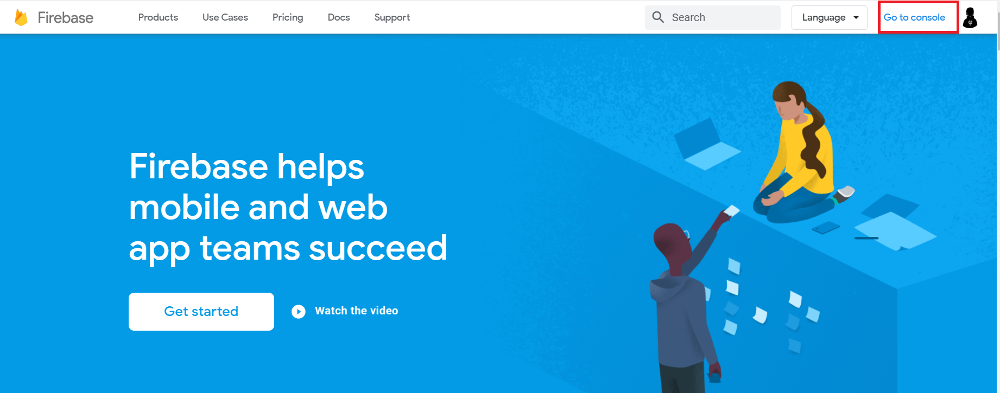

[TOC]

C:\Users\phuong\AppData\Local\Programs\Python\Python37\python.exe D:/Source/Source_All/python/Test/readfile.py
======== name dir ========

# React - The Complete Guide (incl Hooks, React Router, Redux)

## 1. Getting Started

https://www.udemy.com/course/react-the-complete-guide-incl-redux/

### 1. Introduction

https://academind.com/learn/javascript/reference-vs-primitive-values/

### 2. What is React

React is a js library for building user interface (include many Components)

Run on browser => ngay lập tức xảy ra trên browser mà không phải đợi server return 

Chia thành nhiều components => dễ bảo trì, tái SD, quản lí

### 2.1 components-learning-card.pdf.pdf

### 3. Real-World SPAs & React Web Apps

### 4. Writing our First React Code

You shouldn't need it right now - but in case you ever want to dive in, here's the official React documenation: https://reactjs.org/

Had issues with the Codepen demo? Here's the finished source code: https://codepen.io/anon/pen/MELQaQ

Xem link codepen ở trên:

Vào tab js: ấn setting và search react, react-dom


JavaScript Preprocessor: chọn babel

Babel là một công cụ chuyển đổi mã lệnh JavaScript hay JavaScript transpiler, được dùng với mục đích chuyển đổi mã lệnh JavaScript được viết dựa trên tiêu chuẩn ECMAScript phiên bản mới về phiên bản cũ hơn trước đó chạy trên broswer.


```js
function Person(props) {
  return (
    <div className="person">
      <h1>{props.name}</h1>
      <p>Your Age: {props.age}</p>
    </div>
  );
}

var app = (
  <div>
    <Person name="Max" age="28" />
    <Person name="Manu" age="29" />
  </div>
);

// allow render js func as a component to a real DOM
ReactDOM.render(app, document.querySelector("#app"));
```

### 5. Why Should we Choose React


### 6. React Alternatives

### 7. Understanding Single Page Applications and Multi Page Applications


### 8. Course Outline


### 9. How to get the Most out of This Course

### 10. Useful Resources & Links.html

You shouldn't need it right now - but in case you ever want to dive in, here's the official React documenation: https://reactjs.org/

Had issues with the Codepen demo? Here's the finished source code: https://codepen.io/anon/pen/MELQaQ

## 2. Refreshing Next Generation JavaScript (Optional)

### 1. Module Introduction

### 2. Understanding let and const

**`let`** allows you to declare variables that are limited to a scope of a [`block`](https://developer.mozilla.org/en-US/docs/Web/JavaScript/Reference/statements/block) statement, or expression on which it is used, unlike the [`var`](https://developer.mozilla.org/en-US/docs/Web/JavaScript/Reference/statements/var) keyword, which defines a variable globally, or locally to an entire function regardless of block scope. The other difference between [`var`](https://developer.mozilla.org/en-US/docs/Web/JavaScript/Reference/statements/var) and `let` is that the latter is initialized to a value only when a [parser evaluates it (see below)](https://developer.mozilla.org/en-US/docs/Web/JavaScript/Reference/Statements/let#Temporal_dead_zone).

At the top level of programs and functions, **`let`**, unlike **`var`**, does not create a property on the global object. For example:

```js
var x = 'global';
let y = 'global';
console.log(this.x); // "global"
console.log(this.y); // undefined
```

### 3. Arrow Functions

### 4. Exports and Imports


### 5. Understanding Classes

### 6. Classes, Properties and Methods


  

Class kế thừa trong constructor phải có super(); nếu không sẽ báo lỗi

  

Cú pháp mới không cần constructor:


### 7. The Spread & Rest Operator

  


```js
const abc = (...args) => {
  return args.filter(el => el === 1);
};
```

### 8. Destructuring

  


### 9. Reference and Primitive Types Refresher

Copy object use rest operator.

Nếu sử dụng copy con trỏ khi thay đổi giá trị của person nó sẽ thay đổi theo


### 10. Refreshing Array Functions

```js
const num = [1, 2, 3];
const doubleArr = num.map((x) => {
  return 2 * x;
});
```

### 11. Wrap Up

### 12. Next-Gen JavaScript - Summary.html

In this module, I provided a brief introduction into some core next-gen JavaScript features, of course focusing on the ones you'll see the most in this course. Here's a quick summary!

#### **let & const**

Read more about `let` : https://developer.mozilla.org/en-US/docs/Web/JavaScript/Reference/Statements/let

Read more about `const` : https://developer.mozilla.org/en-US/docs/Web/JavaScript/Reference/Statements/const

`let` and `const` basically replace `var` . You use `let` instead of `var` and `const` instead of `var` if you plan on never re-assigning this "variable" (effectively turning it into a constant therefore).

#### **ES6 Arrow Functions**

Read more: https://developer.mozilla.org/en-US/docs/Web/JavaScript/Reference/Functions/Arrow_functions

Arrow functions are a different way of creating functions in JavaScript. Besides a shorter syntax, they offer advantages when it comes to keeping the scope of the `this` keyword (see [here](https://developer.mozilla.org/en-US/docs/Web/JavaScript/Reference/Functions/Arrow_functions#No_binding_of_this)).

Arrow function syntax may look strange but it's actually simple.

```
function callMe(name) { 
    console.log(name);
}
```

which you could also write as:

```
const callMe = function(name) { 
    console.log(name);
}
```

becomes: 

```
const callMe = (name) => { 
    console.log(name);
}
```

**Important:** 

When having **no arguments**, you have to use empty parentheses in the function declaration:

```
const callMe = () => { 
    console.log('Max!');
}
```

When having **exactly one argument**, you may omit the parentheses:

```
const callMe = name => { 
    console.log(name);
}
```

When **just returning a value**, you can use the following shortcut:

```
const returnMe = name => name
```

That's equal to:

```
const returnMe = name => { 
    return name;
}
```

#### **Exports & Imports**

In React projects (and actually in all modern JavaScript projects), you split your code across multiple JavaScript files - so-called modules. You do this, to keep each file/ module focused and manageable.

To still access functionality in another file, you need `export` (to make it available) and `import` (to get access) statements.

You got two different types of exports: **default** (unnamed) and **named** exports:

**default** => `export default ...;` 

**named** => `export const someData = ...;` 

You can import **default exports** like this:

```
import someNameOfYourChoice from './path/to/file.js';
```

Surprisingly, `someNameOfYourChoice` is totally up to you.

**Named exports** have to be imported by their name:

```
import { someData } from './path/to/file.js';
```

A file can only contain one default and an unlimited amount of named exports. You can also mix the one default with any amount of named exports in one and the same file.

When importing **named exports**, you can also import all named exports at once with the following syntax:

```
import * as upToYou from './path/to/file.js';
```

`upToYou` is - well - up to you and simply bundles all exported variables/functions in one JavaScript object. For example, if you `export const someData = ...` (`/path/to/file.js` ) you can access it on `upToYou` like this: `upToYou.someData` .

#### **Classes**

Classes are a feature which basically replace constructor functions and prototypes. You can define blueprints for JavaScript objects with them. 

Like this:

```
class Person {
    constructor () {
        this.name = 'Max';
    }
}

const person = new Person();
console.log(person.name); // prints 'Max'
```

In the above example, not only the class but also a property of that class (=> `name` ) is defined. The syntax you see there, is the "old" syntax for defining properties. In modern JavaScript projects (as the one used in this course), you can use the following, more convenient way of defining class properties:

```
class Person {
    name = 'Max';
}

const person = new Person();
console.log(person.name); // prints 'Max'
```

You can also define methods. Either like this:

```
class Person {
    name = 'Max';
    printMyName () {
        console.log(this.name); // this is required to refer to the class!
    }
}

const person = new Person();
person.printMyName();
```

Or like this:

```
class Person {
    name = 'Max';
    printMyName = () => {
        console.log(this.name);
    }
}

const person = new Person();
person.printMyName();
```

The second approach has the same advantage as all arrow functions have: The `this` keyword doesn't change its reference.

You can also use **inheritance** when using classes:

```
class Human {
    species = 'human';
}

class Person extends Human {
    name = 'Max';
    printMyName = () => {
        console.log(this.name);
    }
}

const person = new Person();
person.printMyName();
console.log(person.species); // prints 'human'
```

#### **Spread & Rest Operator**

The spread and rest operators actually use the same syntax: `...` 

Yes, that is the operator - just three dots. It's usage determines whether you're using it as the spread or rest operator.

**Using the Spread Operator:**

The spread operator allows you to pull elements out of an array (=> split the array into a list of its elements) or pull the properties out of an object. Here are two examples:

```
const oldArray = [1, 2, 3];
const newArray = [...oldArray, 4, 5]; // This now is [1, 2, 3, 4, 5];
```

Here's the spread operator used on an object:

```
const oldObject = {
    name: 'Max'
};
const newObject = {
    ...oldObject,
    age: 28
};
```

`newObject` would then be

```
{
    name: 'Max',
    age: 28
}
```

The spread operator is extremely useful for cloning arrays and objects. Since both are [reference types (and not primitives)](https://youtu.be/9ooYYRLdg_g), copying them safely (i.e. preventing future mutation of the copied original) can be tricky. With the spread operator you have an easy way of creating a (shallow!) clone of the object or array. 

#### **Destructuring**

Destructuring allows you to easily access the values of arrays or objects and assign them to variables.

Here's an example for an array:

```
const array = [1, 2, 3];
const [a, b] = array;
console.log(a); // prints 1
console.log(b); // prints 2
console.log(array); // prints [1, 2, 3]
```

And here for an object:

```
const myObj = {
    name: 'Max',
    age: 28
}
const {name} = myObj;
console.log(name); // prints 'Max'
console.log(age); // prints undefined
console.log(myObj); // prints {name: 'Max', age: 28}
```

Destructuring is very useful when working with function arguments. Consider this example:

```
const printName = (personObj) => {
    console.log(personObj.name);
}
printName({name: 'Max', age: 28}); // prints 'Max'
```

Here, we only want to print the name in the function but we pass a complete person object to the function. Of course this is no issue but it forces us to call personObj.name inside of our function. We can condense this code with destructuring:

```
const printName = ({name}) => {
    console.log(name);
}
printName({name: 'Max', age: 28}); // prints 'Max')
```

We get the same result as above but we save some code. By destructuring, we simply pull out the `name` property and store it in a variable/ argument named `name` which we then can use in the function body.

### 12.1 next-gen-js-summary.pdf.pdf

### 13. JS Array Functions.html

Not really next-gen JavaScript, but also important: JavaScript array functions like map() , filter() , reduce() etc.

You'll see me use them quite a bit since a lot of React concepts rely on working with arrays (in immutable ways).

The following page gives a good overview over the various methods you can use on the array prototype - feel free to click through them and refresh your knowledge as required: https://developer.mozilla.org/en-US/docs/Web/JavaScript/Reference/Global_Objects/Array

Particularly important in this course are:

map() => https://developer.mozilla.org/en-US/docs/Web/JavaScript/Reference/Global_Objects/Array/map
find() => https://developer.mozilla.org/en-US/docs/Web/JavaScript/Reference/Global_Objects/Array/find
findIndex() => https://developer.mozilla.org/en-US/docs/Web/JavaScript/Reference/Global_Objects/Array/findIndex
filter() => https://developer.mozilla.org/en-US/docs/Web/JavaScript/Reference/Global_Objects/Array/filter
reduce() => https://developer.mozilla.org/en-US/docs/Web/JavaScript/Reference/Global_Objects/Array/Reduce?v=b
concat() => https://developer.mozilla.org/en-US/docs/Web/JavaScript/Reference/Global_Objects/Array/concat?v=b
slice() => https://developer.mozilla.org/en-US/docs/Web/JavaScript/Reference/Global_Objects/Array/slice
splice() => https://developer.mozilla.org/en-US/docs/Web/JavaScript/Reference/Global_Objects/Array/splice

## 3. Understanding the Base Features & Syntax

### 1. Module Introduction

### 2. The Build Workflow


### 3. Using Create React App

```ts
npm install -g create-react-app
create-react-app my-app --scripts-version 1.1.5 // impact structure of project
// create-react-app my-app
cd my-app
npm start
```

Doi port tai file package.json

http://localhost:3000/

Default la 3000

```json
 "scripts": {
     // Add
    "start": "set port=4200 && react-scripts start",
    "build": "react-scripts build",
    "test": "react-scripts test",
    "eject": "react-scripts eject"
  },
```

### 4. Understanding the Folder Structure

https://quoctuan.info/bai-02-cau-truc-ung-dung-co-trong-reactjs.1.2.html


### 4.1 ide-setup.pdf.pdf

**Editor / IDE Setup**
My Setup
In this course, I use Microsoﬞ Visual Studio Code which is a great free-to-use Web Development IDE.
It’s a different IDE than Microsoﬞ Visual Studio - don’t mix them up. The laמּer is NOT free and also not as suited for JavaScript Web Development as Visual
Studio Code is.
If you just installed VS Code, it’s going to look different than in my videos. That’s because I’m using a different theme and icons. In general, you can install a lot
of free extensions for VS Code to customise it to your needs and requirements (both visually as well as from the functionality offered).
• Theme: Dark+ (default theme, no extension required)
• Icons: Material Icons (extension: hמּps://marketplace.visualstudio.com/
items?itemName=PKief.material-icon-theme)
Feel free to browse the extension marketplace for more useful extensions!
**Alternatives**
If you don’t want to use VS Code but also don’t have you favourite IDE/ editor,
here are the common alternatives:
• Webstorm: hמּps://www.jetbrains.com/webstorm/ (not free)
• Sublime Text: hמּps://www.sublimetext.com/ (free unlimited trial)
• Atom: hמּps://atom.io/ (free)

### 5. Understanding Component Basics

### 5.1 components-learning-card.pdf.pdf

### 6. Understanding JSX

Comment đoạn trên và thêm React.createElement để test

App.js

```js
import React, { Component } from "react";
import logo from "./logo.svg";
import "./App.css";

class App extends Component {
  render() {
    // return (
    // <div className="App">
    //   <h1 className="App-title">Welcome to React</h1>
    // </div>
    // );

    // work behind the sence
    return React.createElement(
      "div",
      { className: "App" },
      React.createElement("h3", null, "Welcome to React")
    );
  }
}

export default App;

```


Ex: SD thay phần return html trong ham render de test

```js
import React from "react";
import ReactDOM from "react-dom";

const list = React.createElement(
  "div",
  {},
  React.createElement("h1", {}, "My favorite ice cream flavors"),
  React.createElement("ul", {}, [
    React.createElement("li", { class: "brown" }, "Chocolate"),
    React.createElement("li", { class: "white" }, "Vanilla"),
    React.createElement("li", { class: "yellow" }, "Banana")
  ])
);

ReactDOM.render(list, document.getElementById("global"));
```

### 7. JSX Restrictions

You can use JSX to write code html in .js file

- cannot use class to set css in file .js so you should replace it with "className"
- Wrap everything in a root tag: div

### 8. Creating a Functional Component

Create class Person in folder Person 

```js
import React from "react";

const person = props => {
  return (
    <div>
      <p>
        I'm {props.name} and I am {props.age} years old!
      </p>
      <p>{props.children}</p>
    </div>
  );
};

export default person;
```

App.js

```js
import React, { Component } from "react";
import "./App.css";
import Person from "./Person/Person";

class App extends Component {
  render() {
    return (
      <div className="App">
        <h1>Hi, I'm a React App</h1>
        <p>This is really working!</p>
        <Person name="Max" age="28" />
        <Person name="Manu" age="29">
          My Hobbies: Racing
        </Person>
        <Person name="Stephanie" age="26" />
      </div>
    );
    // return React.createElement('div', {className: 'App'}, React.createElement('h1', null, 'Does this work now?'));
  }
}

export default App;
```

### 9. Components & JSX Cheat Sheet.html

Components are the **core building block of React apps**. Actually, React really is just a library for creating components in its core.

A typical React app therefore could be depicted as a **component tree** - having one root component ("App") and then an potentially infinite amount of nested child components.

Each component needs to return/ render some **JSX** code - it defines which HTML code React should render to the real DOM in the end.

**JSX is NOT HTML** but it looks a lot like it. Differences can be seen when looking closely though (for example className in JSX vs class in "normal HTML"). JSX is just syntactic sugar for JavaScript, allowing you to write HTMLish code instead of nested React.createElement(...) calls.

When creating components, you have the choice between **two different ways:**

1. **Functional components** (also referred to as "presentational", "dumb" or "stateless" components - more about this later in the course) => `const cmp = () => { return some JSX }` (using ES6 arrow functions as shown here is recommended but optional)
2. **class-based components** (also referred to as "containers", "smart" or "stateful" components) => `class Cmp extends Component { render () { return some JSX } }` 

We'll of course dive into the difference throughout this course, you can already note that you should use 1) as often as possible though. It's the best-practice.

### 9.1 components.pdf.pdf

### 10. Working with Components & Re-Using Them

### 11. Outputting Dynamic Content

Write js code in `{}` in person.js file

### 12. Working with Props

Khi có code js cần xử lý thì đặt trong dấu {}; đây là cú pháp của JSX

Đối với class thì truy cập từ khóa props thông qua this.props


### 12.1 props-learning-card.pdf.pdf


### 13. Understanding the Children Property

props.children print value in the middle of tag: 

- ví dụ như My Hobbies: Racing

Ex: ` <Person name="Manu" age="29" >My Hobbies: Racing</Person>`

### 14. Understanding & Using State

State is managed inside the Component,  

Từ react 16.8 có react-hook

Thêm button tag và state

```js
import React, { Component } from "react";
import "./App.css";
import Person from "./Person/Person";

class App extends Component {
  // Add
  state = {
    persons: [
      { name: "Max", age: 28 },
      { name: "Manu", age: 29 },
      { name: "Stephanie", age: 26 }
    ],
    otherState: "some other value"
  };

  switchNameHandler = () => {
    // console.log('Was clicked!');
    // DON'T DO THIS: this.state.persons[0].name = 'Maximilian';
    this.setState({
      persons: [
        { name: "Maximilian", age: 28 },
        { name: "Manu", age: 29 },
        { name: "Stephanie", age: 27 }
      ]
    });
  };

  render() {
    return (
      <div className="App">
        <h1>Hi, I'm a React App</h1>
        <p>This is really working!</p>
        <button onClick={this.switchNameHandler}>Switch Name</button>
        <Person
          name={this.state.persons[0].name}
          age={this.state.persons[0].age}
        />
        <Person
          name={this.state.persons[1].name}
          age={this.state.persons[1].age}
        >
          My Hobbies: Racing
        </Person>
        <Person
          name={this.state.persons[2].name}
          age={this.state.persons[2].age}
        />
      </div>
    );
    // return React.createElement('div', {className: 'App'}, React.createElement('h1', null, 'Does this work now?'));
  }
}

export default App;  
```

Đối với function không thể define properties trong func components: person

### 15. Props & State.html

`props` and `state` are **CORE concepts** of React. Actually, only changes in `props` and/ or `state` trigger React to re-render your components and potentially update the DOM in the browser (a detailed look at how React checks whether to really touch the real DOM is provided in section 6).

**Props**

`props` allow you to pass data from a parent (wrapping) component to a child (embedded) component.

**Example:**

**AllPosts Component:**

```js
const posts = () => {
    return (
        <div>
            <Post title="My first Post" />
        </div>
    );
}
```

Here, `title` is the custom property (`prop` ) set up on the custom `Post` component. We basically replicate the default HTML attribute behavior we already know (e.g. `` informs the browser about how to handle that input).

**Post Component:**

```js
const post = (props) => {
    return (
        <div>
            <h1>{props.title}</h1>
        </div>
    );
}
```

The `Post` component receives the `props` argument. You can of course name this argument whatever you want - it's your function definition, React doesn't care! But React will pass one argument to your component function => An object, which contains all properties you set up on `` .

`{props.title}` then dynamically outputs the `title` property of the `props` object - which is available since we set the `title` property inside `AllPosts` component (see above).


**State**

Whilst props allow you to pass data down the component tree (and hence trigger an UI update), state is used to change the component, well, state from within. Changes to state also trigger an UI update.

**Example:**

**NewPost Component:**

```js
class NewPost extends Component { // state can only be accessed in class-based components!
    state = {
        counter: 1
    };  

    render () { // Needs to be implemented in class-based components! Needs to return some JSX!
        return (
            <div>{this.state.counter}</div>
        );
    }
}
```

Here, the `NewPost` component contains `state` . Only class-based components can define and use `state` . You can of course pass the `state` down to functional components, but these then can't directly edit it.

`state` simply is a property of the component class, you have to call it `state` though - the name is not optional. You can then access it via `this.state` in your class JSX code (which you return in the required `render()` method).

Whenever `state` changes (taught over the next lectures), the component will re-render and reflect the new state. The difference to `props` is, that this happens within one and the same component - you don't receive new data (`props` ) from outside!

### 15.1 props&state.pdf.pdf


### 16. Handling Events with Methods

 `<button onClick={this.switchNameHandler}>Switch Name</button>`

Đối với hàm không có tham số không được gọi this.switchNameHandler() mà nên sử dụng như trên

### 17. To Which Events Can You Listen.html

In the last lecture, we saw that you can react to the onClick event - but to which other events can you listen? You can find a list of supported events here: https://reactjs.org/docs/events.html#supported-events

### Clipboard Events

Event names:

```
onCopy onCut onPaste
```

Properties:

```
DOMDataTransfer clipboardData
```

### Composition Events

Event names:

```
onCompositionEnd onCompositionStart onCompositionUpdate
```

Properties:

```
string data
```

### Keyboard Events

Event names:

```
onKeyDown onKeyPress onKeyUp
```

Properties:

```
boolean altKey
number charCode
boolean ctrlKey
boolean getModifierState(key)
string key
number keyCode
string locale
number location
boolean metaKey
boolean repeat
boolean shiftKey
number which
```

### Focus Events

Event names:

```
onFocus onBlur
```

These focus events work on all elements in the React DOM, not just form elements.

Properties:

```
DOMEventTarget relatedTarget
```

### Form Events

Event names:

```
onChange onInput onInvalid onSubmit
```

For more information about the onChange event, see [Forms](https://reactjs.org/docs/forms.html).

### Mouse Events

Event names:

```
onClick onContextMenu onDoubleClick onDrag onDragEnd onDragEnter onDragExit
onDragLeave onDragOver onDragStart onDrop onMouseDown onMouseEnter onMouseLeave
onMouseMove onMouseOut onMouseOver onMouseUp
```

The `onMouseEnter` and `onMouseLeave` events propagate from the element being left to the one being entered instead of ordinary bubbling and do not have a capture phase.

Properties:

```
boolean altKey
number button
number buttons
number clientX
number clientY
boolean ctrlKey
boolean getModifierState(key)
boolean metaKey
number pageX
number pageY
DOMEventTarget relatedTarget
number screenX
number screenY
boolean shiftKey
```

### Selection Events

Event names:

```
onSelect
```

### Touch Events

Event names:

```
onTouchCancel onTouchEnd onTouchMove onTouchStart
```

Properties:

```
boolean altKey
DOMTouchList changedTouches
boolean ctrlKey
boolean getModifierState(key)
boolean metaKey
boolean shiftKey
DOMTouchList targetTouches
DOMTouchList touches
```

### UI Events

Event names:

```
onScroll
```

Properties:

```
number detail
DOMAbstractView view
```

### Wheel Events

Event names:

```
onWheel
```

Properties:

```
number deltaMode
number deltaX
number deltaY
number deltaZ
```

### Media Events

Event names:

```
onAbort onCanPlay onCanPlayThrough onDurationChange onEmptied onEncrypted
onEnded onError onLoadedData onLoadedMetadata onLoadStart onPause onPlay
onPlaying onProgress onRateChange onSeeked onSeeking onStalled onSuspend
onTimeUpdate onVolumeChange onWaiting
```

### Image Events

Event names:

```
onLoad onError
```

### Animation Events

Event names:

```
onAnimationStart onAnimationEnd onAnimationIteration
```

Properties:

```
string animationName
string pseudoElement
float elapsedTime
```

### Transition Events

Event names:

```
onTransitionEnd
```

Properties:

```
string propertyName
string pseudoElement
float elapsedTime
```

### Other Events

Event names:

```
onToggle
```

### 18. Manipulating the State

Sẽ overwrite old state to new state, merge

Nếu là class thì sẽ merge vào và ngược lại

### 18.1 state-learning-card.pdf.pdf

### 19. Function Components Naming.html

In the **next lecture**, we'll learn how to manage state in functional components (instead of class-based components).

In case you're getting an error with the code shown in the next lecture, simply assign a capitalized variable name to the variable that holds your functional component.

**Example:**

Use

```
const App = () => { ... }
```

instead of

```
const app = () => { ... }
```

Technically, that's not required but depending on your project setup, the built-in linter (a code quality checking tool) that comes with create-react-app might not like the lowercase variable name.

You can also avoid this by creating projects with the **right react-scripts version**, which I would **recommend for this course** anyways (see the [setup video, lecture 26](https://www.udemy.com/react-the-complete-guide-incl-redux/learn/lecture/14320208))

```shell
create-react-app my-app --scripts-version 1.1.5
```

### 20. Using the useState() Hook for State Manipulation

react-hook cơ bản là tập hợp các hàm exposed to you by react which you can use in func components

useState always return two elements, tham số thứ nhất là current state tham số thứ 2 là func to update state

```js
import React, { useState } from "react";
import "./App.css";
import Person from "./Person/Person";

const app = props => {
  // use State always return two elements
  const [personsState, setPersonsState] = useState({
    persons: [
      { name: "Max", age: 28 },
      { name: "Manu", age: 29 },
      { name: "Stephanie", age: 26 }
    ]
  });

  const [otherState, setOtherState] = useState("some other value");

  console.log(personsState, otherState);

  const switchNameHandler = () => {
    // console.log('Was clicked!');
    // DON'T DO THIS: this.state.persons[0].name = 'Maximilian';
    setPersonsState({
      persons: [
        { name: "Maximilian", age: 28 },
        { name: "Manu", age: 29 },
        { name: "Stephanie", age: 27 }
      ]
    });
  };

  return (
    <div className="App">
      <h1>Hi, I'm a React App</h1>
      <p>This is really working!</p>
      <button onClick={switchNameHandler}>Switch Name</button>
      <Person
        name={personsState.persons[0].name}
        age={personsState.persons[0].age}
      />
      <Person
        name={personsState.persons[1].name}
        age={personsState.persons[1].age}
      >
        My Hobbies: Racing
      </Person>
      <Person
        name={personsState.persons[2].name}
        age={personsState.persons[2].age}
      />
    </div>
  );
  // return React.createElement('div', {className: 'App'}, React.createElement('h1', null, 'Does this work now?'));
};

export default app;
```

### 20.3 usestate-learning-card.pdf.pdf


### 21. Stateless vs Stateful Components

Stateful is a component that manage state
Stateless is a component that doesn’t manage state

=> func presentation component than statefull component => easy to maintain and manage 

### 22. Passing Method References Between Components

Click on paragraph => have two way to call func with params(use arrow func is not recommend). You can pass method like a props `click={this.switchNameHandler.bind(this, 'Max!')`

`() => this.switchNameHandler('Maximilian!!')` mean `() => return this.switchNameHandler('Maximilian!!')`

arrow func khuyên k nên SD

App.js

```js

  switchNameHandler = (newName) => {
    // console.log('Was clicked!');
    // DON'T DO THIS: this.state.persons[0].name = 'Maximilian';
    this.setState( {
      persons: [
        { name: newName, age: 28 },
        { name: 'Manu', age: 29 },
        { name: 'Stephanie', age: 27 }
      ]
    } )
  }

  // 23 add
  nameChangedHandler = (event) => {
    this.setState( {
      persons: [
        { name: 'Max', age: 28 },
        { name: event.target.value, age: 29 },
        { name: 'Stephanie', age: 26 }
      ]
    } )
  }

  render () {
    return (
      <div className="App">
        <h1>Hi, I'm a React App</h1>
        <p>This is really working!</p>
        <button onClick={() => this.switchNameHandler('Maximilian!!')}>Switch Name</button>
        <Person
          name={this.state.persons[0].name}
          age={this.state.persons[0].age} />
        <Person
          name={this.state.persons[1].name}
          age={this.state.persons[1].age}
          click={this.switchNameHandler.bind(this, 'Max!')}
          changed={this.nameChangedHandler} >My Hobbies: Racing</Person>
        <Person
          name={this.state.persons[2].name}
          age={this.state.persons[2].age} />
      </div>
    );
    // return React.createElement('div', {className: 'App'}, React.createElement('h1', null, 'Does this work now?'));
  }
}
```

Person.js

```js
import React from "react";

const person = props => {
  return (
    <div>
      <p onClick={props.click}>
        I'm {props.name} and I am {props.age} years old!
      </p>
      <p>{props.children}</p>
      <input type="text" onChange={props.changed} value={props.name} />
    </div>
  );
};

export default person;
```

### 23. Adding Two Way Binding

Để xem name hiển thị ở input khi init thì thêm `{props.name}`, nhưng khi thêm sẽ xuất hiện warning bởi vì bạn đang binding value with properties without allowing react to change


person.js

```js
<input type="text" onChange={props.changed} value={props.name} />
```

Them value={props.name} moi bi error

### 24. Adding Styling with Stylesheets

28.3 base-syntax--03-finished.zip
add person.css

```css
.Person {
  width: 60%;
  margin: 16px auto;
  border: 1px solid #eee;
  box-shadow: 0 2px 3px #ccc;
  padding: 16px;
  text-align: center;
}
```

thanks to webpack you can import css file in js file

> class => className 

### 25. Working with Inline Styles

App.js

```js
render () {
    const style = {
      backgroundColor: 'white',
      font: 'inherit',
      border: '1px solid blue',
      padding: '8px',
      cursor: 'pointer'
    };

    return (
      <div className="App">
        <h1>Hi, I'm a React App</h1>
        <p>This is really working!</p>
        <button
          style={style}
          onClick={() => this.switchNameHandler('Maximilian!!')}>Switch Name</button>
```

### 26. Time to Practice - The Base Syntax.html

### 27. [OPTIONAL] Assignment Solution

### 28. Useful Resources & Links.html

- create-react-app: https://github.com/facebookincubator/create-react-app
- Introducing JSX: https://reactjs.org/docs/introducing-jsx.html
- Rendering Elements: https://reactjs.org/docs/rendering-elements.html
- Components & Props: https://reactjs.org/docs/components-and-props.html
- Listenable Events: https://reactjs.org/docs/events.html

## 4. Working with Lists and Conditionals

### 1. Module Introduction

### 2. Rendering Content Conditionally

Them thuoc tinh showPersons: false
App.js

```js
import React, { Component } from "react";
import "./App.css";
import Person from "./Person/Person";

class App extends Component {
  state = {
    persons: [
      { name: "Max", age: 28 },
      { name: "Manu", age: 29 },
      { name: "Stephanie", age: 26 }
    ],
    otherState: "some other value",
    showPersons: false
  };

  switchNameHandler = newName => {
    // console.log('Was clicked!');
    // DON'T DO THIS: this.state.persons[0].name = 'Maximilian';
    this.setState({
      persons: [
        { name: newName, age: 28 },
        { name: "Manu", age: 29 },
        { name: "Stephanie", age: 27 }
      ]
    });
  };

  nameChangedHandler = event => {
    this.setState({
      persons: [
        { name: "Max", age: 28 },
        { name: event.target.value, age: 29 },
        { name: "Stephanie", age: 26 }
      ]
    });
  };

  // Add
  togglePersonsHandler = () => {
    const doesShow = this.state.showPersons;
    this.setState({ showPersons: !doesShow });
  };

  render() {
    const style = {
      backgroundColor: "white",
      font: "inherit",
      border: "1px solid blue",
      padding: "8px",
      cursor: "pointer"
    };

    //  ### 3. Handling Dynamic Content The JavaScript Way
    let persons = null;

    if (this.state.showPersons) {
      persons = (
        <div>
          <Person
            name={this.state.persons[0].name}
            age={this.state.persons[0].age}
          />
          <Person
            name={this.state.persons[1].name}
            age={this.state.persons[1].age}
            click={this.switchNameHandler.bind(this, "Max!")}
            changed={this.nameChangedHandler}
          >
            My Hobbies: Racing
          </Person>
          <Person
            name={this.state.persons[2].name}
            age={this.state.persons[2].age}
          />
        </div>
      );
    }

    return (
      <div className="App">
        <h1>Hi, I'm a React App</h1>
        <p>This is really working!</p>
        <button style={style} onClick={this.togglePersonsHandler}>
          Toggle Persons
        </button>
        {persons}
      </div>
    );
    // return React.createElement('div', {className: 'App'}, React.createElement('h1', null, 'Does this work now?'));
  }
}

export default App;
```

// Cach 2: dùng code js trong dấu  {}

```js
{
this.state.showPersons === true ? <div>
          <Person
            name={this.state.persons[0].name}
            age={this.state.persons[0].age}
          />
          <Person
            name={this.state.persons[1].name}
            age={this.state.persons[1].age}
            click={this.switchNameHandler.bind(this, "Max!")}
            changed={this.nameChangedHandler}
          >
            My Hobbies: Racing
          </Person>
          <Person
            name={this.state.persons[2].name}
            age={this.state.persons[2].age}
          />
        </div> : null
}
```

Nó sẽ tự động merge state

### 2.1 jsx-conditionals-learning-card.pdf.pdf

### 3. Handling Dynamic Content The JavaScript Way

```js
 let persons = null;

    if ( this.state.showPersons ) {
      persons = (
        <div>
          <Person
            name={this.state.persons[0].name}
            age={this.state.persons[0].age} />
          <Person
            name={this.state.persons[1].name}
            age={this.state.persons[1].age}
            click={this.switchNameHandler.bind( this, 'Max!' )}
            changed={this.nameChangedHandler} >My Hobbies: Racing</Person>
          <Person
            name={this.state.persons[2].name}
            age={this.state.persons[2].age} />
        </div>
      );
    }

```

Refactor 

### 4. Outputting Lists (Intro)

### 5. Outputting Lists

Không như angular hay vue có ngFor hay v-for, react xử lý all bằng js

App.js

```js
if (this.state.showPersons) {
  persons = (
    <div>
      {this.state.persons.map((person, index) => {
        return (
          <Person
            click={() => this.deletePersonHandler(index)}
            name={person.name}
            age={person.age}
            key={person.id}
            changed={event => this.nameChangedHandler(event, person.id)}
          />
        );
      })}
    </div>
  );
}
```

### 5.1 jsx-lists-learning-card.pdf.pdf


### 6. Lists & State

```js
deletePersonHandler = personIndex => {
  // const persons = this.state.persons.slice();
  const persons = [...this.state.persons];
  persons.splice(personIndex, 1);
  this.setState({ persons: persons });
};
```

const persons = this.state.persons => Xoa k chinh xac
person is an reference object so you can change value of it when using const

### 7. Updating State Immutably

use `this.state.persons.slice();` to copy

### 8. Lists & Keys

```js
state = {
  persons: [
    { id: "asfa1", name: "Max", age: 28 },
    { id: "vasdf1", name: "Manu", age: 29 },
    { id: "asdf11", name: "Stephanie", age: 26 }
  ],
  otherState: "some other value",
  showPersons: false
};
```

### 9. Flexible Lists

```js
nameChangedHandler = (event, id) => {
  const personIndex = this.state.persons.findIndex(p => {
    return p.id === id;
  });

  const person = {
    ...this.state.persons[personIndex]
  };

  // const person = Object.assign({}, this.state.persons[personIndex]);

  person.name = event.target.value;

  const persons = [...this.state.persons];
  persons[personIndex] = person;

  this.setState({ persons: persons });
};
```

Call
`changed={(event) => this.nameChangedHandler(event, person.id)}`

### 10. Wrap Up

### 11. Time to Practice - Lists & Conditionals.html

### 12. [OPTIONAL] Assignment Solution

App.js

```ts
import React, { Component } from 'react';
import './App.css';
import Validation from './Validation/Validation';
import Char from './Char/Char';

class App extends Component {
  state = {
    userInput: ''
  }

  inputChangedHandler = ( event ) => {
    this.setState( { userInput: event.target.value } );
  }

  deleteCharHandler = ( index ) => {
    const text = this.state.userInput.split('');
    text.splice(index, 1);
    const updatedText = text.join('');
    this.setState({userInput: updatedText});
  }

  render () {
    const charList = this.state.userInput.split('').map((ch, index) => {
      return <Char 
        character={ch} 
        key={index}
        clicked={() => this.deleteCharHandler(index)} />;
    });

    return (
      <div className="App">
        
        <p>Hint: Keep in mind that JavaScript strings are basically arrays!</p>
        <hr />
        <input
          type="text"
          onChange={this.inputChangedHandler}
          value={this.state.userInput} />
        <p>{this.state.userInput}</p>
        <Validation inputLength={this.state.userInput.length} />
        {charList}
      </div>
    );
  }
}

export default App;

```

Validation

```ts
import React from "react";

const validation = props => {
  let validationMessage = "Text long enough";

  if (props.inputLength <= 5) {
    validationMessage = "Text too short";
  }

  return (
    <div>
      <p>{validationMessage}</p>
    </div>
  );
};

export default validation;
```

Char.js

```js
import React from "react";

const char = props => {
  const style = {
    display: "inline-block",
    padding: "16px",
    margin: "16px",
    border: "1px solid black",
    textAlign: "center"
  };

  return (
    <div style={style} onClick={props.clicked}>
      {props.character}
    </div>
  );
};

export default char;
```


### 13. Useful Resources & Links.html

Conditional Rendering: https://reactjs.org/docs/conditional-rendering.html
Lists & Keys: https://reactjs.org/docs/lists-and-keys.html

## 5. Styling React Components & Elements

### 1. Module Introduction

### 2. Outlining the Problem Set

### 3. Setting Styles Dynamically

Change backgroundColor to green

```ts

  render () {
    const style = {
      backgroundColor: 'green',
      color: 'white', // ADD
      font: 'inherit',
      border: '1px solid blue',
      padding: '8px',
      cursor: 'pointer'
    };

    let persons = null;

    if ( this.state.showPersons ) {
      persons = (
        <div>
          {this.state.persons.map( ( person, index ) => {
            return <Person
              click={() => this.deletePersonHandler( index )}
              name={person.name}
              age={person.age}
              key={person.id}
              changed={( event ) => this.nameChangedHandler( event, person.id )} />
          } )}
        </div>
      );

// Add if show person => color is red
      style.backgroundColor = 'red';
    }

```

### 4. Setting Class Names Dynamically

App.css

```css
.App {
  text-align: center;
}

.red {
  color: red;
}

.bold {
  font-weight: bold;
}

.App button {
  border: 1px solid blue;
  padding: 16px;
  background-color: green;
  font: inherit;
  color: white;
  cursor: pointer;
}

.App button:hover {
  background-color: lightgreen;
  color: black;
}

.App button.Red {
  background-color: red;
}

.App button.Red:hover {
  background-color: salmon;
  color: black;
}
```

App.js

```ts
const classes = [];
if (this.state.persons.length <= 2) {
  classes.push("red"); // classes = ['red']
}
if (this.state.persons.length <= 1) {
  classes.push("bold"); // classes = ['red', 'bold']
}

// html trong hàm render
<p className={classes.join(" ")}>This is really working!</p>;
```

### 5. Adding and Using Radium

```ts
// allow use inline style with pseudo selector @media
npm install --save radium
```

App.js

```ts
import Radium, { StyleRoot } from "radium";

render () {
    const style = {
      backgroundColor: 'green',
      color: 'white', // ADD
      font: 'inherit',
      border: '1px solid blue',
      padding: '8px',
      cursor: 'pointer',
        // add
      ':hover': {
        backgroundColor: 'lightgreen',
        color: 'black'
      }
    };

    let persons = null;

    if ( this.state.showPersons ) {
      persons = (
        <div>
          {this.state.persons.map( ( person, index ) => {
            return <Person
              click={() => this.deletePersonHandler( index )}
              name={person.name}
              age={person.age}
              key={person.id}
              changed={( event ) => this.nameChangedHandler( event, person.id )} />
          } )}
        </div>
      );

// Add if show person => color is red
      style.backgroundColor = 'red';
// Add
      style[':hover'] = {
        backgroundColor: 'salmon',
        color: 'black'
      };
    }

// ở cuối file wrap App bằng Radium
export default Radium(App);
```

Person.js

```js
import React from "react";
import Radium from "radium";

import "./Person.css";

const person = props => {
    // add
  const style = {
    "@media (min-width: 500px)": {
      width: "450px"
    }
  };
  return (
    <div className="Person" style={style}>
      <p onClick={props.click}>
        I'm {props.name} and I am {props.age} years old!
      </p>
      <p>{props.children}</p>
      <input type="text" onChange={props.changed} value={props.name} />
    </div>
  );
};

// add
export default Radium(person);
```

### 6. Using Radium for Media Queries

Person

```ts

const person = ( props ) => {
    const style = {
        '@media (min-width: 500px)': {
            width: '450px'
        }
    };
    return (
        <div className="Person" style={style}>
```

Person.css

```css
/* @media (min-width: 500px) {
    .Person {
        width: 450px;
    }
} */
```

Tại file app.js wrap by StyleRoot

```js
return (
      <StyleRoot>
        <div className="App">
          <h1>Hi, I'm a React App</h1>
          <p className={classes.join( ' ' )}>This is really working!</p>
          <button
            style={style}
            onClick={this.togglePersonsHandler}>Toggle Persons</button>
          {persons}
        </div>
      </StyleRoot>
    );
    // return React.createElement('div', {className: 'App'}, React.createElement('h1', null, 'Does this work now?'));
  }
```


### 7. MUST READ Enabling CSS Modules.html

**Don't skip this lecture - and keep it open in a separate browser tab when you go through the next lecture - sorry for the small inconvenience at this point!**

In the next lecture, we'll use a styling solution named "CSS modules". I'll explain what it is and how it works over the next lectures.

The way we unlock it changed a little bit though.

In the next lecture, we'll eject from the project created with create-react-app (I'll show how that is done in the next lecture and that process will be exactly the same).

We'll then replace some code in a newly added webpack config file (it'll be available after ejecting).

In the video, I'll look for an entry that starts like this (in the `webpack.config.js` file):

```
{
  test: /\.css$/,
  ...
}
```

and I then edit this entry.

This entry now looks slightly different. You'll have to find the following part in your `webpack.config.js` file:

```
{
  test: cssRegex,
  exclude: cssModuleRegex,
  ...
}
```

and then edit that entry.

Finally, it should look like this:

```
{
  test: cssRegex,
  exclude: cssModuleRegex,
  use: getStyleLoaders({
      importLoaders: 1,
      modules: true,
      localIdentName: '[name]__[local]__[hash:base64:5]'
  }),
}
```

You can ignore me editing the `webpack.config.prod.js` file - with the latest version of create-react-app, ejecting only gives you **ONE** webpack config file (which you edit as described above).

**---**

Alternatively, you can now also use CSS modules without ejecting (you still can though, it won't be a problem). In a non-ejected project created with create-react-app, you can use CSS modules as described here: https://facebook.github.io/create-react-app/docs/adding-a-css-modules-stylesheet

https://create-react-app.dev/docs/adding-a-css-modules-stylesheet/

### 8. Enabling & Using CSS Modules

Remove Radium in Person

```js
import React from "react";

import classes from "./Person.css";

const person = props => {
  return (
    <div className={classes.Person}>
      <p onClick={props.click}>
        I'm {props.name} and I am {props.age} years old!
      </p>
      <p>{props.children}</p>
      <input type="text" onChange={props.changed} value={props.name} />
    </div>
  );
};

export default person;
```


Xoa Radium in App.js

- Remove Radium and style
- `npm run eject` => sinh ra 2 folder scripts and config : tự chỉnh sửa config(xem lại)

In the video, I'll look for an entry that starts like this (in the webpack.config.js file):
{
test: /\.css\$/,
...
}
and I then edit this entry.

O duoi phan options:
File configs/webpack.config.dev.js

```js
test: /\.css$/,
            use: [
              require.resolve('style-loader'),
              {
                loader: require.resolve('css-loader'),
                options: {
                  importLoaders: 1,
                   modules: true,
      				localIdentName: 	         '[name]__[local]__[hash:base64:5]'
                },
              },      

```

File webpack.config.prod.js

```js
      importLoaders: 1,
      modules: true,
      localIdentName: '[name]__[local]__[hash:base64:5]',
      minimize: true,
      sourceMap: shouldUseShouldMap
```

App.css

```css
.App {
  text-align: center;
}

.red {
  color: red;
}

.bold {
  font-weight: bold;
}

.App button {
  border: 1px solid blue;
  padding: 16px;
  background-color: green;
  font: inherit;
  color: white;
  cursor: pointer;
}

.App button:hover {
  background-color: lightgreen;
  color: black;
}

.App button.Red {
  background-color: red;
}

.App button.Red:hover {
  background-color: salmon;
  color: black;
}
```

App.js(Sau khi sửa phải run lại app)

```js
// add
import classes from "./App.css";

const assignedClasses = [];
if (this.state.persons.length <= 2) {
  assignedClasses.push(classes.red); // classes = ['red']
}
if (this.state.persons.length <= 1) {
  assignedClasses.push(classes.bold); // classes = ['red', 'bold']
}

return (
  <div className={classes.App}>
    <h1>Hi, I'm a React App</h1>
    <p className={assignedClasses.join(" ")}>This is really working!</p>
    <button className={btnClass} onClick={this.togglePersonsHandler}>
      Toggle Persons
    </button>
    {persons}
  </div>
);
// return        <div className={classes.App}>
```

Person.js sửa thành

`<div className={classes.Person}>`

### 8.1 css-modules-learning-card.pdf.pdf


### 9. More on CSS Modules.html

**CSS Modules** are a relatively new concept (you can dive super-deep into them here: https://github.com/css-modules/css-modules). With CSS modules, you can write normal CSS code and make sure, that it only applies to a given component.

It's not using magic for that, instead it'll simply **automatically generate unique CSS class names** for you. And by importing a JS object and assigning classes from there, you use these dynamically generated, unique names. So the imported JS object simply exposes some properties which hold the generated CSS class names as values.

**Example:**

**In Post.css File**

```
.Post {
    color: red;
}
```

**In Post Component File**

```
import classes from './Post.css';

const post = () => (
    <div className={classes.Post}>...</div>
);
```

Here, `classes.Post` refers to an automatically generated `Post` property on the imported `classes` object. That property will in the end simply hold a value like `Post__Post__ah5_1` .

So your `.Post` class was automatically transformed to a different class (`Post__Post__ah5_1` ) which is unique across the application. You also can't use it accidentally in other components because you don't know the generated string! You can only access it through the `classes` object. And if you import the CSS file (in the same way) in another component, the `classes` object there will hold a `Post` property which yields a **different** (!) CSS class name. Hence it's scoped to a given component.

By the way, if you somehow also want to define a global (i.e. un-transformed) CSS class in such a `.css` file, you can prefix the selector with `:global` .

**Example:**

```
:global .Post { ... }
```

Now you can use `className="Post"` anywhere in your app and receive that styling.

### 10. Adding Pseudo Selectors

className={btnClass}

App.css add

```css

.App button {
  border: 1px solid blue;
  padding: 16px;
  background-color: green;
  font: inherit;
  color: white;
  cursor: pointer;
}

.App button:hover {
  background-color: lightgreen;
  color: black;
}

.App button.Red {
  background-color: red;
}

.App button.Red:hover {
  background-color: salmon;
  color: black;
}
```

App.js

```js
<button
            className={btnClass}
            onClick={this.togglePersonsHandler}>Toggle Persons</button>
          {persons}
```


### 11. Working with Media Queries

Sua file Person.css
Person.css

```css
@media (min-width: 500px) {
  .Person {
    width: 450px;
  }
}
```
### 12. Useful Resources & Links.html

Using CSS Modules in create-react-app Projects: https://medium.com/nulogy/how-to-use-css-modules-with-create-react-app-9e44bec2b5c2
More information about CSS Modules: https://github.com/css-modules/css-modules

## 6. Debugging React Apps

### 1. Module Introduction

### 2. Understanding Error Messages

F12 tab console and source

### 3. Finding Logical Errors by using Dev Tools & Sourcemaps

### 4. Working with the React Developer Tools

### 5. Using Error Boundaries (React 16+)

Person.js

```js
const person = ( props ) => {
    const rnd = Math.random();

    if ( rnd > 0.7 ) {
        throw new Error( 'Something went wrong' );
    }
```

ErrorBoundary

```js
import React, { Component } from "react";

class ErrorBoundary extends Component {
  state = {
    hasError: false,
    errorMessage: ""
  };

  componentDidCatch = (error, info) => {
    this.setState({ hasError: true, errorMessage: error });
  };

  render() {
    if (this.state.hasError) {
      return <h1>{this.state.errorMessage}</h1>;
    } else {
      return this.props.children;
    }
  }
}

export default ErrorBoundary;
```

App.js

```js
// key để lặp k lỗi
return (
  <ErrorBoundary key={person.id}>
    <Person
      click={() => this.deletePersonHandler(index)}
      name={person.name}
      age={person.age}
      changed={event => this.nameChangedHandler(event, person.id)}
    />
  </ErrorBoundary>
);
```

### 6. Wrap Up

### 7. Useful Resources & Links.html

- Error Boundaries: https://reactjs.org/docs/error-boundaries.html
- Chrome Devtool Debugging: https://developers.google.com/web/tools/chrome-devtools/javascript/

## 7. Diving Deeper into Components & React Internals

### 1. Module Introduction

### 2. A Better Project Structure

Create folder components, assets, container
Modify import

### 3. Splitting an App Into Components

Persons.js add new file

```js
import React from "react";

import Person from "./Person/Person";

const persons = props => {
  console.log("[Persons.js] rendering...");
  return props.persons.map((person, index) => {
    return (
      <Person
        click={() => props.clicked(index)}
        name={person.name}
        age={person.age}
        key={person.id}
        changed={event => props.changed(event, person.id)}
      />
    );
  });
};

export default persons;
```

App.js

```js
/* if ( this.state.showPersons ) {
      persons = (
        <div>
          {this.state.persons.map( ( person, index ) => {
            return <Person
              click={() => this.deletePersonHandler( index )}
              name={person.name}
              age={person.age}
              key={person.id}
              changed={( event ) => this.nameChangedHandler( event, person.id )} />
          } )}
        </div>
      );

      btnClass = classes.Red;
    }
 */   
    
if (this.state.showPersons) {
  persons = (
    <Persons
      persons={this.state.persons}
      clicked={this.deletePersonHandler}
      changed={this.nameChangedHandler}
    />
  );
}
```

Cockpit

```js
import React from "react";

import classes from "./Cockpit.css";

const cockpit = props => {
  const assignedClasses = [];
  let btnClass = "";
  if (props.showPersons) {
    btnClass = classes.Red;
  }

  if (props.persons.length <= 2) {
    assignedClasses.push(classes.red); // classes = ['red']
  }
  if (props.persons.length <= 1) {
    assignedClasses.push(classes.bold); // classes = ['red', 'bold']
  }

  return (
    <div className={classes.Cockpit}>
      <h1>{props.title}</h1>
      <p className={assignedClasses.join(" ")}>This is really working!</p>
      <button className={btnClass} onClick={props.clicked}>
        Toggle Persons
      </button>
    </div>
  );
};

export default cockpit;
```

Cockpit.css thay đổi tên App thành Cockpit

```css
.red {
  color: red;
}

.bold {
  font-weight: bold;
}

.Cockpit button {
  border: 1px solid blue;
  padding: 16px;
  background-color: green;
  font: inherit;
  color: white;
  cursor: pointer;
}

.Cockpit button:hover {
  background-color: lightgreen;
  color: black;
}

.Cockpit button.Red {
  background-color: red;
}

.Cockpit button.Red:hover {
  background-color: salmon;
  color: black;
}
```

App.js

```js
return (
  <div className={classes.App}>
    <Cockpit
      title={this.props.appTitle}
      showPersons={this.state.showPersons}
      persons={this.state.persons}
      clicked={this.togglePersonsHandler}
    />
    {persons}
  </div>
);
```

### 4. Comparing Stateless and Stateful Components

presentational component is func component does not manage state

### 5. Class-based vs Functional Components


index

```js
ReactDOM.render(
  <App appTitle="Person Manager" />,
  document.getElementById("root")
);
```

### 6. class Component Lifecycle Overview


Side effect: mean call something like https or store somethings in local storage of the browser or sending something to gg analysic => affect performance

getDiverStateFromProps that is lifecycle hook from react 16.3, the idea is whenever props change


### 7. Component Creation Lifecycle in Action

App.js

```js
  constructor(props) {
    super(props);
    console.log('[App.js] constructor');
  }

  static getDerivedStateFromProps(props, state) {
    console.log('[App.js] getDerivedStateFromProps', props);
    return state;
  }
// rare
componentWillMount() {
    console.log('[App.js] componentWillMount');
  }

  componentDidMount() {
    console.log('[App.js] componentDidMount');
  }
```

If you want to set initial state based on props => use constructor

Cách init state ở ngoài là cách hiện đại trong js, behind the sence


### 7.1 lifecycle-creation-learning-card.pdf.pdf


### 8. Component Update Lifecycle (for props Changes)

rarely use react hook to update your state
there is a more elegant way of updating your state or managing your component based on external properties

getSnapshotBeforeUpdate => Get snapshot of use state, restore the scrolling position before update happen
ComponentDidMount => không nên use sync: cause re-render when update state

shouldComponentUpdate => có update hay không?

**Practice**
Person.js

```js
// convert func to class-based component
// import React from 'react';

// import classes from './Person.css';

// const person = props => {
//   console.log('[Person.js] rendering...');
//   return (
//     <div className={classes.Person}>
//       <p onClick={props.click}>
//         I'm {props.name} and I am {props.age} years old!
//       </p>
//       <p>{props.children}</p>
//       <input type="text" onChange={props.changed} value={props.name} />
//     </div>
//   );
// };

// export default person;

// ------------------------------
import React, { Component } from "react";

import classes from "./Person.css";

class Person extends Component {
  render() {
    console.log("[Person.js] rendering...");
    return (
      <div className={classes.Person}>
        <p onClick={this.props.click}>
          I'm {this.props.name} and I am {this.props.age} years old!
        </p>
        <p>{this.props.children}</p>
        <input
          type="text"
          onChange={this.props.changed}
          value={this.props.name}
        />
      </div>
    );
  }
}

export default Person;
```

convert Persons.js

```js
import React, { Component } from "react";

import Person from "./Person/Person";

class Persons extends Component {
  // since you have an uninitilized state => is not use lifecycle hook
  // static getDerivedStateFromProps(props, state) {
  //   console.log('[Persons.js] getDerivedStateFromProps');
  //   return state;
  // }

  // componentWillReceiveProps(props) {
  //   console.log('[Persons.js] componentWillReceiveProps', props);
  // }

  shouldComponentUpdate(nextProps, nextState) {
    console.log("[Persons.js] shouldComponentUpdate");
    // continue update if true
    return true;
  }

    // send snapshot to componentDidUpdate
  getSnapshotBeforeUpdate(prevProps, prevState) {
    console.log("[Persons.js] getSnapshotBeforeUpdate");
    return { message: "Snapshot!" };
  }

  // componentWillUpdate() {

  // }

//   componentDidUpdate() {
//    console.log("[Persons.js] componentDidUpdate");
//  }
    
  componentDidUpdate(prevProps, prevState, snapshot) {
    console.log("[Persons.js] componentDidUpdate");
    console.log(snapshot);
  }

  render() {
    console.log("[Persons.js] rendering...");
    return this.props.persons.map((person, index) => {
      return (
        <Person
          click={() => this.props.clicked(index)}
          name={person.name}
          age={person.age}
          key={person.id}
          changed={event => this.props.changed(event, person.id)}
        />
      );
    });
  }
}

export default Persons;
```

Them tham so snapshot trong componentDidUpdate(prevProps, prevState, snapshot) no nhan tu getSnapshotBeforeUpdate.  
componentWillReceiveProps don't support any more


### 8.1 lifecycle-update-external-learning-card.pdf.pdf


### 9. Component Update Lifecycle (for state Changes)

App.js

```js
  shouldComponentUpdate(nextProps, nextState) {
    console.log('[App.js] shouldComponentUpdate');
    return true;
  }

  componentDidUpdate() {
    console.log('[App.js] componentDidUpdate');
  }
```


### 10. Using useEffect() in Functional Components

useEffect is not a lifecycle hook, this is a react hook
It will run for every render cycle(khi thay đổi name trong input nó cũng thay đổi state => re-render so useEffect was called)

Cockpit.js

```js
useEffect(() => {
  console.log("[Cockpit.js] useEffect");
  // Http request...
});
```

### 11. Controlling the useEffect() Behavior

Khi chi muon goi http request khi lan dau render

Cockpit.js

```js
useEffect(() => {
  console.log("[Cockpit.js] useEffect");
  // Http request...
  setTimeout(() => {
    alert("Saved data to cloud!");
  }, 1000);
}, [props.persons]);
// khi delete hay sửa input person nó mới call còn ấn vào button nó sẽ không call vì person not change
// Nếu để là [] nó sẽ chạy lần đầu khi ấn button còn các lần sau sẽ không hiển thị nữa
```

Tham số thứ 2: nếu không có khi ta reload hay ấn button hay xóa person sẽ alert

[props.persons] : second arguments is point to all variable or all data use in that actually are used in your effect

Có thể SD cùng lúc nhiều hàm useEffect

### 12. Cleaning up with Lifecycle Hooks & useEffect()

persons.js

```js
  componentWillUnmount() {
    console.log('[Persons.js] componentWillUnmount');
  }
// Khi click button lần 2 sẽ gọi useEffect 
```

Cockpit

```js
// khi remove
useEffect(() => {
  console.log("[Cockpit.js] useEffect");
  // Http request...
  setTimeout(() => {
    alert("Saved data to cloud!");
  }, 1000);
  return () => {
    console.log("[Cockpit.js] cleanup work in useEffect");
  };
}, []);

// every re-render will clean
useEffect(() => {
  console.log("[Cockpit.js] 2nd useEffect");
  return () => {
    console.log("[Cockpit.js] cleanup work in 2nd useEffect");
  };
});
```

App.js

Add state showCockpit and add button to remove the cockpit

```js
<button
  onClick={() => {
    this.setState({ showCockpit: false });
  }}
>
  Remove Cockpit
</button>;
{
  this.state.showCockpit ? (
    <Cockpit
      title={this.props.appTitle}
      showPersons={this.state.showPersons}
      persons={this.state.persons}
      clicked={this.togglePersonsHandler}
    />
  ) : null;
}
```

> It will run BEFORE main useEffect function run and AFTER the (first) render cycle run(hàm return được gọi ở cockpit)

### 13. Cleanup Work with useEffect() - Ex

Clear timer neu k se nhin thay alert khi click button remove
clearTimeout(timer)

```js
useEffect(() => {
  console.log("[Cockpit.js] useEffect");
  // Http request...
  timer = setTimeout(() => {
    alert("Saved data to cloud!");
  }, 1000);
  return () => {
      clearTimeout(timer);
    console.log("[Cockpit.js] cleanup work in useEffect");
  };
}, []);
// tham số thứ 2 => chạy khi mount and unmount
```

### 14. Using shouldComponentUpdate for Optimization

Bấm vào button toggle và sau đó xóa Cockpit sẽ không render lại Persons(xem log)

Person.js

```js
shouldComponentUpdate(nextProps, nextState) {
    console.log('[Persons.js] shouldComponentUpdate');
    if (nextProps.persons !== this.props.persons) {
      return true;
    } else {
      return false;
    }
    // return true;
  }
```

Xem lại có sử dụng tool

  

enable paint flashing

Update in a virtual DOM but not update in real DOM when you see

https://viblo.asia/p/tim-hieu-ve-hooks-trong-react-Ljy5VzGG5ra

https://viblo.asia/p/tim-hieu-ve-hooks-trong-react-p2-GrLZDkyEKk0

https://viblo.asia/p/tim-hieu-ve-hooks-trong-react-p3-m68Z07g2KkG?fbclid=IwAR2zq7MEfttB7VsFS0LBY-gHG2JKPUYTm78mPzzGVDb3uIS0ZNg_EPxHad4


### 14.1 Reference vs Primitive Types.html

https://academind.com/learn/javascript/reference-vs-primitive-values/

### 15. Optimizing Functional Components with React.memo()

Khi thay đổi name trong input useEffect trong Cockpit được gọi bằng cách xem log của useEffect => prevent

```js
export default React.memo(cockpit);
// will store a snapshot of this component, only input change => re-render. If parent doesnot change React will back in store components
```

App.js add personsLength

```js
{this.state.showCockpit ? (
          <Cockpit
            title={this.props.appTitle}
            showPersons={this.state.showPersons}
            personsLength={this.state.persons.length}
            clicked={this.togglePersonsHandler}
          />
        ) : null}
// Không phụ thuộc gì của persons nên Cockpit sẽ không gọi lại useEffect nếu có memo
```

nếu không thêm thì nó sẽ phụ thuộc vào person nếu truyền person vào như cũ  => re-render khi bấm vào button sẽ gọi useEffect

Kết quả là khi thay đổi input nó sẽ không gọi lại hàm useEffect

### 16. When should you optimize

Khi có khoảng 60% component cần update mà wrap bằng memo hay shouldComponentUpdate thì sẽ ảnh hưởng tốc độ app vì phải check mỗi lần render

### 17. PureComponents instead of shouldComponentUpdate

Person.js

```js
// shouldComponentUpdate(nextProps, nextState) {
  //   console.log('[Persons.js] shouldComponentUpdate');
  //   if (
  //     nextProps.persons !== this.props.persons ||
  //     nextProps.changed !== this.props.changed ||
  //     nextProps.clicked !== this.props.clicked
  //   ) {
  //     return true;
  //   } else {
  //     return false;
  //   }
  //   // return true;
  // }
```

Cách 2: extends PureComponent

Khi edit input mới update còn remove cockpit sẽ không render lại Persons

```js
import React, { PureComponent } from 'react';

import Person from './Person/Person';

class Persons extends PureComponent {
```


### 18. How React Updates the DOM

render rất dễ bị gọi dẫn đến hiển thị the same => nên mới có shouldComponentUpdate


### 19. Rendering Adjacent JSX Elements
Cách 1: warp all elements in a div

Cách 2: return an array with id 

```js
class Person extends Component {
  render() {
    console.log('[Person.js] rendering...');
    return 
      [
        <p onClick={this.props.click}>
          I'm {this.props.name} and I am {this.props.age} years old!
        </p>,
        <p key="i2">{this.props.children}</p>,
        <input
          key="i3"
          type="text"
          onChange={this.props.changed}
          value={this.props.name}
        />
     ];
  }
}

------------------------------------------
// React có cách để replace như trên
import React, { Component } from 'react';

import Aux from '../../../hoc/Aux';
import classes from './Person.css';

class Person extends Component {
  render() {
    console.log('[Person.js] rendering...');
    return (
      <Aux>
        <p onClick={this.props.click}>
          I'm {this.props.name} and I am {this.props.age} years old!
        </p>
        <p key="i2">{this.props.children}</p>
        <input
          key="i3"
          type="text"
          onChange={this.props.changed}
          value={this.props.name}
        />
      </Aux>
    );
  }
}

export default Person;

```

Create two file in folder hoc/

```js
Aux.js
const aux = props => props.children;

export default aux;

---------------
Auxiliary.js
const aux = props => props.children;

export default aux;
```

### 19.1 react-adjacent-jsx.pdf.pdf

Xem lại

**Why can’t you return adjacent, top-level JSX elements?**
It becomes clear, once you translate the JSX code to the
React.createElement() calls React actually executes (don’t forget: The React
project build workflow performs this transformation for you!)
JSX:

```js
import React from 'react';
const heading = props => (
<h1>{props.title}</h1>
<h2>{props.subtitle}</h2>
);
export default heading;
```
This is NOT allowed because it would be translated to:

```js
import React from 'react';
const heading = props => React.createElement('h1', {},
props.title) React.createElement('h2', {}, props.subtitle);
export default heading;
```

This is invalid JavaScript syntax, you’re trying to return two expressions (two
React.createElement() calls).
You are allowed to do that if you
a) return an array of `React.createElement()` calls OR
b) return a single `React.createElement()` call that wraps the other two
a)

```js
import React from 'react';
const heading = props => [
React.createElement('h1', {key: 'i1'}, props.title),
React.createElement('h2', {key: 'i2'}, props.subtitle)
];
export default heading;
```


This is equivalent to returning an array of keyed JSX elements.
b)

```js
import React from 'react';
import Aux from '../hoc/Aux';
const heading = props => React.createElement(
Aux,
{},
React.createElement('h1', {key: 'i1'}, props.title),
React.createElement('h2', {key: 'i2'}, props.subtitle)
);
export default heading;
This is equivalent to using <Aux>.
```


b) works because we can pass as many children (third argument to
React.createElement()) as we want.  

### 20. Windows Users Must Read.html

**On Windows**, the `Aux.js` filename is not allowed in ZIP archives. Hence when extracting the attached source code, you might get prompted to rename the `Aux.js` file. You might also **face difficulties creating an Aux folder** and Aux.js file.

I really apologize for that inconvenience, Windows is really doing an amazing job here ;-).

Follow these fixes:

#### **1) Problems when unzipping the attached file:**

Simply **skip this step** (e.g. by pressing **"No"**) and **ignore** the upcoming error message.

In the extracted folder, you'll then find **all source files** EXCEPT for the `Aux.js` file. In later course modules (where we work on the course project), the `Aux.js` file can be found in an `Aux/` subfolder inside `hoc/` .

Make sure to take the `Aux.js` file **attached to this lecture** and place it inside the `hoc/` or `hoc/Aux/` folder (which ever of the two you got).

#### **2) Problems with the creation of an Aux folder and/ or file:**

Simply name both differently. For example, you may create an `Auxiliary` folder and name the file inside of it `Auxiliary.js` . Make sure to then adjust your imports (`import Aux from './path/to/Auxiliary/Auxiliary'` ) and you should be fine.

### 21. Using React.Fragment

Thực hiện giống như Aux

```js
<React.Fragment>
        <p onClick={this.props.click}>
          I'm {this.props.name} and I am {this.props.age} years old!
        </p>
        <p key="i2">{this.props.children}</p>
        <input
          key="i3"
          type="text"
          onChange={this.props.changed}
          value={this.props.name}
        />
      </React.Fragment>
```

hay import { Fragment} from 'react';

### 22. Higher Order Components (HOC) - Introduction

Create file WithClass.js

```js
import React from 'react';

const withClass = props => (
  <div className={props.classes}>{props.children}</div>
);

export default withClass;

```

App.js wrap WithClass

```js
return (
      <WithClass classes={classes.App}>
        <button
          onClick={() => {
            this.setState({ showCockpit: false });
          }}
        >
          Remove Cockpit
        </button>
        {this.state.showCockpit ? (
          <Cockpit
            title={this.props.appTitle}
            showPersons={this.state.showPersons}
            personsLength={this.state.persons.length}
            clicked={this.togglePersonsHandler}
          />
        ) : null}
        {persons}
      </WithClass>
    );
```


### 23. Another Form of HOCs

withClass.js

```js
import React from 'react';

const withClass = (WrappedComponent, className) => {
    // return a functional component
  return props => (
    <div className={className}>
      <WrappedComponent />
    </div>
  );
};

export default withClass;
// Tham số đầu WrappedComponent là 1 Components

```

App.js

```js
return (
    // return Aux
      <Aux>
        <button
          onClick={() => {
            this.setState({ showCockpit: false });
          }}
        >
          Remove Cockpit
        </button>
        {this.state.showCockpit ? (
          <Cockpit
            title={this.props.appTitle}
            showPersons={this.state.showPersons}
            personsLength={this.state.persons.length}
            clicked={this.togglePersonsHandler}
          />
        ) : null}
        {persons}
      </Aux>
    );
    // return React.createElement('div', {className: 'App'}, React.createElement('h1', null, 'Does this work now?'));
  }
}

// wrap App
export default withClass(App, classes.App);
```


### 24. Passing Unknown Props

Thực hiện tương tự với class Person

Ban đầu sẽ không hiển thị data tương ứng vì withClass không có props

withClass.js

```js
import React from 'react';

const withClass = (WrappedComponent, className) => {
  return props => (
    <div className={className}>
      <WrappedComponent {...props}/>
    </div>
  );
};

export default withClass;

```

Person.js

```js
import React, { Component } from 'react';

import Aux from '../../../hoc/Aux';
import withClass from '../../../hoc/withClass';
import classes from './Person.css';

class Person extends Component {
  render() {
    console.log('[Person.js] rendering...');
    return (
      <Aux>
        <p onClick={this.props.click}>
          I'm {this.props.name} and I am {this.props.age} years old!
        </p>
        <p key="i2">{this.props.children}</p>
        <input
          key="i3"
          type="text"
          onChange={this.props.changed}
          value={this.props.name}
        />
      </Aux>
    );
  }
}

export default withClass(Person, classes.Person);

```


### 25. Setting State Correctly

thêm state: changeCounter

trong hàm nameChangeHandler file App.js

```js
this.setState({
        persons: persons,
        changeCounter: this.state.changeCounter + 1
      };
    );
// wrong bởi vì nó cannot be previous state
```
Sửa thành
```js
nameChangedHandler = (event, id) => {
    const personIndex = this.state.persons.findIndex(p => {
      return p.id === id;
    });

    const person = {
      ...this.state.persons[personIndex]
    };

    // const person = Object.assign({}, this.state.persons[personIndex]);

    person.name = event.target.value;

    const persons = [...this.state.persons];
    persons[personIndex] = person;

    // Add new
    this.setState((prevState, props) => {
      return {
        persons: persons,
        changeCounter: prevState.changeCounter + 1
      };
    });
  };
// wrong bởi vì nó cannot be previous state
// Vào F12/ React để xem thay đổi khi sửa input
```

### 26. Using PropTypes

`npm install --save prop-types`

Person.js

```js
import React, { Component } from 'react';
import PropTypes from 'prop-types';

import Aux from '../../../hoc/Aux';
import withClass from '../../../hoc/withClass';
import classes from './Person.css';

class Person extends Component {
  render() {
    console.log('[Person.js] rendering...');
    return (
      <Aux>
        <p onClick={this.props.click}>
          I'm {this.props.name} and I am {this.props.age} years old!
        </p>
        <p key="i2">{this.props.children}</p>
        <input
          key="i3"
          type="text"
          onChange={this.props.changed}
          value={this.props.name}
        />
      </Aux>
    );
  }
}

// add
Person.propTypes = {
  click: PropTypes.func,
  name: PropTypes.string,
  age: PropTypes.number,
  changed: PropTypes.func
};

export default withClass(Person, classes.Person);

```

Xuất hiên warning nếu truyền sai kiểu data

### 27. Using Refs

Person.js sử dụng từ khóa ref và chuẩn bị làm để focus vào thẻ input cuối

```js
import React, { Component } from 'react';
import PropTypes from 'prop-types';

import Aux from '../../../hoc/Aux';
import withClass from '../../../hoc/withClass';
import classes from './Person.css';

class Person extends Component {
  // react 16.3 cách 2 to access element
  constructor(props) {
    super(props);
    this.inputElementRef = React.createRef();
  }

    // add
  componentDidMount() {
    // document.querySelector('input').focus(); 
    // focus vào input đầu
    // inputElement là thuộc tính của class
    // Cách 1
    // this.inputElement.focus();
    this.inputElementRef.current.focus();
  }

  render() {
    console.log('[Person.js] rendering...');
    return (
      <Aux>
        <p onClick={this.props.click}>
          I'm {this.props.name} and I am {this.props.age} years old!
        </p>
        <p key="i2">{this.props.children}</p>
        <input
          key="i3"
          // ref={(inputEl) => {this.inputElement = inputEl}}
          ref={this.inputElementRef}
          type="text"
          onChange={this.props.changed}
          value={this.props.name}
        />
      </Aux>
    );
  }
}

Person.propTypes = {
  click: PropTypes.func,
  name: PropTypes.string,
  age: PropTypes.number,
  changed: PropTypes.func
};

export default withClass(Person, classes.Person);

```


### 28. Refs with React Hooks

Cockpit.js

```js
import React, { useEffect, useRef } from 'react';

import classes from './Cockpit.css';

const cockpit = props => {
    // add
    // can store value in there
  const toggleBtnRef = useRef(null);

  useEffect(() => {
    console.log('[Cockpit.js] useEffect');
    // Http request...
    // setTimeout(() => {
    //   alert('Saved data to cloud!');
    // }, 1000);
    toggleBtnRef.current.click();
    return () => {
      console.log('[Cockpit.js] cleanup work in useEffect');
    };
  }, []);
  ....

  return (
    <div className={classes.Cockpit}>
      <h1>{props.title}</h1>
      <p className={assignedClasses.join(' ')}>This is really working!</p>
      <button ref={toggleBtnRef} className={btnClass} onClick={props.clicked}>
        Toggle Persons
      </button>
    </div>
  );
};

export default React.memo(cockpit);

```

Làm cho nút tự bấm sau khi load page

Thêm trong hàm useEffect vì nó sẽ chạy sau khi JSX code render xong => không bị lỗi

### 29. Understanding Prop Chain Problems

Thêm chức năng login

App.js thêm state authenticated

```js
// add
loginHandler = () => {
    this.setState({ authenticated: true });
  };

  render() {
    console.log('[App.js] render');
    let persons = null;

    if (this.state.showPersons) {
      persons = (
        <Persons
          persons={this.state.persons}
          clicked={this.deletePersonHandler}
          changed={this.nameChangedHandler}
      // add new
          isAuthenticated={this.state.authenticated}
        />
      );
    }

    return (
      <Aux>
        <button
          onClick={() => {
            this.setState({ showCockpit: false });
          }}
        >
          Remove Cockpit
        </button>
        <AuthContext.Provider
          value={{
            authenticated: this.state.authenticated,
            login: this.loginHandler
          }}
        >
          {this.state.showCockpit ? (
            <Cockpit
              title={this.props.appTitle}
              showPersons={this.state.showPersons}
              personsLength={this.state.persons.length}
              clicked={this.togglePersonsHandler}
		// add
			  login={this.loginHandler}
            />
          ) : null}
          {persons}
        </AuthContext.Provider>
      </Aux>
    );
    // return React.createElement('div', {className: 'App'}, React.createElement('h1', null, 'Does this work now?'));
  }
```

Cockpit.js

```js
// add
<button onClick={props.login}></button>
```

Persons.js

```js
// Truyền data vào trong vào hiển thị ở Person.js khi ấn btn login
return (
        <Person
          click={() => this.props.clicked(index)}
          name={person.name}
          age={person.age}
          key={person.id}
          changed={event => this.props.changed(event, person.id)}
          // add
          isAuth={this.props.isAuthenticated}
        />
      );
      
--------------------- Person
return (
      <Aux>
        {this.props.isAuth ? 
         <p>Authenticated!</p>
         : 
          <p>Please log in</p>
        }
```

Khi pass data to multiple component, multiple level => use context

### 30. Using the Context API

create folder context/

create file auth-context

```js
import React from 'react';

const authContext = React.createContext({
  authenticated: false,
  login: () => {}
});

export default authContext;

```

Note: it can be an arr or string, object,...

App.js thêm wrap by AuthContext.Provider

```js
import AuthContext from '../context/auth-context';

return (
      <Aux>
        <button
          onClick={() => {
            this.setState({ showCockpit: false });
          }}
        >
          Remove Cockpit
        </button>
        <AuthContext.Provider
          value={{
            authenticated: this.state.authenticated,
            login: this.loginHandler
          }}
        >
          {this.state.showCockpit ? (
            <Cockpit
              title={this.props.appTitle}
              showPersons={this.state.showPersons}
              personsLength={this.state.persons.length}
              clicked={this.togglePersonsHandler}
            />
          ) : null}
          {persons}
        </AuthContext.Provider>
      </Aux>
    );
```

Person.js

```js
componentDidMount() {
    // this.inputElement.focus();
    this.inputElementRef.current.focus();
  }

render() {
return (
      <Aux>
       <AuthContext.Consumer> { context => context.authenticated ? 
          <p>Authenticated!</p>
         : 
          <p>Please log in</p>
        }
       </AuthContext.Consumer>
```


Cockpit.js

```js

render() {
return (
      <Aux>
       <AuthContext.Consumer> { context =>  
          <button onClick={context.login}></button>
        }
        </AuthContext.Consumer>
```


### 31. contextType & useContext()

Person.js

```js
static contextType = AuthContext;

componentDidMount() {
    // this.inputElement.focus();
    this.inputElementRef.current.focus();
    console.log(this.context.authenticated);
  }

render() {
return (
      <Aux>
        {this.context.authenticated ? (
          <p>Authenticated!</p>
        ) : (
          <p>Please log in</p>
        )}

// Xóa AuthContext.Consumer
```

Cockpit.js

```js
import React, { useEffect, useRef, useContext } from 'react';


const cockpit = props => {
  const toggleBtnRef = useRef(null);
  const authContext = useContext(AuthContext);
  console.log(authContext.authenticated);

  ....
  return (
    <div className={classes.Cockpit}>
      <h1>{props.title}</h1>
      <p className={assignedClasses.join(' ')}>This is really working!</p>
      <button ref={toggleBtnRef} className={btnClass} onClick={props.clicked}>
        Toggle Persons
      </button>
// add
      <button onClick={authContext.login}>Log in</button>
    </div>
  );
    
    
```


### 32. Wrap Up

### 33. Useful Resources & Links.html

Useful Resources:

- More on useEffect(): https://reactjs.org/docs/hooks-effect.html
- State & Lifecycle: https://reactjs.org/docs/state-and-lifecycle.html
- PropTypes: https://reactjs.org/docs/typechecking-with-proptypes.html
- Higher Order Components: https://reactjs.org/docs/higher-order-components.html
- Refs: https://reactjs.org/docs/refs-and-the-dom.html

### 34. MUST READ Legacy Lectures.html

**DON'T SKIP THIS!**

\---

With React 16.8, a new feature called "**React Hooks**" was introduced. This course already covers this feature and this module, up to this point, is 100% up-to-date with that feature (e.g. you learned about `useEffect()`).

The upcoming lectures marked as **"[LEGACY]"** are only there to allow existing students who started this module before the update (on February 6th) to continue smoothly.

You can skip all remaining lectures in this module (i.e. the lectures with **"[LEGACY]"**) if you watched all the other lectures prior to this one.

### 35. [LEGACY] Splitting an App Into Components

Person.js

```js
import React from 'react';

import Person from './Person/Person';

const persons = (props) => props.persons.map( ( person, index ) => {
        return <Person
          click={() => props.clicked( index )}
          name={person.name}
          age={person.age}
          key={person.id}
          changed={( event ) => props.changed( event, person.id )} />
      } );

export default persons;
```

App.js

```js
 render () {
    let persons = null;

    if ( this.state.showPersons ) {
      persons = <Persons
        persons={this.state.persons}
        clicked={this.deletePersonHandler}
        changed={this.nameChangedHandler} />;
    }

    return (
      <div className={classes.App}>
        <Cockpit
          appTitle={this.props.title}
          showPersons={this.state.showPersons}
          persons={this.state.persons}
          clicked={this.togglePersonsHandler} />
        {persons}
      </div>
    );
    // return React.createElement('div', {className: 'App'}, React.createElement('h1', null, 'Does this work now?'));
  }
```

Cockpit.ts

```js
import React from 'react';

import classes from './Cockpit.css';

const cockpit = ( props ) => {
    const assignedClasses = [];
    let btnClass = '';
    if (props.showPersons) {
        btnClass = classes.Red;
    }

    if ( props.persons.length <= 2 ) {
      assignedClasses.push( classes.red ); // classes = ['red']
    }
    if ( props.persons.length <= 1 ) {
      assignedClasses.push( classes.bold ); // classes = ['red', 'bold']
    }

    return (
        <div className={classes.Cockpit}>
            <h1>{ props.appTitle }</h1>
            <p className={assignedClasses.join( ' ' )}>This is really working!</p>
            <button
                className={btnClass}
                onClick={props.clicked}>Toggle Persons</button>
        </div>
    );
};

export default cockpit;
```


### 36. [LEGACY] Comparing Stateless and Stateful Components

Cố gắng create nhiều functional component càng  nhiều càng tốt bởi vì these component have a narow focus and clear responsibility => present something

Khi ứng dụng lớn => vấn đề về manage state, quản lý state từng component khó track 

  

index.js

```js
ReactDOM.render(<App title="Relevant Persons" />, document.getElementById('root'));
// add title
```


### 37. [LEGACY] Understanding the Component Lifecycle

Chỉ có những method này được chạy khi create

  

Creation call super constructor of parent in constructor 

render => how component look like, chỉ update những gì thay đổi vào real DOM


### 38. [LEGACY] Converting Stateless to Stateful Components

Person.js convert to class-base component

```js
import React, { Component } from 'react';

import classes from './Person.css';

class Person extends Component {
    render () {
        console.log( '[Person.js] Inside render()' );
        return (
            <div className={classes.Person}>
                <p onClick={this.props.click}>I'm {this.props.name} and I am {this.props.age} years old!</p>
                <p>{this.props.children}</p>
                <input type="text" onChange={this.props.changed} value={this.props.name} />
            </div>
        )
    }
}

export default Person;
```


### 39. [LEGACY] Component Creation Lifecycle in Action

App.js

```js
import React, { Component } from 'react';

import classes from './App.css';
import Persons from '../components/Persons/Persons';
import Cockpit from '../components/Cockpit/Cockpit';

class App extends Component {
    // Add
  constructor( props ) {
    super( props );
    console.log( '[App.js] Inside Constructor', props );
      // cách cũ
    this.state = {
      persons: [
        { id: 'asfa1', name: 'Max', age: 28 },
        { id: 'vasdf1', name: 'Manu', age: 29 },
        { id: 'asdf11', name: 'Stephanie', age: 26 }
      ],
      otherState: 'some other value',
      showPersons: false
    };
  }

  componentWillMount () {
    console.log( '[App.js] Inside componentWillMount()' );
  }

  componentDidMount () {
    console.log( '[App.js] Inside componentDidMount()' );
  }

  shouldComponentUpdate ( nextProps, nextState ) {
    console.log( '[UPDATE App.js] Inside shouldComponentUpdate', nextProps, nextState );
    return true;
  }

  componentWillUpdate ( nextProps, nextState ) {
    console.log( '[UPDATE App.js] Inside componentWillUpdate', nextProps, nextState );
  }

  componentDidUpdate () {
    console.log( '[UPDATE App.js] Inside componentDidUpdate' );
  }

  // state = {
  //   persons: [
  //     { id: 'asfa1', name: 'Max', age: 28 },
  //     { id: 'vasdf1', name: 'Manu', age: 29 },
  //     { id: 'asdf11', name: 'Stephanie', age: 26 }
  //   ],
  //   otherState: 'some other value',
  //   showPersons: false
  // }

  nameChangedHandler = ( event, id ) => {
    const personIndex = this.state.persons.findIndex( p => {
      return p.id === id;
    } );

    const person = {
      ...this.state.persons[personIndex]
    };

    // const person = Object.assign({}, this.state.persons[personIndex]);

    person.name = event.target.value;

    const persons = [...this.state.persons];
    persons[personIndex] = person;

    this.setState( { persons: persons } );
  }

  deletePersonHandler = ( personIndex ) => {
    // const persons = this.state.persons.slice();
    const persons = [...this.state.persons];
    persons.splice( personIndex, 1 );
    this.setState( { persons: persons } );
  }

  togglePersonsHandler = () => {
    const doesShow = this.state.showPersons;
    this.setState( { showPersons: !doesShow } );
  }

  render () {
    console.log( '[App.js] Inside render()' );
    let persons = null;

    if ( this.state.showPersons ) {
      persons = <Persons
        persons={this.state.persons}
        clicked={this.deletePersonHandler}
        changed={this.nameChangedHandler} />;
    }

    return (
      <div className={classes.App}>
        <Cockpit
          appTitle={this.props.title}
          showPersons={this.state.showPersons}
          persons={this.state.persons}
          clicked={this.togglePersonsHandler} />
        {persons}
      </div>
    );
    // return React.createElement('div', {className: 'App'}, React.createElement('h1', null, 'Does this work now?'));
  }
}

export default App;

```

  

thêm các hàm ở Person.js

    

### 39.1 lifecycle-creation-learning-card.pdf.pdf


### 40. [LEGACY] componentWillUnmount().html

We saw the Component Lifecycle during Component Creation in Action. 

There also is one Lifecycle method which gets executed (when implemented) **right before** a Component is **removed** from the DOM: `componentWillUnmount()` .

*Here's an Example:*

**App.js** (using `class App extends Component` )

```js
state = {
    showUserComponent: true
};

removeUserHandler = () => {
    this.setState({showUserComponent: false});
}

render() {
    return (
        <div>
            {this.state.showUserComponent ? <User /> : null}
            <button onClick={this.removeUserHandler}>Remove User Component</button>
        </div>
    );
}
```

**User.js** (using `class User extends Component` )

```js
componentWillUnmount() {
    // Component is about to get removed => Perform any cleanup work here!
    console.log('I\'m about to be removed!');
}
```

In the above example, the User component is removed upon a button click (due to it being rendered conditionally and the condition result being changed to `false` ). This triggers `componentWillUnmount()` to run in the User component right before the component is destroyed and removed from the DOM.

### 41. [LEGACY] Component Updating Lifecycle Hooks

  


### 42. [LEGACY] Component Updating Lifecycle in Action

Persons.js (khi delete person)

```js

// Add 
componentWillReceiveProps ( nextProps ) {
        console.log( '[UPDATE Persons.js] Inside componentWillReceiveProps', nextProps );
    }

    shouldComponentUpdate ( nextProps, nextState ) {
        console.log( '[UPDATE Persons.js] Inside shouldComponentUpdate', nextProps, nextState );
        return nextProps.persons !== this.props.persons;
        // Neu delete return false => wil not update real DOM
    }

    componentWillUpdate ( nextProps, nextState ) {
        console.log( '[UPDATE Persons.js] Inside componentWillUpdate', nextProps, nextState );
    }

    componentDidUpdate () {
        console.log( '[UPDATE Persons.js] Inside componentDidUpdate' );
    }
```


### 42.1 lifecycle-update-external-learning-card.pdf.pdf


### 43. [LEGACY] Updating Lifecycle Hooks (Triggered by State Changes)

App.js khi ấn button thì state change => update

```js
 shouldComponentUpdate ( nextProps, nextState ) {
    console.log( '[UPDATE App.js] Inside shouldComponentUpdate', nextProps, nextState );
    return true;
  }

  componentWillUpdate ( nextProps, nextState ) {
    console.log( '[UPDATE App.js] Inside componentWillUpdate', nextProps, nextState );
  }

  componentDidUpdate () {
    console.log( '[UPDATE App.js] Inside componentDidUpdate' );
  }
```


### 43.1 lifecycle-update-internal-learning-card.pdf.pdf

  


### 44. [LEGACY] Performance Gains with PureComponents

App.js add button show

```js
<button onClick={() => { this.setState( { showPersons: true } ) }}>Show Persons</button>

```

Khi click show liên tiếp 2 lần mặc dù k thay đổi gì nó vẫn render full lại 

  

  

Khi test thấy không render real DOM nhưng k có gì thay đổi mà gọi method render => performance issue

Nên mới có shouldComponentUpdate để check nếu có thay đổi mới update chứ để return true nó sẽ auto render

Persons.js bỏ // để test

```js
// shouldComponentUpdate ( nextProps, nextState ) {
    //     console.log( '[UPDATE Persons.js] Inside shouldComponentUpdate', nextProps, nextState );
    //     return nextProps.persons !== this.props.persons ||
    //         nextProps.changed !== this.props.changed ||
    //         nextProps.clicked !== this.props.clicked;
    //     // return true;
    // }

========== App.js ======
    // shouldComponentUpdate ( nextProps, nextState ) {
  //   console.log( '[UPDATE App.js] Inside shouldComponentUpdate', nextProps, nextState );
  //   return nextState.persons !== this.state.persons ||
  //     nextState.showPersons !== this.state.showPersons;
  // }
```

Cách 2: SD Shallow check thì comment đoạn trên lại và tiến hành như bên dưới:

`class App extends PureComponent {` và `class Persons extends PureComponent {`

Nên hạn chế SD vì prevent update child component and performance

### 45. [LEGACY] How React Updates the App & Component Tree

  

Vì có check ở trên cùng rồi

### 46. [LEGACY] Understanding React's DOM Updating Strategy

Nếu không thay đổi sẽ không render


### 47. [LEGACY] Windows Users Must Read - File Downloads.html

**On Windows**, the `Aux.js` filename (will be used in next lectures) is not allowed in ZIP archives. Hence when extracting the attached source code, you might get prompted to rename the `Aux.js` file. You might also **face difficulties creating an Aux folder** and Aux.js file.

I really apologize for that inconvenience, Windows is really doing an amazing job here ;-).

Follow these fixes:

#### **1) Problems when unzipping the attached file:**

Simply **skip this step** (e.g. by pressing **"No"**) and **ignore** the upcoming error message.

In the extracted folder, you'll then find **all source files** EXCEPT for the `Aux.js` file. In later course modules (where we work on the course project), the `Aux.js` file can be found in an `Aux/` subfolder inside `hoc/` .

Make sure to take the `Aux.js` file **attached to this lecture** and place it inside the `hoc/` or `hoc/Aux/` folder (which ever of the two you got).

#### **2) Problems with the creation of an Aux folder and/ or file:**

Simply name both differently. For example, you may create an `Auxiliary` folder and name the file inside of it `Auxiliary.js` . Make sure to then adjust your imports (`import Aux from './path/to/Auxiliary/Auxiliary'` ) and you should be fine.

### 48. [LEGACY] Returning Adjacent Elements (React 16+)

WithClass.js

```js
import React from 'react';

const withClass = (props) => (
    <div className={props.classes}>
        {props.children}
    </div>
);

export default withClass;
```

Person.js

```js
render () {
        console.log( '[Person.js] Inside render()' );
        return (
            <WithClass classes={classes.Person}>
                <p onClick={this.props.click}>I'm {this.props.name} and I am {this.props.age} years old!</p>
                <p>{this.props.children}</p>
                <input type="text" onChange={this.props.changed} value={this.props.name} />
            </WithClass>
        )
        
        // cach 1: Nếu trả về array phải có tt key!!
        // return [
        //     <p key="1" onClick={this.props.click}>I'm {this.props.name} and I am {this.props.age} years old!</p>,
        //     <p key="2">{this.props.children}</p>,
        //     <input key="3" type="text" onChange={this.props.changed} value={this.props.name} />
        // ]
    }
```

Cockpit.css sửa lại tên class css

```css
.Button { 
    border: 1px solid blue;
    padding: 16px;
    background-color: green;
    font: inherit;
    color: white;
    cursor: pointer;
  }
  
  .Button:hover {
    background-color: lightgreen;
    color: black;
  }
  
  .Button.Red {
    background-color: red;
  }
  
  .Button.Red:hover {
    background-color: salmon;
    color: black;
  }
```

Cockpit.js

```js
const cockpit = ( props ) => {
    const assignedClasses = [];
    // Sửa
    let btnClass = classes.Button;
    if ( props.showPersons ) {
        btnClass = [classes.Button, classes.Red].join( ' ' );
    }
    
    // Sau đó có thẻ remove className trong thẻ div cha
     return (
        <Aux>
            <h1>{props.appTitle}</h1>
            <p className={assignedClasses.join( ' ' )}>This is really working!</p>
            <button
                className={btnClass}
                onClick={props.clicked}>Toggle Persons</button>
        </Aux>
    );
```

Aux.js

```js
const aux = (props) => props.children;

export default aux;
```


### 49. [LEGACY] React 16.2 Feature Fragments.html

If your project uses **React 16.2**, you can now use a built-in "Aux" component - a so called **fragment**.

It's actually not called `Aux` but you simply use `<>` - an empty JSX tag.

So the following code

```
<Aux>
    <h1>First Element</h1>
    <h1>Second Element</h1>
</Aux>
```

becomes

```
<>
    <h1>First Element</h1>
    <h1>Second Element</h1>
</>
```

Behind the scenes, it does the same our `Aux` component did.

### 50. [LEGACY] Understanding Higher Order Components (HOCs)

Sửa Person.js

```js
return (
      <WithClass classes={classes.Person}>
        <p onClick={this.props.click}>
          I'm {this.props.name} and I am {this.props.age} years old!
        </p>
        <p>{this.props.children}</p>
        <input
          type="text"
          onChange={this.props.changed}
          value={this.props.name}
        />
      </WithClass>
    );


// App.js cũng được thực hiện tương tự
return (
      <Aux>
        <button onClick={() => { this.setState( { showPersons: true } ) }}>Show Persons</button>
        <Cockpit
          appTitle={this.props.title}
          showPersons={this.state.showPersons}
          persons={this.state.persons}
          clicked={this.togglePersonsHandler} />
        {persons}
      </Aux>
    );
  }
}

export default withClass( App, classes.App );
```

  

WithClass.js
```js
import React, { Component } from 'react';

// const withClass = (WrappedComponent, className) => {
//     return (props) => (
//         <div className={className}>
//             <WrappedComponent />
//         </div>
//     )
// }
}


export default withClass;
```


### 51. [LEGACY] A Different Approach to HOCs

### 52. [LEGACY] Passing Unknown Props
WithClass.js
```js
import React, { Component } from 'react';

// const withClass = (WrappedComponent, className) => {
//     return (props) => (
//         <div className={className}>
//             <WrappedComponent {...props} />
//         </div>
//     )
// }

const withClass = (WrappedComponent, className) => {
    return class extends Component {
        render () {
            return (
                <div className={className}>
                    <WrappedComponent {...this.props} />
                </div>
            )
        }
    }
}
// dùng class

export default withClass;
```

### 53. [LEGACY] Using setState Correctly

counter App.js

```js
togglePersonsHandler = () => {
    const doesShow = this.state.showPersons;
    this.setState( ( prevState, props ) => {
      return {
        showPersons: !doesShow,
        toggleClicked: prevState.toggleClicked + 1
      }
    } );
  }
```

Get prevState, vào tab react để xem state => nên sử dụng cách này

### 54. [LEGACY] Validating Props

`npm install --save prop-types`

Person.js

```js
import PropTypes from 'prop-types';

Person.propTypes = {
    click: PropTypes.func,
    name: PropTypes.string,
    age: PropTypes.number,
    changed: PropTypes.func 
};
```

Persons.js

```js
import React, { PureComponent } from 'react';

import Person from './Person/Person';

class Persons extends PureComponent {
    constructor( props ) {
        super( props );
        console.log( '[Persons.js] Inside Constructor', props );
        this.lastPersonRef = React.createRef();
    }

 ....

    componentDidUpdate () {
        console.log( '[UPDATE Persons.js] Inside componentDidUpdate' );
    }

    render () {
        console.log( '[Persons.js] Inside render()' );
        return this.props.persons.map( ( person, index ) => {
            return <Person
                click={() => this.props.clicked( index )}
                name={person.name}
                position={index}
                age={person.age}
// add
                ref={this.lastPersonRef}
                key={person.id}
                changed={( event ) => this.props.changed( event, person.id )} />
        } );
    }
}

export default Persons;
```

Person

```js
import React, { Component } from 'react';
import PropTypes from 'prop-types';

import classes from './Person.css';
import withClass from '../../../hoc/WithClass';
import Aux from '../../../hoc/Aux';

class Person extends Component {
    constructor( props ) {
        super( props );
        console.log( '[Person.js] Inside Constructor', props );
        this.inputElement = React.createRef();
    }

    componentWillMount () {
        console.log( '[Person.js] Inside componentWillMount()' );
    }

    componentDidMount () {
        console.log( '[Person.js] Inside componentDidMount()' );
        // add
        if ( this.props.position === 0 ) {
            this.inputElement.current.focus();
        }
    }

    focus() {
        this.inputElement.current.focus();
    }

    render () {
        console.log( '[Person.js] Inside render()' );
        return (
            <Aux>
                <p onClick={this.props.click}>I'm {this.props.name} and I am {this.props.age} years old!</p>
                <p>{this.props.children}</p>
                <input
// add
                    ref={this.inputElement}
                    type="text"
                    onChange={this.props.changed}
                    value={this.props.name} />
            </Aux>
        )
    }
}

Person.propTypes = {
    click: PropTypes.func,
    name: PropTypes.string,
    age: PropTypes.number,
    changed: PropTypes.func
};

export default withClass( Person, classes.Person );
```


### 55. [LEGACY] Available PropTypes.html

Source: https://reactjs.org/docs/typechecking-with-proptypes.html

```js
import PropTypes from 'prop-types';

MyComponent.propTypes = {
  // You can declare that a prop is a specific JS primitive. By default, these
  // are all optional.
  optionalArray: PropTypes.array,
  optionalBool: PropTypes.bool,
  optionalFunc: PropTypes.func,
  optionalNumber: PropTypes.number,
  optionalObject: PropTypes.object,
  optionalString: PropTypes.string,
  optionalSymbol: PropTypes.symbol,

  // Anything that can be rendered: numbers, strings, elements or an array
  // (or fragment) containing these types.
  optionalNode: PropTypes.node,

  // A React element.
  optionalElement: PropTypes.element,

  // You can also declare that a prop is an instance of a class. This uses
  // JS's instanceof operator.
  optionalMessage: PropTypes.instanceOf(Message),

  // You can ensure that your prop is limited to specific values by treating
  // it as an enum.
  optionalEnum: PropTypes.oneOf(['News', 'Photos']),

  // An object that could be one of many types
  optionalUnion: PropTypes.oneOfType([
    PropTypes.string,
    PropTypes.number,
    PropTypes.instanceOf(Message)
  ]),

  // An array of a certain type
  optionalArrayOf: PropTypes.arrayOf(PropTypes.number),

  // An object with property values of a certain type
  optionalObjectOf: PropTypes.objectOf(PropTypes.number),

  // An object taking on a particular shape
  optionalObjectWithShape: PropTypes.shape({
    color: PropTypes.string,
    fontSize: PropTypes.number
  }),

  // You can chain any of the above with `isRequired` to make sure a warning
  // is shown if the prop isn't provided.
  requiredFunc: PropTypes.func.isRequired,

  // A value of any data type
  requiredAny: PropTypes.any.isRequired,

  // You can also specify a custom validator. It should return an Error
  // object if the validation fails. Don't `console.warn` or throw, as this
  // won't work inside `oneOfType`.
  customProp: function(props, propName, componentName) {
    if (!/matchme/.test(props[propName])) {
      return new Error(
        'Invalid prop `' + propName + '` supplied to' +
        ' `' + componentName + '`. Validation failed.'
      );
    }
  },

  // You can also supply a custom validator to `arrayOf` and `objectOf`.
  // It should return an Error object if the validation fails. The validator
  // will be called for each key in the array or object. The first two
  // arguments of the validator are the array or object itself, and the
  // current item's key.
  customArrayProp: PropTypes.arrayOf(function(propValue, key, componentName, location, propFullName) {
    if (!/matchme/.test(propValue[key])) {
      return new Error(
        'Invalid prop `' + propFullName + '` supplied to' +
        ' `' + componentName + '`. Validation failed.'
      );
    }
  })
};
```

### Requiring Single Child

With `PropTypes.element` you can specify that only a single child can be passed to a component as children.

```js
import PropTypes from 'prop-types';

class MyComponent extends React.Component {
  render() {
    // This must be exactly one element or it will warn.
    const children = this.props.children;
    return (
      <div>
        {children}
      </div>
    );
  }
}

MyComponent.propTypes = {
  children: PropTypes.element.isRequired
};
```

### Default Prop Values

You can define default values for your `props` by assigning to the special `defaultProps` property:

```js
class Greeting extends React.Component {
  render() {
    return (
      <h1>Hello, {this.props.name}</h1>
    );
  }
}

// Specifies the default values for props:
Greeting.defaultProps = {
  name: 'Stranger'
};

// Renders "Hello, Stranger":
ReactDOM.render(
  <Greeting />,
  document.getElementById('example')
);
```

The `defaultProps` will be used to ensure that `this.props.name` will have a value if it was not specified by the parent component. The `propTypes` typechecking happens after `defaultProps` are resolved, so typechecking will also apply to the `defaultProps`.

### 56. [LEGACY] Using References (ref)

focus vào input

Person.js

```js
class Person extends Component {
  constructor(props) {
    super(props);
    console.log("[Person.js] Inside Constructor", props);
    this.inputElement = React.createRef();
  }
    
componentDidMount () {
        console.log( '[Person.js] Inside componentDidMount()' );
    // focus first element
        if ( this.props.position === 0 ) {
            this.inputElement.current.focus();
        }
    }
// add
focus() {
    this.inputElement.current.focus();
  }
....

 <input
                    ref={this.inputElement}
                    type="text"
                    onChange={this.props.changed}
                    value={this.props.name} />
```


### 57. [LEGACY] More on the React ref API (16.3)

xem lại

Person.js, Persons.js call focus từ cha

```js

class Persons extends PureComponent {
    constructor( props ) {
        super( props );
        console.log( '[Persons.js] Inside Constructor', props );
        // add
        this.lastPersonRef = React.createRef();
    }

    componentWillMount () {
        console.log( '[Persons.js] Inside componentWillMount()' );
    }

    componentDidMount () {
        console.log( '[Persons.js] Inside componentDidMount()' );
        // add
        this.lastPersonRef.current.focus();
    }
 .....
 return this.props.persons.map( ( person, index ) => {
            return <Person
                click={() => this.props.clicked( index )}
                name={person.name}
                position={index}
                age={person.age}
// add
                ref={this.lastPersonRef}
                key={person.id}
                changed={( event ) => this.props.changed( event, person.id )} />
        } );


export default Persons;
```

// ở cuối file xoa withClass để tránh lỗi ở file Person.js thôi vì withClass cũng là 1 component mà nó k có method focus nên sẽ báo lỗi

Từ react 16 có cách fix

```js
const withClass = (WrappedComponent, className) => {
    const WithClass = class extends Component {
        render () {
            return (
                <div className={className}>
                    <WrappedComponent ref={this.props.forwardedRef} {...this.props} />
                </div>
            )
        }
    }

    return React.forwardRef((props, ref) => {
        return <WithClass {...props} forwardedRef={ref} />
    });
}


export default withClass;
```


### 58. [LEGACY] The Context API (React 16.3)

Tạo button Login in Cockpit
Cách 1: truyền thủ công qua hàm LoginHandler

App.js thêm wrap by AuthContext.Provider

```js
import AuthContext from '../context/auth-context';

const authContext = React.createContext(false);

return (
      <Aux>
        <button
          onClick={() => {
            this.setState({ showCockpit: false });
          }}
        >
          Remove Cockpit
        </button>
        
          {this.state.showCockpit ? (
            <Cockpit
              title={this.props.appTitle}
              showPersons={this.state.showPersons}
              personsLength={this.state.persons.length}
              clicked={this.togglePersonsHandler}
            />
          ) : null}
          // add
          <AuthContext.Provider
          value={this.state.authenticated} >
          {persons}
        </AuthContext.Provider>
      </Aux>
    );
```

Person.js

```js
componentDidMount() {
    // this.inputElement.focus();
    this.inputElementRef.current.focus();
  }

render() {
return (
      <Aux>
       <AuthContext.Consumer> { auth => auth ? 
          <p>Authenticated!</p>
         : 
          <p>Please log in</p>
        }
       </AuthContext.Consumer>
```

### 59. [LEGACY] More on the Context API (16.6)

New sample

App.js

```js
import React, { Component } from 'react';

import Login from './components/Login';
import Profile from './components/Profile';
import AuthContext from './auth-context';

class App extends Component {
  state = {
    isAuth: false
  };

  toggleAuth = () => {
    this.setState(prevState => {
      return {
        isAuth: !prevState.isAuth
      };
    });
  };

  render() {
    return (
      <AuthContext.Provider
        value={{ isAuth: this.state.isAuth, toggleAuth: this.toggleAuth }}
      >
        <Login />
        <Profile />
      </AuthContext.Provider>
    );
  }
}

export default App;

```

Login.js

```js
import React, { Component } from 'react';

import AuthContext from '../auth-context';

class Login extends Component {
  static contextType = AuthContext;

  componentDidMount() {
    console.log(this.context);
  }

  render() {
    return (
      <button onClick={this.context.toggleAuth}>
        {this.context.isAuth ? 'Logout' : 'Login'}
      </button>
    );
  }
}

export default Login;
// Không cần dùng Consumer mà truy cập bằng this.context

```

Profile.js

```js
import React from 'react';

import AuthContext from '../auth-context';

const profile = props => (
  <AuthContext.Consumer>
    {authContext => {
      return (
        <h1>{authContext.isAuth ? 'You are logged in!' : 'Not logged in!'}</h1>
      );
    }}
  </AuthContext.Consumer>
);

export default profile;

```

auth-context.js

```js
import React from 'react';

export default React.createContext({
  isAuth: false,
  toggleAuth: () => {}
});
// Fix lỗi import từ App.js
```


### 60. [LEGACY] Updated Lifecycle Hooks (React 16.3)

Từ react 16.3 nên tránh sử dụng componentWillUpdate, componentWillMount, componentWillReceiveProps

App.js

```js
static getDerivedStateFromProps(nextProps, prevState) {
    console.log(
      "[UPDATE App.js] Inside getDerivedStateFromProps",
      nextProps,
      prevState
    );

    return prevState;
  }

  getSnapshotBeforeUpdate() {
    console.log(
      "[UPDATE App.js] Inside getSnapshotBeforeUpdate"
    );
  }
```

  

  

Lưu lại vị trí scroll trước khi update

### 61. [LEGACY] The memo Method (16.4)

Áp dụng cho functional component

`export default React.memno(cockpit);`

### 62. [LEGACY] Wrap Up

### 63. [LEGACY] Useful Resources & Links.html

- State & Lifecycle: https://reactjs.org/docs/state-and-lifecycle.html
- PropTypes: https://reactjs.org/docs/typechecking-with-proptypes.html
- Higher Order Components: https://reactjs.org/docs/higher-order-components.html
- Refs: https://reactjs.org/docs/refs-and-the-dom.html

## 8. A Real App The Burger Builder (Basic Version)

### 1. About React Hooks.html

As mentioned before, we'll build the course project **without React Hooks for now** (React Hooks are a new feature, introduced with React 16.8, I'll introduce them in-depth later).

Towards the end of the course, we'll have an entire module where we convert it to use React Hooks though (after having yet another Hooks deep-dive module of course).


### 2. Module Introduction
Build a burger app

### 3. Planning an App in React - Core Steps

  

Xác định ở bước 3 cái nào là stateless stateful

### 4. Planning our App - Layout and Component Tree

Xem lại
### 5. Planning the State


### 6. Setting up the Project

enable css modules: npm run eject 

Vào google font, Vào tab CUSTOMIZE chọn bold 

  

index.html

```html
<link href="https://fonts.googleapis.com/css?family=Open+Sans:400,700" rel="stylesheet">
    <title>MyBurger</title>
<!-- add new -->
```

index.css

```css
body {
  margin: 0;
  padding: 0;
  font-family: "Open Sans", sans-serif;
}

```
### 7. Creating a Layout Component

Create folder Layout

Aux.js

```js
const aux = (props) => props.children;

export default aux;
```

Layout.js, css

```js
import React from 'react';

import Aux from '../../hoc/Aux';
import classes from './Layout.css';

const layout = ( props ) => (
    <Aux>
        <div>Toolbar, SideDrawer, Backdrop</div>
        <main className={classes.Content}>
            {props.children}
        </main>
    </Aux>
);

export default layout;
```

App.js

```js
import React, { Component } from 'react';

import Layout from './components/Layout/Layout';
import BurgerBuilder from './containers/BurgerBuilder/BurgerBuilder';

class App extends Component {
  render () {
    return (
      <div>
        <Layout>
          <BurgerBuilder />
        </Layout>
      </div>
    );
  }
}

export default App;

```

### 8. Starting Implementation of The Burger Builder Container

BurgerBuilder

```js
import React, { Component } from 'react';

import Aux from '../../hoc/Aux';
import Burger from '../../components/Burger/Burger';

class BurgerBuilder extends Component {
    

    render () {
        return (
            <Aux>
                <div>Burger</div>
                <div>Build Controls</div>

            </Aux>
        );
    }
}

export default BurgerBuilder;
```
### 9. Adding a Dynamic Ingredient Component
BurgerIngredient.js , .css

```js
import React, { Component } from 'react';
import PropTypes from 'prop-types';

import classes from './BurgerIngredient.css';

class BurgerIngredient extends Component {
    render () {
        let ingredient = null;

        switch ( this.props.type ) {
            case ( 'bread-bottom' ):
                ingredient = <div className={classes.BreadBottom}></div>;
                break;
            case ( 'bread-top' ):
                ingredient = (
                    <div className={classes.BreadTop}>
                        <div className={classes.Seeds1}></div>
                        <div className={classes.Seeds2}></div>
                    </div>
                );
                break;
            case ( 'meat' ):
                ingredient = <div className={classes.Meat}></div>;
                break;
            case ( 'cheese' ):
                ingredient = <div className={classes.Cheese}></div>;
                break;
            case ( 'bacon' ):
                ingredient = <div className={classes.Bacon}></div>;
                break;
            case ( 'salad' ):
                ingredient = <div className={classes.Salad}></div>;
                break;
            default:
                ingredient = null;
        }

        return ingredient;
    }
}

## 10. Adding Prop Type Validation
BurgerIngredient.propTypes = {
    type: PropTypes.string.isRequired
};

export default BurgerIngredient;
```


### 10. Adding Prop Type Validation

Khi xài phải convert qua class-based component


### 11. Starting the Burger Component

Add Burger.js ,.css

```js
import React from 'react';

import classes from './Burger.css';
import BurgerIngredient from './BurgerIngredient/BurgerIngredient';

const burger = ( props ) => {
    
    return (
        <div className={classes.Burger}>
            <BurgerIngredient type="bread-top" />
            <BurgerIngredient type="cheese" />
            <BurgerIngredient type="meat" />
            <BurgerIngredient type="bread-bottom" />
        </div>
    );
};

export default burger;
```

Burger.css

```css
.Burger {
    width: 100%;
    margin: auto;
    height: 250px;
    overflow: scroll;
    text-align: center;
    font-weight: bold;
    font-size: 1.2rem;
}

@media (min-width: 500px) and (min-height: 400px) {
    .Burger {
        width: 350px;
        height: 300px;
    }
}

@media (min-width: 500px) and (min-height: 401px) {
    .Burger {
        width: 450px;
        height: 400px;
    }
}

@media (min-width: 1000px) and (min-height: 700px) {
    .Burger {
        width: 700px;
        height: 600px;
    }
}
```

BurgerBuilder.js sửa thành

```js
class BurgerBuilder extends Component {
    

    render () {
        return (
            <Aux>
                <Burger />
                <div>Build Controls</div>

            </Aux>
        );
    }
}

export default BurgerBuilder;
```


### 12. Outputting Burger Ingredients Dynamically

BurgerBuilder.js

```js
import React, { Component } from 'react';

import Aux from '../../hoc/Aux';
import Burger from '../../components/Burger/Burger';

class BurgerBuilder extends Component {
    // constructor(props) {
    //     super(props);
    //     this.state = {...}
    // }
    state = {
        ingredients: {
            salad: 0,
            bacon: 0,
            cheese: 0,
            meat: 0
        }
    }

    render () {
        return (
            <Aux>
                <Burger ingredients={this.state.ingredients} />
                <div>Build Controls</div>
            </Aux>
        );
    }
}

export default BurgerBuilder;
```

Burger.js

```js
import React from 'react';

import classes from './Burger.css';
import BurgerIngredient from './BurgerIngredient/BurgerIngredient';

const burger = ( props ) => {
    let transformedIngredients = Object.keys( props.ingredients )
        .map( igKey => {
            return [...Array( props.ingredients[igKey] )].map( ( _, i ) => {
                return <BurgerIngredient key={igKey + i} type={igKey} />;
            } );
        } )
        .reduce((arr, el) => {
            return arr.concat(el)
        }, []);
    // # 13
    if (transformedIngredients.length === 0) {
        transformedIngredients = <p>Please start adding ingredients!</p>;
    }
    return (
        <div className={classes.Burger}>
            <BurgerIngredient type="bread-top" />
            {transformedIngredients}
            <BurgerIngredient type="bread-bottom" />
        </div>
    );
};

export default burger;
```

_ : không care about itself

### 13. Calculating the Ingredient Sum Dynamically

  

(arr, el): arr là previous value, el là current value

[] is initial value of the reduce value


### 14. Adding the Build Control Component

BuildControls.js

```js
import React from 'react';

import classes from './BuildControls.css';
import BuildControl from './BuildControl/BuildControl';

const controls = [
    { label: 'Salad', type: 'salad' },
    { label: 'Bacon', type: 'bacon' },
    { label: 'Cheese', type: 'cheese' },
    { label: 'Meat', type: 'meat' },
];

const buildControls = (props) => (
    <div className={classes.BuildControls}>
        <p>Current Price: <strong>{props.price.toFixed(2)}</strong></p>
        {controls.map(ctrl => (
            <BuildControl 
                key={ctrl.label} 
                label={ctrl.label}
                 />
        ))}
        <button 
            className={classes.OrderButton}
            disabled={!props.purchasable}>ORDER NOW</button>
    </div>
);

export default buildControls;
```
BuildControls.css

```css
.BuildControls {
    width: 100%;
    background-color: #CF8F2E;
    display: flex;
    flex-flow: column;
    align-items: center;
    box-shadow: 0 2px 1px #ccc;
    margin: auto;
    padding: 10px 0;
}

.OrderButton {
    background-color: #DAD735;
    outline: none;
    cursor: pointer;
    border: 1px solid #966909;
    color: #966909;
    font-family: inherit;
    font-size: 1.2em;
    padding: 15px 30px;
    box-shadow: 2px 2px 2px #966909;
}

.OrderButton:hover, .OrderButton:active {
    background-color: #A0DB41;
    border: 1px solid #966909;
    color: #966909;
}

.OrderButton:disabled {
    background-color: #C7C6C6;
    cursor: not-allowed;
    border: 1px solid #ccc;
    color: #888888;
}

.OrderButton:not(:disabled) {
    animation: enable 0.3s linear;
}

@keyframes enable {
    0% {
        transform: scale(1);
    }
    60% {
        transform: scale(1.1);
    }
    100% {
        transform: scale(1);
    }
}
```
BuildControl.js
```js
import React from 'react';

import classes from './BuildControl.css';

const buildControl = (props) => (
    <div className={classes.BuildControl}>
        <div className={classes.Label}>{props.label}</div>
        <button 
            className={classes.Less} 
            onClick={props.removed} 
            disabled={props.disabled}>Less</button>
        <button 
            className={classes.More} 
            onClick={props.added}>More</button>
    </div>
);

export default buildControl;
```

BuildControl.css
```css
.BuildControl {
    display: flex;
    justify-content: space-between;
    align-items: center;
    margin: 5px 0;
}

.BuildControl button {
    display: block;
    font: inherit;
    padding: 5px;
    margin: 0 5px;
    width: 80px;
    border: 1px solid #AA6817;
    cursor: pointer;
    outline: none;
}


.BuildControl button:disabled {
    background-color: #AC9980;
    border: 1px solid #7E7365;
    color: #ccc;
    cursor: default;
}

.BuildControl button:hover:disabled {
    background-color: #AC9980;
    color: #ccc;
    cursor: not-allowed;
}

.Label {
    padding: 10px;
    font-weight: bold;
    width: 80px;
}

.BuildControl .Less {  
    background-color: #D39952;
    color: white;
}

.BuildControl .More {
    background-color: #8F5E1E;
    color: white;
}

.BuildControl .Less:hover, .BuildControl .Less:active {  
    background-color: #DAA972;
    color: white;
}

.BuildControl .More:hover,.BuildControl .More:active {
    background-color: #99703F;
    color: white;
}
```

Vào BurgerBuilder.js thay BuildControls vào

### 15. Outputting Multiple Build Controls

```js
<!DOCTYPE html>
<html>
<body>

<h2>JavaScript Objects</h2>

<p id="demo"></p>

<script>
// Create an object:
var ingredients = {type:"Fiat", model:"500", color:"white"};
const sum = Object.keys( ingredients )
            .map( igKey => {
            console.log("- key: ", igKey);
            console.log(ingredients[igKey]);
                return ingredients[igKey];
            });
 console.log(ingredients["type"]);
// Display some data from the object:
document.getElementById("demo").innerHTML = "The car type is " + sum[0];
</script>

</body>
</html>
// test
```


### 16. Connecting State to Build Controls

BurgerBuilder.js 

```js
const INGREDIENT_PRICES = {
    salad: 0.5,
    cheese: 0.4,
    meat: 1.3,
    bacon: 0.7
};
....

// Add
    addIngredientHandler = ( type ) => {
        const oldCount = this.state.ingredients[type];
        const updatedCount = oldCount + 1;
        const updatedIngredients = {
            ...this.state.ingredients
        };
        updatedIngredients[type] = updatedCount;
        const priceAddition = INGREDIENT_PRICES[type];
        const oldPrice = this.state.totalPrice;
        const newPrice = oldPrice + priceAddition;
        this.setState( { totalPrice: newPrice, ingredients: updatedIngredients } );
        this.updatePurchaseState(updatedIngredients);
    }

    // ## 17
    removeIngredientHandler = ( type ) => {
        const oldCount = this.state.ingredients[type];
        if ( oldCount <= 0 ) {
            return;
        }
        const updatedCount = oldCount - 1;
        const updatedIngredients = {
            ...this.state.ingredients
        };
        updatedIngredients[type] = updatedCount;
        const priceDeduction = INGREDIENT_PRICES[type];
        const oldPrice = this.state.totalPrice;
        const newPrice = oldPrice - priceDeduction;
        this.setState( { totalPrice: newPrice, ingredients: updatedIngredients } );
        this.updatePurchaseState(updatedIngredients);
    }

    render () {
        // 17 add check valid value => true or false
        const disabledInfo = {
            ...this.state.ingredients
        };
        for ( let key in disabledInfo ) {
            disabledInfo[key] = disabledInfo[key] <= 0
        }
        // {salad: true, meat: false, ...}
        return (
            <Aux>
                <Burger ingredients={this.state.ingredients} />
                <BuildControls
// add
                    ingredientAdded={this.addIngredientHandler}
                    ingredientRemoved={this.removeIngredientHandler}
                    disabled={disabledInfo}
                    purchasable={this.state.purchasable}
                    price={this.state.totalPrice} />
            </Aux>
        );
    }
}

export default BurgerBuilder;
```


### 17. Removing Ingredients Safely

### 18. Displaying and Updating the Burger Price

BuildControls.js

```js

const buildControls = (props) => (
    <div className={classes.BuildControls}>
        <p>Current Price: <strong>{props.price.toFixed(2)}</strong></p>
```


### 19. Adding the Order Button

BuildControls.js add props purchasable

```js

const buildControls = (props) => (
    <div className={classes.BuildControls}>
        <p>Current Price: <strong>{props.price.toFixed(2)}</strong></p>
        {controls.map(ctrl => (
            <BuildControl 
                key={ctrl.label} 
                label={ctrl.label}
                added={() => props.ingredientAdded(ctrl.type)}
                removed={() => props.ingredientRemoved(ctrl.type)}
                disabled={props.disabled[ctrl.type]} />
        ))}
        
        // Add new button here
        <button 
            className={classes.OrderButton}
            disabled={!props.purchasable}>ORDER NOW</button>
    </div>
);
```

BurgerBuilder.js

```js
updatePurchaseState (ingredients) {
        const sum = Object.keys( ingredients )
            .map( igKey => {
                return ingredients[igKey];
            } )
            .reduce( ( sum, el ) => {
                return sum + el;
            }, 0 );
        this.setState( { purchasable: sum > 0 } );
    }
```

Khi thêm hay bớt nhớ thêm hàm này vào và truyền vào trong

### 20. Creating the Order Summary Modal

Add folder UI/

Backdrop.js

```js
import React from 'react';

import classes from './Backdrop.css';

const backdrop = (props) => (
    props.show ? <div className={classes.Backdrop} onClick={props.clicked}></div> : null
);

export default backdrop;
```

Modal.js

```js
import React from 'react';

import classes from './Modal.css';
import Aux from '../../../hoc/Aux';
import Backdrop from '../Backdrop/Backdrop';

const modal = ( props ) => (
    <Aux>
        <Backdrop show={props.show} clicked={props.modalClosed} />
        <div
            className={classes.Modal}
            style={{
                transform: props.show ? 'translateY(0)' : 'translateY(-100vh)',
                opacity: props.show ? '1' : '0'
            }}>
            {props.children}
        </div>
    </Aux>
);

export default modal;
```

BurgerBuilder.js

```js
return (
            <Aux>
    // add
                <Modal show={this.state.purchasing} modalClosed={this.purchaseCancelHandler}>
                    <OrderSummary 
                        ingredients={this.state.ingredients}
                        purchaseCancelled={this.purchaseCancelHandler}
                        purchaseContinued={this.purchaseContinueHandler} />
                </Modal>
                <Burger ingredients={this.state.ingredients} />
                ....
            </Aux>
        );
```

OrderSummary.js

```js
import React from 'react';

import Aux from '../../../hoc/Aux';
import Button from '../../UI/Button/Button';

const orderSummary = ( props ) => {
    const ingredientSummary = Object.keys( props.ingredients )
        .map( igKey => {
            return (
                <li key={igKey}>
                    <span style={{ textTransform: 'capitalize' }}>{igKey}</span>: {props.ingredients[igKey]}
                </li> );
        } );

    return (
        <Aux>
            <h3>Your Order</h3>
            <p>A delicious burger with the following ingredients:</p>
            <ul>
                {ingredientSummary}
            </ul>
            <p>Continue to Checkout?</p>
            <Button btnType="Danger" clicked={props.purchaseCancelled}>CANCEL</Button>
            <Button btnType="Success" clicked={props.purchaseContinued}>CONTINUE</Button>
        </Aux>
    );
};

export default orderSummary;
```


### 21. Showing & Hiding the Modal (with Animation!)

Add BurgerBuilder.js

```js
// phải là arrow func
purchaseHandler = () => {
        this.setState({purchasing: true});
    }
...
// Add show or hide
<Modal show={this.state.purchasing} modalClosed={this.purchaseCancelHandler}>
                    <OrderSummary 
                        ingredients={this.state.ingredients}
                        purchaseCancelled={this.purchaseCancelHandler}
                        purchaseContinued={this.purchaseContinueHandler} />
            </Modal>
             <Burger ingredients={this.state.ingredients} />
<BuildControls
                    ingredientAdded={this.addIngredientHandler}
                    ingredientRemoved={this.removeIngredientHandler}
                    disabled={disabledInfo}
                    purchasable={this.state.purchasable}
// Add
                    ordered={this.purchaseHandler}
                    price={this.state.totalPrice} />
```

BuildControls.js

```js
<button 
            className={classes.OrderButton}
            disabled={!props.purchasable}
            onClick={props.ordered}>ORDER NOW</button>
```

Modal.js add style

```js
  <div
            className={classes.Modal}
            style={{
                transform: props.show ? 'translateY(0)' : 'translateY(-100vh)',
                opacity: props.show ? '1' : '0'
            }}>
            {props.children}
        </div>
```


### 22. Implementing the Backdrop Component

Sửa BackDrop.js, Modal.js để wrap

BurgerBuilder.js

```js
purchaseCancelHandler = () => {
        this.setState({purchasing: false});
    }
```

BackDrop.js

```js
import React from 'react';

import classes from './Backdrop.css';

const backdrop = (props) => (
    props.show ? <div className={classes.Backdrop} onClick={props.clicked}></div> : null
);

export default backdrop;
```

Modal.js

```js
const modal = ( props ) => (
    <Aux>
        <Backdrop show={props.show} clicked={props.modalClosed} />
        <div
            className={classes.Modal}
            style={{
                transform: props.show ? 'translateY(0)' : 'translateY(-100vh)',
                opacity: props.show ? '1' : '0'
            }}>
            {props.children}
        </div>
    </Aux>
);
```


### 23. Adding a Custom Button Component

OrderSummary.js

```js
<p>Continue to Checkout?</p>
            <Button btnType="Danger" clicked={props.purchaseCancelled}>CANCEL</Button>
            <Button btnType="Success" clicked={props.purchaseContinued}>CONTINUE</Button>
```

Button.js

```js
import React from 'react';

import classes from './Button.css';

const button = (props) => (
    <button
        className={[classes.Button, classes[props.btnType]].join(' ')}
        onClick={props.clicked}>{props.children}</button>
);

export default button;
```

OrderSummary được gọi trong BurgẻBuilder


### 24. Implementing the Button Component

BurgerBuilder.js

```js

    purchaseCancelHandler = () => {
        this.setState({purchasing: false});
    }

    purchaseContinueHandler = () => {
        alert('You continue!');
    }
....

<Modal show={this.state.purchasing} modalClosed={this.purchaseCancelHandler}>
                    <OrderSummary 
                        ingredients={this.state.ingredients}
/// add
                        purchaseCancelled={this.purchaseCancelHandler}
                        purchaseContinued={this.purchaseContinueHandler} />
                </Modal>
```


### 25. Adding the Price to the Order Summary

OrderSummary.js add

```js
<p><strong>Total Price: {props.price.toFixed(2)}</strong></p>
```

BurgerBuilder.js thêm total

```js
<Modal show={this.state.purchasing} modalClosed={this.purchaseCancelHandler}>
                    <OrderSummary 
                        ingredients={this.state.ingredients}
                        price={this.state.totalPrice}
                        purchaseCancelled={this.purchaseCancelHandler}
                        purchaseContinued={this.purchaseContinueHandler} />
                </Modal>
```


### 26. Adding a Toolbar

Add components/Navigation/

ToolBar.js

```js
import React from 'react';

import classes from './Toolbar.css';
import Logo from '../../Logo/Logo';
import NavigationItems from '../NavigationItems/NavigationItems';
import DrawerToggle from '../SideDrawer/DrawerToggle/DrawerToggle';

const toolbar = ( props ) => (
    <header className={classes.Toolbar}>
        <DrawerToggle clicked={props.drawerToggleClicked} />
        <div className={classes.Logo}>
            <Logo />
        </div>
        <nav className={classes.DesktopOnly}>
            <NavigationItems />
        </nav>
    </header>
);

export default toolbar;
```

ToolBar.css

```css
.Toolbar {
    height: 56px;
    width: 100%;
    position: fixed;
    top: 0;
    left: 0;
    background-color: #703B09;
    display: flex;
    justify-content: space-between;
    align-items: center;
    padding: 0 20px;
    box-sizing: border-box;
    z-index: 90;
}

.Toolbar nav {
    height: 100%;
}

.Logo {
    height: 80%;
}

@media (max-width: 499px) {
    .DesktopOnly {
        display: none;
    }
}
```

Vào Layout.js add và cập nhật lại css cho Layout.css

```css
.Content {
    margin-top: 72px;
}
```


### 27. Using a Logo in our Application

Logo.js

```js
import React from 'react';

import burgerLogo from '../../assets/images/burger-logo.png';
import classes from './Logo.css';

const logo = (props) => (
    <div className={classes.Logo} style={{height: props.height}}>
        
    </div>
);

export default logo;
// # 30 mới thêm style={{height: props.height}}
```

Sau đó vào ToolBar.js thêm `<Logo />`, hình thì được load như trên vì webpack manage

### 28. Adding Reusable Navigation Items

NavigationItems.js

```js
import React from 'react';

import classes from './NavigationItems.css';
import NavigationItem from './NavigationItem/NavigationItem';

const navigationItems = () => (
    <ul className={classes.NavigationItems}>
        <NavigationItem link="/" active>Burger Builder</NavigationItem>
        <NavigationItem link="/">Checkout</NavigationItem>
    </ul>
);

export default navigationItems;
```

NavigationItem.js

```js
import React from 'react';

import classes from './NavigationItem.css';

const navigationItem = ( props ) => (
    <li className={classes.NavigationItem}>
        <a 
            href={props.link} 
            className={props.active ? classes.active : null}>{props.children}</a>
    </li>
);

export default navigationItem;
```

Vào ToolBar.js add `<NavigationItems />`


### 29. Creating a Responsive Sidedrawer

SideDrawer.js

```js
import React from 'react';

import Logo from '../../Logo/Logo';
import NavigationItems from '../NavigationItems/NavigationItems';
import classes from './SideDrawer.css';
import Backdrop from '../../UI/Backdrop/Backdrop';
import Aux from '../../../hoc/Aux';

const sideDrawer = ( props ) => {
    let attachedClasses = [classes.SideDrawer, classes.Close];
    if (props.open) {
        attachedClasses = [classes.SideDrawer, classes.Open];
    }
    return (
        <Aux>
            <Backdrop show={props.open} clicked={props.closed}/>
            <div className={attachedClasses.join(' ')}>
                // # 30
                <div className={classes.Logo}>
                    <Logo />
                </div>
                <nav>
                    <NavigationItems />
                </nav>
            </div>
        </Aux>
    );
};

export default sideDrawer;
```

Layout.js

```js
 return (
            <Aux>
                <Toolbar drawerToggleClicked={this.sideDrawerToggleHandler} />
                <SideDrawer
                    open={this.state.showSideDrawer}
                    closed={this.sideDrawerClosedHandler} />
                <main className={classes.Content}>
                    {this.props.children}
                </main>
            </Aux>
        )
```


Logo.js

```js
const logo = (props) => (
    <div className={classes.Logo} style={{height: props.height}}>
        
    </div>
);
```

SideDrawer.css

```css
.SideDrawer {
    position: fixed;
    width: 280px;
    max-width: 70%;
    height: 100%;
    left: 0;
    top: 0;
    z-index: 200;
    background-color: white;
    padding: 32px 16px;
    box-sizing: border-box;
    transition: transform 0.3s ease-out;
}

@media (min-width: 500px) {
    .SideDrawer {
        display: none;
    }
}

.Open {
    transform: translateX(0);
}

.Close {
    transform: translateX(-100%);
}

.Logo {
    height: 11%;
    margin-bottom: 32px;
}
```


### 30. Working on Responsive Adjustments

Toolbar.js

```js
const toolbar = ( props ) => (
    <header className={classes.Toolbar}>
        <DrawerToggle clicked={props.drawerToggleClicked} />
        <div className={classes.Logo}>
            <Logo />
        </div>
        <nav className={classes.DesktopOnly}>
            <NavigationItems />
        </nav>
    </header>
);
```


### 31. More about Responsive Adjustments

navigationItem.css

```css

@media (min-width: 500px) {
    .NavigationItem {
        margin: 0;
        display: flex;
        height: 100%;
        width: auto;
        align-items: center;
    }
    
    .NavigationItem a {
        color: white;
        height: 100%;
        padding: 16px 10px;
        border-bottom: 4px solid transparent;
    }
    
    .NavigationItem a:hover,
    .NavigationItem a:active,
    .NavigationItem a.active {
        background-color: #8F5C2C;
        border-bottom: 4px solid #40A4C8;
        color: white;
    }
    
    /// mobile
```


ToolBar.js add css class

```js
<nav className={classes.DesktopOnly}>
            <NavigationItems />
        </nav>
```


### 32. Reusing the Backdrop

sideDrawer.js

```js
// add
const sideDrawer = ( props ) => {
    let attachedClasses = [classes.SideDrawer, classes.Close];
    if (props.open) {
        attachedClasses = [classes.SideDrawer, classes.Open];
    }
    
return (
        <Aux>
            <Backdrop show={props.open} clicked={props.closed}/>
    // add
    <div className={attachedClasses.join(' ')}>
                <div className={classes.Logo}>
                    <Logo />
                </div>
                <nav>
                    <NavigationItems />
                </nav>
            </div
```

Layout.js

```js
class Layout extends Component {
    state = {
        showSideDrawer: false
    }

    sideDrawerClosedHandler = () => {
        this.setState( { showSideDrawer: false } );
    }
// 33
    sideDrawerToggleHandler = () => {
        this.setState( ( prevState ) => {
            return { showSideDrawer: !prevState.showSideDrawer };
        } );
    }

render () {
        return (
            <Aux>
                <Toolbar drawerToggleClicked={this.sideDrawerToggleHandler} />
                <SideDrawer
                    open={this.state.showSideDrawer}
                    closed={this.sideDrawerClosedHandler} />
```


### 33. Adding a Sidedrawer Toggle Button

DrawToggle.js

```js
import React from 'react';

import classes from './DrawerToggle.css';

const drawerToggle = (props) => (
    <div className={classes.DrawerToggle} onClick={props.clicked}>
        <div></div>
        <div></div>
        <div></div>
    </div>
);

export default drawerToggle;
```

ToolBar.js

```js
 <DrawerToggle clicked={props.drawerToggleClicked} />
```

Truyền từ Layout.js vào

```js
sideDrawerToggleHandler = () => {
        this.setState( ( prevState ) => {
            return { showSideDrawer: !prevState.showSideDrawer };
        } );
    }

    render () {
        return (
            <Aux>
                <Toolbar drawerToggleClicked={this.sideDrawerToggleHandler} />
```


### 34. Adding a Hamburger Icon

### 35. Improving the App - Introduction

### 36. Prop Type Validation

### 37. Improving Performance

Modal.js

```js
class Modal extends Component {
// don't need re-render
    shouldComponentUpdate ( nextProps, nextState ) {
        return nextProps.show !== this.props.show;
    }
    
    componentWillUpdate () {
        console.log('[Modal] WillUpdate');
    }
```

OrderSummary.js

```js
class OrderSummary extends Component {
    // This could be a functional component, doesn't have to be a class
    componentWillUpdate() {
        console.log('[OrderSummary] WillUpdate');
    }
```


### 38. Using Component Lifecycle Methods

### 39. Changing the Folder Structure

move Layout in hoc/ folder


### 40. Wrap Up

### 41. Useful Resources & Links.html


## 9. Reaching out to the Web (Http Ajax)

### 1. Module Introduction

### 

### 2. Understanding Http Requests in React


### 3. Understanding our Project and Introducing Axios

  

https://jsonplaceholder.typicode.com/

Install axios: `npm install axios --save`

### 4. Creating a Http Request to GET Data

Blog.js

```js
import React, { Component } from 'react';
import axios from 'axios';

import Post from '../../components/Post/Post';
import FullPost from '../../components/FullPost/FullPost';
import NewPost from '../../components/NewPost/NewPost';
import './Blog.css';

class Blog extends Component {
    state = {
        posts: [],
        selectedPostId: null
    }

    componentDidMount () {
        axios.get( 'https://jsonplaceholder.typicode.com/posts' )
            .then( response => {
                const posts = response.data.slice(0, 4);
                const updatedPosts = posts.map(post => {
                    return {
                        ...post,
                        author: 'Max'
                    }
                });
                this.setState({posts: updatedPosts});
                // console.log( response );
            } );
    }

    postSelectedHandler = (id) => {
        this.setState({selectedPostId: id});
    }

    render () {
        const posts = this.state.posts.map(post => {
            return <Post 
                key={post.id} 
                title={post.title} 
                author={post.author}
                clicked={() => this.postSelectedHandler(post.id)} />;
        });

        return (
            <div>
                <section className="Posts">
                    {posts}
                </section>
                <section>
                    <FullPost id={this.state.selectedPostId} />
                </section>
                <section>
                    <NewPost />
                </section>
            </div>
        );
    }
}

export default Blog;
```

Post.js

```js
import React from 'react';

import './Post.css';

const post = (props) => (
    <article className="Post" onClick={props.clicked}>
        <h1>{props.title}</h1>
        <div className="Info">
            <div className="Author">{props.author}</div>
        </div>
    </article>
);

export default post;
```


### 5. Rendering Fetched Data to the Screen

### 6. Transforming Data

### 7. Making a Post Selectable

Blog.js

```js
postSelectedHandler = (id) => {
        this.setState({selectedPostId: id});
    }

render () {
        const posts = this.state.posts.map(post => {
            return <Post 
                key={post.id} 
                title={post.title} 
                author={post.author}
                clicked={() => this.postSelectedHandler(post.id)} />;
        });

....
<FullPost id={this.state.selectedPostId} />
```


### 8. Fetching Data on Update (without Creating Infinite Loops)

FullPost.js

```js
import React, { Component } from 'react';
import axios from 'axios';

import './FullPost.css';

class FullPost extends Component {
    state = {
        loadedPost: null
    }

    componentDidUpdate () {
        if ( this.props.id ) {
        // Nếu k check => loop
            if ( !this.state.loadedPost || (this.state.loadedPost && this.state.loadedPost.id !== this.props.id) ) {
                axios.get( 'https://jsonplaceholder.typicode.com/posts/' + this.props.id )
                    .then( response => {
                        // console.log(response);
                        this.setState( { loadedPost: response.data } );
                    } );
            }
        }
    }

    render () {
        let post = <p style={{ textAlign: 'center' }}>Please select a Post!</p>;
        if ( this.props.id ) {
            post = <p style={{ textAlign: 'center' }}>Loading...!</p>;
        }
        if ( this.state.loadedPost ) {
            post = (
                <div className="FullPost">
                    <h1>{this.state.loadedPost.title}</h1>
                    <p>{this.state.loadedPost.body}</p>
                    <div className="Edit">
                        <button className="Delete">Delete</button>
                    </div>
                </div>

            );
        }
        return post;
    }
}

export default FullPost;
```

loadedPost.content => sửa thành loadedPost.body mới đúng

### 9. POSTing Data to the Server

NewPost.js

```js
postDataHandler = () => {
        const data = {
            title: this.state.title,
            body: this.state.content,
            author: this.state.author
        };
        axios.post('https://jsonplaceholder.typicode.com/posts', data)
            .then(response => {
                console.log(response);
            });
    }

    render () {
        return (
            <div className="NewPost">
                <h1>Add a Post</h1>
                <label>Title</label>
                <input type="text" value={this.state.title} onChange={(event) => this.setState({title: event.target.value})} />
                <label>Content</label>
                <textarea rows="4" value={this.state.content} onChange={(event) => this.setState({content: event.target.value})} />
                <label>Author</label>
                <select value={this.state.author} onChange={(event) => this.setState({author: event.target.value})}>
                    <option value="Max">Max</option>
                    <option value="Manu">Manu</option>
                </select>
                <button onClick={this.postDataHandler}>Add Post</button>
            </div>
        );
    }
```

Thêm button Add post

### 10. Sending a DELETE Request

FullPost.js

```js
// add
    deletePostHandler = () => {
        axios.delete('https://jsonplaceholder.typicode.com/posts/' + this.props.id)
            .then(response => {
                console.log(response);
            });
    }

    render () {
        ....
        if ( this.state.loadedPost ) {
            post = (
                <div className="FullPost">
                    <h1>{this.state.loadedPost.title}</h1>
                    <p>{this.state.loadedPost.body}</p>
                    <div className="Edit">
                        // add
                        <button onClick={this.deletePostHandler} className="Delete">Delete</button>
                    </div>
                </div>

            );
        }
        return post;
    }
```


### 11. Fixing a Bug

sửa .content thành body như trên

### 12. Handling Errors Locally

Blog.js

```js
componentDidMount () {
        axios.get( 'https://jsonplaceholder.typicode.com/posts' )
            .then( response => {
                const posts = response.data.slice(0, 4);
                const updatedPosts = posts.map(post => {
                    return {
                        ...post,
                        author: 'Max'
                    }
                });
                this.setState({posts: updatedPosts});
                // console.log( response );
            } )
            .catch(error => {
                // console.log(error);
                this.setState({error: true});
            });
    }

render () {
    // add
        let posts = <p style={{textAlign: 'center'}}>Something went wrong!</p>;
        if (!this.state.error) {
            posts = this.state.posts.map(post => {
                return <Post 
                    key={post.id} 
                    title={post.title} 
                    author={post.author}
                    clicked={() => this.postSelectedHandler(post.id)} />;
            });
        }
```


### 13. Adding Interceptors to Execute Code Globally

index.js

```js
import React from 'react';
import ReactDOM from 'react-dom';
import './index.css';
import App from './App';
import registerServiceWorker from './registerServiceWorker';
import axios from 'axios';

## 15 add
axios.defaults.baseURL = 'https://jsonplaceholder.typicode.com';
axios.defaults.headers.common['Authorization'] = 'AUTH TOKEN';
axios.defaults.headers.post['Content-Type'] = 'application/json';

axios.interceptors.request.use(request => {
    console.log(request);
    // Edit request config
    return request;
}, error => {
    console.log(error);
    return Promise.reject(error);
});

axios.interceptors.response.use(response => {
    console.log(response);
    // Edit request config
    return response;
}, error => {
    console.log(error);
    return Promise.reject(error);
});

ReactDOM.render( <App />, document.getElementById( 'root' ) );
registerServiceWorker();

```


### 14. Removing Interceptors.html

You learned how to add an interceptor, getting rid of one is also easy. Simply store the reference to the interceptor in a variable and call `eject` with that reference as an argument, to remove it (more info: https://github.com/axios/axios#interceptors):

```js
var myInterceptor = axios.interceptors.request.use(function () {/*...*/});
axios.interceptors.request.eject(myInterceptor);
```

### 15. Setting a Default Global Configuration for Axios

Sau đó sửa lại các url để gọi

### 16. Creating and Using Axios Instances

Create file axios.js

```js
import axios from 'axios';

const instance = axios.create({
    baseURL: 'https://jsonplaceholder.typicode.com'
});

instance.defaults.headers.common['Authorization'] = 'AUTH TOKEN FROM INSTANCE';

// instance.interceptors.request...
// Nếu  muốn SD

export default instance;
```

comment baseURL ở index.js

```js
// axios.defaults.baseURL = 'https://jsonplaceholder.typicode.com';

```


Blog.js

```js
// import axios from 'axios';
import axios from '../../axios';

// Thay đoạn import
```


Xem lại

### 17. Wrap Up

### 18. Useful Resources & Links.html

Axios Docs: https://github.com/axios/axios

## 10. Burger Builder Project Accessing a Server

### 1. Module Introduction

### 2. Firebase & The Right Database.html

The Firebase Database console - which we'll see in the next lecture - changed visually.

**Important:** Make sure you pick the **Realtime Database**, NOT Firestore!


### 3. Creating the Firebase Project

  

Click Go to console

  

Add Project

  

Database

Vào database thêm /rules

  

Set rules là true rồi chọn PUBLISH

### 4. Creating the Axios Instance

`npm install --save axios`

create file axios-orders.js

```js
import axios from 'axios';

const instance = axios.create({
    baseURL: 'https://react-my-burger.firebaseio.com/'
});

export default instance;
```

### 5. Sending a POST Request

BurgerBuilder.js

```js
purchaseContinueHandler = () => {
        // alert('You continue!');
        this.setState( { loading: true } );
        const order = {
            ingredients: this.state.ingredients,
            price: this.state.totalPrice,
            customer: {
                name: 'Max Schwarzmüller',
                address: {
                    street: 'Teststreet 1',
                    zipCode: '41351',
                    country: 'Germany'
                },
                email: 'test@test.com'
            },
            deliveryMethod: 'fastest'
        }
        // bất kì tên + .json 
        // axios.post( '/orders.json', order )
        //     .then( response => {
        //         this.setState({ loading: false, purchasing: false });
        //     } )
        //     .catch( error => {
        //         this.setState({ loading: false, purchasing: false });
        //     } );
    }
```


### 6. Displaying a Spinner while Sending a Request

Create Spinner when loading

Search gg  css spinner: https://projects.lukehaas.me/css-loaders/

```js
import React from 'react';

import classes from './Spinner.css';

const spinner = () => (
    <div className={classes.Loader}>Loading...</div>
);

export default spinner;
```

Spinner.css

```css
.Loader,
.Loader:before,
.Loader:after {
  border-radius: 50%;
}
.Loader {
  color: #521751;
  font-size: 11px;
  text-indent: -99999em;
  margin: 55px auto;
  position: relative;
  width: 10em;
  height: 10em;
  box-shadow: inset 0 0 0 1em;
  -webkit-transform: translateZ(0);
  -ms-transform: translateZ(0);
  transform: translateZ(0);
}
.Loader:before,
.Loader:after {
  position: absolute;
  content: '';
}
.Loader:before {
  width: 5.2em;
  height: 10.2em;
  background: #fff;
  border-radius: 10.2em 0 0 10.2em;
  top: -0.1em;
  left: -0.1em;
  -webkit-transform-origin: 5.2em 5.1em;
  transform-origin: 5.2em 5.1em;
  -webkit-animation: load2 2s infinite ease 1.5s;
  animation: load2 2s infinite ease 1.5s;
}
.Loader:after {
  width: 5.2em;
  height: 10.2em;
  background: #fff;
  border-radius: 0 10.2em 10.2em 0;
  top: -0.1em;
  left: 5.1em;
  -webkit-transform-origin: 0px 5.1em;
  transform-origin: 0px 5.1em;
  -webkit-animation: load2 2s infinite ease;
  animation: load2 2s infinite ease;
}
@-webkit-keyframes load2 {
  0% {
    -webkit-transform: rotate(0deg);
    transform: rotate(0deg);
  }
  100% {
    -webkit-transform: rotate(360deg);
    transform: rotate(360deg);
  }
}
@keyframes load2 {
  0% {
    -webkit-transform: rotate(0deg);
    transform: rotate(0deg);
  }
  100% {
    -webkit-transform: rotate(360deg);
    transform: rotate(360deg);
  }
}
```

BurgerBuilder.js add loading

```js
 render () {
        const disabledInfo = {
            ...this.state.ingredients
        };
        for ( let key in disabledInfo ) {
            disabledInfo[key] = disabledInfo[key] <= 0
        }
     // add
        let orderSummary = <OrderSummary
            ingredients={this.state.ingredients}
            price={this.state.totalPrice}
            purchaseCancelled={this.purchaseCancelHandler}
            purchaseContinued={this.purchaseContinueHandler} />;
        if ( this.state.loading ) {
            orderSummary = <Spinner />;
        }
```

Modal.js

```js
class Modal extends Component {
// fix lỗi k hiejn spinner
    shouldComponentUpdate ( nextProps, nextState ) {
        return nextProps.show !== this.props.show || nextProps.children !== this.props.children;
    }
```


### 7. Handling Errors

withErrorHandler.js

```js
import React, { Component } from 'react';

import Modal from '../../components/UI/Modal/Modal';
import Aux from '../Aux/Aux';

const withErrorHandler = ( WrappedComponent, axios ) => {
    return class extends Component {
        state = {
            error: null
        }

    // video đang SD componentDidMount => sau này xài constructor 
        componentWillMount () {
            axios.interceptors.request.use(req => {
                this.setState({error: null});
                return req;
            });
            axios.interceptors.response.use(res => res, error => {
                this.setState({error: error});
            });
        }

        errorConfirmedHandler = () => {
            this.setState({error: null});
        }

        render () {
            return (
                <Aux>
                    <Modal 
                        show={this.state.error}
                        modalClosed={this.errorConfirmedHandler}>
                        {this.state.error ? this.state.error.message : null}
                    </Modal>
                    <WrappedComponent {...this.props} />
                </Aux>
            );
        }
    }
}

export default withErrorHandler;
```

BurgerBuilder.js

```js
export default withErrorHandler( BurgerBuilder, axios );
```

Xem lại Modal .js

`modalClosed`

### 8. Retrieving Data from the Backend

  

Add ingredients 

BurgerBuilder.js

```js
class BurgerBuilder extends Component {
    // constructor(props) {
    //     super(props);
    //     this.state = {...}
    // }
    state = {
        ingredients: null,
        totalPrice: 4,
        purchasable: false,
        purchasing: false,
        loading: false,
        error: false
    }

    componentDidMount () {
        axios.get( 'https://react-my-burger.firebaseio.com/ingredients.json' )
            .then( response => {
                this.setState( { ingredients: response.data } );
            } )
            .catch( error => {
                this.setState( { error: true } );
            } );
    }

....

render () {
        const disabledInfo = {
            ...this.state.ingredients
        };
        for ( let key in disabledInfo ) {
            disabledInfo[key] = disabledInfo[key] <= 0
        }
        let orderSummary = null;
// Add new
        let burger = this.state.error ? <p>Ingredients can't be loaded!</p> : <Spinner />;

        if ( this.state.ingredients ) {
            burger = (
                <Aux>
                    <Burger ingredients={this.state.ingredients} />
                    <BuildControls
                        ingredientAdded={this.addIngredientHandler}
                        ingredientRemoved={this.removeIngredientHandler}
                        disabled={disabledInfo}
                        purchasable={this.state.purchasable}
                        ordered={this.purchaseHandler}
                        price={this.state.totalPrice} />
                </Aux>
            );
            orderSummary = <OrderSummary
                ingredients={this.state.ingredients}
                price={this.state.totalPrice}
                purchaseCancelled={this.purchaseCancelHandler}
                purchaseContinued={this.purchaseContinueHandler} />;
        }
```

Sửa url sai => thêm catch

### 9. Removing Old Interceptors

Khi có HOC => use leak memory

withErrorHandler.js

```js
componentWillMount () {
            this.reqInterceptor = axios.interceptors.request.use(req => {
                this.setState({error: null});
                return req;
            });
            this.resInterceptor = axios.interceptors.response.use(res => res, error => {
                this.setState({error: error});
            });
        }

componentWillUnmount() {
            axios.interceptors.request.eject(this.reqInterceptor);
            axios.interceptors.response.eject(this.resInterceptor);
        }
```

Khi nào không cần BurgerBuilder nó sẽ clean up

### 10. Useful Resources & Links.html


## 11. Multi-Page-Feeling in a Single-Page-App Routing

### 1. Module Introduction

  


### 2. Routing and SPAs

### 3. Setting Up Links

Blog.js

```js
class Blog extends Component {
    render () {
        return (
            <div className="Blog">
                <header>
                    <nav>
                        <ul>
                           <li><a href="/">Home</a></li>
                           <li><a href="/">New Post</a></li>
                        </ul>
                    </nav>
                </header>
```

Chỉnh Blog.css cho link

```css
.Blog ul {
    list-style: none;
    margin: 0;
    padding: 0;
    width: 100%;
    text-align: center;
}

.Blog li {
    display: inline-block;
    margin: 20px;
}

.Blog a {
    text-decoration: none;
    color: black;
}

.Blog a:hover,
.Blog a:active {
    color: #fa923f;
}
```


### 4. Setting Up the Router Package

`npm install --save react-router react-router-dom`

Tại Blog.js xóa FullPost and NewPost

App.js

```js
import React, { Component } from 'react';
import { BrowserRouter } from 'react-router-dom';

import Blog from './containers/Blog/Blog';

class App extends Component {
  render () {
    return (
      // now we can use routing
      <BrowserRouter>
        <div className="App">
          <Blog />
        </div>
      </BrowserRouter>
    );
  }
}

export default App;

```

Chỉnh sửa lại cấu trúc folder Post, Blog

### 5. react-router vs react-router-dom.html

We installed both `react-router` and `react-router-dom` . **Technically, only `react-router-dom` is required for web development**. It wraps `react-router` and therefore uses it as a dependency. 

We **don't need to install** `react-router` on our own for it to work. You can omit this installation step, I left it in there for historic reasons and because I like to emphasize that the main package is named react-router. If you ever search for assistance, you probably want to search for "react router" - that's the name of the package.

### 6. Preparing the Project For Routing

### 7. Setting Up and Rendering Routes

### 8. Rendering Components for Routes

### 9. Switching Between Pages

### 10. Using Links to Switch Pages

### 11. Using Routing-Related Props

### 12. The withRouter HOC & Route Props

### 13. Absolute vs Relative Paths

### 14. Absolute vs Relative Paths (Article).html

### 15. Styling the Active Route

### 16. Passing Route Parameters

### 17. Extracting Route Parameters

### 18. Parsing Query Parameters & the Fragment.html

### 19. Using Switch to Load a Single Route


### 2.1 routing-learning-card.pdf.pdf

### 20. Navigating Programmatically

### 21. Additional Information Regarding Active Links

### 22. Understanding Nested Routes

### 23. Creating Dynamic Nested Routes

### 24. Redirecting Requests

### 25. Conditional Redirects

### 26. Using the History Prop to Redirect (Replace)

### 27. Working with Guards

### 28. Handling the 404 Case (Unknown Routes)

### 29. Loading Routes Lazily

### 

### 30. Lazy Loading with React Suspense (16.6)

### 31. Routing and Server Deployment

### 32. Time to Practice - Routing.html

### 33. Wrap Up

### 34. Useful Resources & Links.html

## 12. Adding Routing to our Burger Project

### 1. Module Introduction

### 10. Implementing Navigation Links

### 11. Fetching Orders

### 12. Outputting the Orders

### 13. Wrap Up

### 14. Useful Resources & Links.html

### 2. Building the Checkout Container

### 3. Setting Up Routing & Routes

### 4. Navigating to the Checkout Page

### 5. Navigating Back & To Next Page

### 6. Passing Ingredients via Query Params

### 7. Navigating to the Contact Data Component

### 8. Order Submission & Passing Data Between Pages

### 9. Adding an Orders Page

## 13. Forms and Form Validation

### 1. Module Introduction

### 10. Fixing a Common Validation Gotcha

### 11. Adding Validation Feedback

### 12. Improving Visual Feedback

### 13. Showing Error Messages.html

### 14. Handling Overall Form Validity

### 15. Working on an Error

### 16. Fixing a Bug

### 17. Useful Resources & Links.html

### 2. Analyzing the App

### 3. Creating a Custom Dynamic Input Component

### 4. Setting Up a JS Config for the Form

### 5. Dynamically Create Inputs based on JS Config

### 6. Adding a Dropdown Component

### 7. Handling User Input

### 8. Handling Form Submission

### 9. Adding Custom Form Validation

## 14. Redux

### 1. Module Introduction

### 10. Dispatching Actions from within the Component

### 11. Time to Practice - Dispatching Actions.html

### 12. Passing and Retrieving Data with Action

### 13. Switch-Case in the Reducer

### 14. Updating State Immutably

### 15. Updating Arrays Immutably

### 16. Immutable Update Patterns.html

### 17. Outsourcing Action Types

### 18. Combining Multiple Reducers

### 19. Understanding State Types

### 19.1 state-types.pdf.pdf

### 2. Understanding State

### 20. Time to Practice - Redux Basics.html

### 21. [OPTIONAL] Assignment Solution

### 22. Combining Local UI State and Redux

### 23. Wrap Up

### 24. Useful Resources & Links.html

### 3. The Complexity of Managing State

### 4. Understanding the Redux Flow

### 4.1 redux-learning-card.pdf.pdf

### 5. Setting Up Reducer and Store

### 6. Dispatching Actions

### 7. Adding Subscriptions

### 8. Connecting React to Redux

### 9. Connecting the Store to React

## 15. Adding Redux to our Project

### 1. Module Introduction

### 10. Useful Resources & Links.html

### 2. Installing Redux and React Redux

### 3. Basic Redux Setup

### 4. Finishing the Reducer for Ingredients

### 5. Connecting the Burger Builder Container to our Store

### 6. Working on the Total Price Calculation

### 7. Redux & UI State

### 8. Adjusting Checkout and Contact Data

### 9. Wrap Up

## 16. Redux Advanced

### 1. Module Introduction

### 10. Using Action Creators and Get State

### 11. Using Utility Functions

### 12. A Leaner Switch Case Statement

### 13. An Alternative Folder Structure

### 14. Diving Much Deeper

### 15. Wrap Up

### 16. Useful Resources & Links.html

### 2. Adding Middleware

### 3. Using the Redux Devtools

### 4. Executing Asynchronous Code - Introduction

### 5. Introducing Action Creators

### 6. Action Creators & Async Code

### 7. Handling Asynchronous Code

### 8. Restructuring Actions

### 9. Where to Put Data Transforming Logic

## 17. Redux Advanced Burger Project

### 1. Module Introduction

### 10. Connecting Contact Data Container & Actions

### 11. The Order Reducer

### 12. Working on Order Actions

### 13. Redirect to Improve UX

### 14. Combining Reducers

### 15. Handling Purchases & Updating the UI

### 16. Resetting the Price after Purchases

### 17. Fetching Orders (via Redux)

### 18. Checking our Implemented Functionalities

### 19. Refactoring Reducers

### 2. Installing the Redux Devtools

### 20. Refactoring Reducers Continued

### 21. Wrap Up

### 22. Useful Resources & Links.html

### 3. Preparing the Folder Structure

### 4. Creating Action Creators

### 5. Executing Asynchronous Code

### 6. Fetching Ingredients Asynchronously

### 7. Initializing Ingredients in the BurgerBuilder

### 8. Changing the Order of our Ingredients Manually

### 9. Adding Order Actions

## 18. Adding Authentication to our Burger Project

### 1. Module Introduction

### 10. Logging Users Out

### 11. Accessing Protected Resources

### 12. Updating the UI Depending on Auth State

### 13. Adding a Logout Link

### 14. Forwarding Unauthenticated Users

### 15. Redirecting the User to the Checkout Page

### 16. Persistent Auth State with localStorage

### 17. Fixing Connect + Routing Errors

### 18. Ensuring App Security

### 19. Guarding Routes

### 2. Understanding Authentication in Single Page Applications

### 20. Displaying User Specific Orders

### 21. Wrap Up

### 22. Useful Resources & Links.html

### 3. Required App Adjustments

### 4. Adding an Auth Form

### 5. Adding Actions

### 6. Getting a Token from the Backend

### 7. Adding Sign-In

### 8. Storing the Token

### 9. Adding a Spinner

## 19. Improving our Burger Project

### 1. Module Introduction

### 2. Fixing the Redirect to the Frontpage

### 3. Using updateObject in the Entire App

### 4. Sharing the Validation Method

### 5. Using Environment Variables

### 6. Removing console.log()s

### 7. Adding Lazy Loading

### 8. Wrap Up

### 9. Useful Resources & Links.html

## 20. Testing

### 1. Module Introduction

### 10. How to Test Redux

### 11. Wrap Up

### 12. Useful Resources & Links.html

### 2. What is Testing

### 3. Required Testing Tools

### 4. What To Test

### 5. Writing our First Test

### 6. Testing Components Continued

### 7. Jest and Enzyme Documentations

### 8. Testing Components Correctly

### 9. Testing Containers

## 21. Deploying the App to the Web

### 1. Module Introduction

### 2. Deployment Steps

### 3. Building the Project

### 4. Example Deploying on Firebase

### 5. Wrap Up

### 6. Useful Resources & Links.html

## 22. Bonus Working with Webpack

### 1. Module Introduction

### 10. Setting Up the Basic Webpack Config

### 11. Adding File Rules

### 12. Introducing Babel

### 13. Adding CSS File Support

### 14. Creating Rules for Images

### 15. Lazy Loading

### 16. Injecting the Script into the index.html File

### 16. Injecting the Script into the index.html File.vtt

### 17. Creating the Production Workflow

### 18. Wrap Up

### 19. Adding babel-polyfill.html

### 2. Important Use Webpack 3.html

### 20. Useful Resources & Links.html

### 3. Introducing Webpack

### 4. How Webpack works

### 5. Basic Workflow Requirements

### 6. Project & npm Setup

### 7. Creating a Basic Folder & File Structure

### 8. Creating the Basic React Application

### 9. Installing Production Dependencies

## 23. Bonus Next.js

### 1. Module Introduction

### 10. Useful Resources & Links.html

### 2. Understanding Server Side Rendering

### 3. Setting Up a Project

### 4. Understanding the Basics

### 5. Next.js & Components & Pages

### 6. Styling our App in Next.js

### 7. Handling (404) Errors

### 8. A Special Lifecycle Hook

### 9. Deploying our App

## 24. Bonus Animations in React Apps

### 1. Module Introduction

### 10. Transition Events

### 11. The CSSTransition Component

### 12. Customizing CSS Classnames

### 13. Animating Lists

### 14. Alternative Animation Packages

### 15. Wrap Up

### 16. Useful Resources & Links.html

### 2. Preparing the Demo Project

### 3. Using CSS Transitions

### 4. Using CSS Animations

### 5. CSS Transition & Animations Limitations

### 6. Using ReactTransitionGroup

### 7. Using the Transition Component

### 8. Wrapping the Transition Component

### 9. Animation Timings

## 25. Bonus A Brief Introduction to Redux Saga

### 1. Module Introduction

### 10. Moving the Orders Side Effects into Sagas

### 11. Why Sagas can be Helpful

### 12. Diving Deeper into Sagas

### 13. Useful Resources & Links.html

### 2. Installing Redux Saga

### 3. Creating our First Saga

### 4. Hooking the Saga Up (to the Store and Actions)

### 5. Moving Logic from the Action Creator to a Saga

### 6. Moving More Logic Into Sagas

### 7. Handling Authentication with a Saga

### 8. Handling Auto-Sign-In with a Saga

### 9. Moving the BurgerBuilder Side Effects into a Saga

## 26. React Hooks

### 1. Introduction

### 10. The useEffect() Hook

### 11. Controlling Effect Execution

### 12. Effect Cleanup

### 13. Converting the App Component

### 14. The useContext() Hook

### 15. State and Effects Gotchas

### 16. The useReducer() Hook

### 17. useReducer() vs useState()

### 18. Working with References and useRef()

### 19. Preparing & Optimizing

### 2. What are Hooks

### 20. Avoiding Unnecessary Re-Rendering

### 21. How to think about Functional Components with Hooks

### 22. Creating a Custom Hook

### 23. Wrap Up

### 3. Enabling Hooks

### 4. The useState() Hook

### 5. Adding Array Destructuring

### 6. Using Multiple State

### 7. Using One State Instead

### 8. The Rules of Hooks

### 9. Sending Data via Http

## 27. Using Hooks in the Burger Builder

### 1. Introduction

### 10. Using React.memo() & More!

### 11. Adding a Custom Error Handling Hook

### 12. Wrap Up

### 13. Useful Resources & Links.html

### 2. Converting App

### 3. Routing with React.lazy()

### 4. Converting the Layout Component

### 5. Converting withErrorHandler HOC

### 6. Adjusting the Order & Checkout Containers

### 7. Add Hooks to ContactData

### 8. Converting the BurgerBuilder Container

### 9. Adjusting Auth & Logout Components

## 28. Bonus Building the Burger CSS

### 1. Building the Burger CSS Code

### 1.1 burger-css.pdf.pdf

## 29. Next Steps and Course Roundup

### 1. Module Introduction

### 10. Bonus More Content!.html

### 2. React Rocks! Where to find more Examples

### 3. More Inspiration Real-World Projects Built with React

### 4. Static React Apps with Gatsby.js

### 5. Introducing React Native

### 6. Component Libraries (Example Material UI)

### 7. Smaller Apps with Preact

### 8. Comparing React with Preact

### 9. Congratulations


Hook

https://viblo.asia/p/tim-hieu-ve-hooks-trong-react-Ljy5VzGG5ra

https://viblo.asia/p/tim-hieu-ve-hooks-trong-react-p2-GrLZDkyEKk0

https://viblo.asia/p/tim-hieu-ve-hooks-trong-react-p3-m68Z07g2KkG?fbclid=IwAR2zq7MEfttB7VsFS0LBY-gHG2JKPUYTm78mPzzGVDb3uIS0ZNg_EPxHad4

# Tìm hiểu về Hooks trong React

[ReactJS](https://viblo.asia/tags/reactjs)

## 1. Mở đầu

------

Xin chào tất cả các bạn mặc dù `Hooks` của `React` đã ra mắt được một thời gian rồi tuy nhiên gần đây mình mới có cơ hội sử dụng thử nó nhiều hơn trong project nên bài viết này mình xin chia sẻ lại với các bạn về một số điều mà mình tìm hiểu được về một số hàm `Hooks` mà mình tìm hiểu được

## 2. React Hook

------

### a. useState

Có lẽ đối với các bạn đã đọc qua về `Hook` trong `React` thì đây là 1 trong 2 `Hook` cơ bản nhất được giới thiệu trong số các `Hook`. `useState` như trong document của `React` giới thiệu thì nó có tính năng tương tự giống như `state` trong `class Component`. Đối với mình thì `Hook` này khá là hữu dụng vì từ khi dùng nó thì mình hầu như không còn cần tạo `class Component` nữa. Nếu trước kia bạn có một component sidebar như sau:

```js
const Sidebar = () => (
    <div>
        <ul>
            <li>Menu 1</li>
            <li>Menu 2</li>
        </ul>    
    </div>
)
```

Với mục đích bạn đầu là phần `Sidebar` này sẽ luôn hiển thị thì bạn chỉ cần viết như trên và import nó vào sử dụng. Tuy nhiên về sau bạn lại muốn có thể thu gọn `Sidebar` này lại để có nhiều diện tích màn hình hơn cho phần nội dung chính thì chúng ta sẽ cần cập nhật lại. Trước thời kì của `Hooks` thì chúng ta sẽ phải refactor lại component này về `class Component` như sau:

```js
class Sidebar extends Components {
    state = {
        isCollapsed: false
    }
    
    const handleToggleSidebar = () => {
        this.setState(prevState => ({
            isCollapsed: !prevState.isCollapsed
        }));
    }

    render() {
        const { isCollapsed } = this.state; 

        return (
            <div className={`${isCollapsed ? 'hide' : 'display'}`}>
                <button onClick={this.handleToggleSidebar}>Collapse</button>
                <ul>
                    <li>Menu 1</li>
                    <li>Menu 2</li>
                </ul>    
            </div>
        )
    }
}
```

Trước thời kì có `Hook` thì mình rất hay phải làm việc này vì mỗi khi code mình vẫn đi theo "lý tưởng" mà mình đọc được đâu đó trên mạng là luôn ưu tiên `function component`  . Tuy nhiên từ khi có `Hooks` thì thay vì phải sửa lại nhiều như trên thì mình chỉ cần đơn giản làm như sau:

```js
const Sidebar = () => {
    const [isCollapsed, setCollapse] = useState(false);

    function handleToggleSidebar() {
        handleToggleSidebar(!isCollapsed);
    }

    return (
        <div className={`${isCollapsed ? 'hide' : 'display'}`}>
            <button onClick={handleToggleSidebar}>Collapse</button>
            <ul>
                <li>Menu 1</li>
                <li>Menu 2</li>
            </ul>    
        </div>
    )
}
```

Như bạn có thể thấy nó ngắng gọn hơn rất nhiều so với phiên bản trước đó mà vẫn đạt được mục đích chúng ta mong muốn.

### b. useReducer

------

Nếu bạn đã từng sử dụng `Redux` thì cũng không còn lạ với khái niệm này. Một trong những người phát triển ra `Redux` là `Dan Abramov` hiện tại cùng là thành viên trong team phát triển `React` cho nên có thể `Dan` đã mang cái tên này vào trong `Hook` của `React`. `useReducer` hoạt động tương tự như `Reducer` mà bạn thấy trong `Redux`. `useReducer` cũng nhận vào 2 tham số đó là `state` hiện tại của chúng ta và một `action` để có thể quyết định state của chúng ta sẽ thay đổi ra sao. Để hiểu rõ hơn chúng ta sẽ xét ví dụ sau:

```js
const PostList = () => {
    const [posts, setPosts] = useState([]);
    const [loading, setLoading] = useState(true);
    const [error, setError] = useState(false);

    function loadUser() {
        setLoading(true)
        axios.get('some-post-url')
            .then(response => {
                const { data } = response;
                setPosts(data);
                setError(false);
                setLoading(false);
            })
            .catch(error => {
                setLoading(false);
                setError(true);
            })
    }

    return (
        // Some UI
    )
}
```

Nói qua về kịch bản phía trên ta sẽ có một function mà khi gọi vào nó sẽ thự hiện việc gọi lên API lấy danh sách bài viết và hiển thị ra cho chúng ta. Và để có trải nghiệm tốt nhất thì trong khi đợi kết quả từ API chúng ta sẽ hiển thị một cái UI là đang loading được quyết định bằng `state loading` như bạn thấy ở trên. Trong trường hợp lấy được dữ liệu thành công thì `loading` sẽ trở lại `false` và ẩn cái UI loading đó đi để hiển thị danh sách bài viết cho bạn. Còn trong trường hợp có lỗi thì `error` sẽ thành `true` và bạn có thể hiển thị ra thông báo lỗi nào đó. Với kịch bạn như trên khi mà `state` của bạn có nhiều các thuộc tính và các thuộc tính sẽ cùng thay đổi theo một nhóm hành động như trên thì ta có thể dùng `useReducer` như sau:

```js
const postReducer = (state, action) => {
    switch (action.type) {
        case 'LOADING':
            return {posts: [], loading: true, error: false};
        case 'LOAD_SUCCESS':
            return {posts: action.posts, loading: false, error: false};
        case 'LOAD_ERROR':
            return {posts: [], loading: false, error: action.error};
    }
}

const PostList = () => {
    const [state, dispatch] = useReducer({
        posts: [],
        loading: false,
        error: false,
    });

    function loadUser() {
        dispatch({ type: "LOADING" });
        axios.get('some-post-url')
            .then(response => {
                const { data } = response;
                 dispatch({ type: "LOAD_SUCCESS", users: data });
            })
            .catch(error => {
                dispatch({ type: "LOAD_ERROR", error });
            })
    }

    return (
        // Some UI
    )
}
```

Với ví dụ trên thì bạn có thể thây tại sao nó có tên gọi là `useReducer` vì nó theo mình giống như là anh em họ với `Reducer` của `Redux`. Với ví dụ trên bạn có thể nghĩ là việc sử dụng `useReducer` có vẻ sẽ mất nhiều công code hơn so với `useState` như ban đầu. Tuy nhiên trong trường hợp `state` của bạn là một object phức tạp chứa nhiều tầng lớp và các action của bạn chỉ thay đổi một phần trong đó thì lúc ấy `useReducer` chính là thứ bạn cần thay cho việc tạo ra cả chục cái `useState`. Điều này cũng dễ hiểu vì đến `Redux` cũng sử dụng nó để thực hiện việc thay đổi `store` mà   

### c. useEffect

------

Khi mới đọc về những dùng mà `Hook` này có thể làm được thì mình thấy nó khá là "ma mị" vì nghe nói nó sẽ thay thế cho cả `componentDidMount`, `componentDidUpdate` lẫn `componentWillUnmount`. Nhưng trên thực tế khi làm việc bạn không nên nghĩ đến nó sẽ thay thế cho các hàm trên mà hãy hiểu đơn giản là hàm là "useEffect sẽ chạy sau mỗi lần component của bạn re-render nếu thỏa mãn điều kiện bạn đặt ra hoắc khi component bị unmount". Đó là tất cả những gì bạn cần nhớ đến chứ không phải việc thay thế cho các lifecycle nói trên. Xét ví dụ sau:

```js
const UserInfo = () => {
    const [user, setUser] = useState(null);
    
    useEffect(() => {
        axios.get(`user-info-${someUserId}`)
            .then(response => setUser(response.data));
    }, [someUserId]);
    
    return (
        // User info UI
    )
}
```

Với ví dụ trên ta thây bên trong `useEffect` sẽ có một function dùng để gọi lên API để lấy thông tin của user có id là `someUserId`. Ngoài ra `useEffect` còn nhận vào một mảng khác dưới tên gọi là `dependancy` hay bạn có nhiều bài viết gọi tắt là `deps`. Về cơ bản đúng như tên gọi của nó là cái function mà bạn truyền vào trong `useEffect` sẽ được gọi là nếu 1 trong các thành phần trong `deps` của bạn thay đổi. Đó chỉ đơn giản như vậy thôi. Tuy nhiên bạn cần chú ý nếu `deps` của bạn là một object thì rất có thể dẫn đến việc `useEffect` của bạn bị gọi liên tục vì với object nó sẽ so sánh tham chiếu chứ không phải giá trị. Thêm một tips nữa cho bạn khi sử dụng `useEffect` như sau. Giả sử ta sửa lại code trên thành:

```js
const SomeRemoteList = () => {
    const [data, setData] = useState(null);
    function fetchData() {
        // So something to fetch data
    }
    
    useEffect(() => {
           fetchData();
    });
    
    return (
        // User info UI
    )
}
```

Nếu bạn có ý định viết tách hẳn hàm gọi API ra khỏi `useEffect` và gọi lại nó trong `useEffect` thì mình khuyên là không nên. Những hàm bạn sử dụng trong `useEffect` thì bạn nên định nghĩa nó luôn trong đó như này:

```js
const SomeRemoteList = () => {
    const [data, setData] = useState(null);
    
    useEffect(() => {
            function fetchData() {
                // So something to fetch data
            }
           fetchData();
    });
    
    return (
        // User info UI
    )
}
```

Tại sao nên làm như trên vì thứ nhất trong trường hợp hàm của bạn có sử dụng hay phụ thuộc vào một tham số nào đó khác thì rất có thể bạn sẽ bị miss mất việc khai báo nó trong `deps` dẫn đến các bug khó hiểu. Thêm nữa việc di chuyển hàm vào trong `useEffect` như nói trên còn giúp cho bạn sau này khi nhìn vào `effect` này sẽ nhanh chóng nắm được toàn bộ những gì nó làm vì nó như viết được đóng gói toàn bộ thành một module nhỏ trong component của bạn vậy

