https://www.udemy.com/course/webpack-from-beginner-to-advanced/

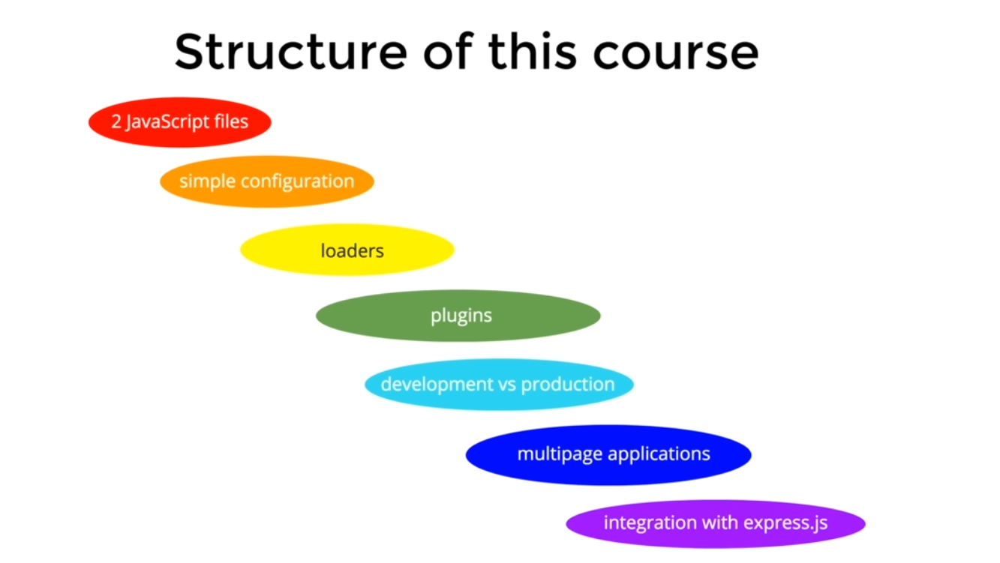

C:\Users\phuong\AppData\Local\Programs\Python\Python37\python.exe D:/Source/Source_All/python/Test/readfile.py
======== name dir ========
## 1. Introduction
### 1. Introduction
### 2. What you need for this course
## 2. Initial Setup and Integrating Webpack
### 1. Why Do We Need Webpack

Có nhiều file js 

### 2. Setting Up Our Application

create file index.html

```html
<!DOCTYPE html>
<html lang="en">
  <head>
    <meta charset="UTF-8" />
    <meta name="viewport" content="width=device-width, initial-scale=1.0" />
    <script src="src/hello-world.js"></script>
    <script src="src/index.js"></script>
    <title>Document</title>
  </head>
  <body></body>
</html>

```

src/index.js

```js
hello();
```

src/hello-world.js

```js
function hello() {
    console.log("hello");
}
```


### 3. Install Webpack And Integrate It With NPM

```shell
npm init -y

npm install --save-dev webpack webpack-cli
```

**project**

```diff
  webpack-demo
  |- package.json
+ |- webpack.config.js
  |- /dist
    |- index.html
  |- /src
    |- index.js
```

**webpack.config.js**

```javascript
const path = require('path');

module.exports = {
  entry: './src/index.js',
  output: {
    filename: 'bundle.js',
    path: path.resolve(__dirname, 'dist'),
  },
};
```

package.json

```js
 "scripts": {
    "test": "echo \"Error: no test specified\" && exit 1",
    "build": "webpack"
  },
```

### 4. Small Note about Github Repository.html

Hi guys and girls,

I hope you are enjoying the course so far!

I just want to let you know that there is a [Github Repository](https://github.com/vp-online-courses/webpack-tutorial) containing all the code for this course. If you have any issues with the code, it will help you to resolve those issues and continue with the course.

I am explaining how you can use the Github Repository in **Section 12**.

If you have any questions regarding the course, please feel free to write me via Q&A section and I will do my best to help you!

https://github.com/vp-online-courses/webpack-tutorial

### 4.1 Github Repository.html

https://github.com/vp-online-courses/webpack-tutorial

**NOTE**: lỗi error Uncaught SyntaxError: Invalid or unexpected token when run webpack

I fixed the problem by adding the meta tag `` to my index.html and rebuilding.

### 5. Integrating Webpack Into Our JS Application

hello-world.js

```js
function hello() {
  console.log("hello");
}

export default hello;

```

index.js

```js
import hello from "./hello-world";

hello();

```

index.html

```html
<!DOCTYPE html>
<html lang="en">
  <head>
    <meta charset="UTF-8" />
    <meta name="viewport" content="width=device-width, initial-scale=1.0" />
    <title>Document</title>
  </head>
  <body>
        <script src="./dist/bundle.js"></script>
    </body>
</html>


```

`npm run build`

NOTE: lưu ý đến thứ tự đặt thẻ script

## 3. Loaders
### 1. What Is Webpack Loader
### 2. Handling Images With Webpack

add-images.js

```js
import Kiwi from "./kiwi.jpg";

function addImage() {
  const img = document.createElement("img");
  img.src = Kiwi;
  img.alt = "Kiwi";
  img.width = 300;

  const bodyDomElement = document.querySelector("body");
  bodyDomElement.appendChild(img);
}

export default addImage;

```

add in index.js

webpack-config.js

```js
const path = require("path");

module.exports = {
  entry: "./src/index.js",
  output: {
    filename: "bundle.js",
    path: path.resolve(__dirname, "dist"),
  },
  mode: "none",
  module: {
    rules: [
      {
        test: /\.(png|jpg)$/,
        use: ["file-loader"],
      },
    ],
  },
};

```

npm install --save-dev file-loader

npm run build

### 3. Handling Images With Webpack. How To Use publicPath

Nếu để file index.html ngoài thư mục dist thì sẽ bị lỗi nên chỉ ra publicPath

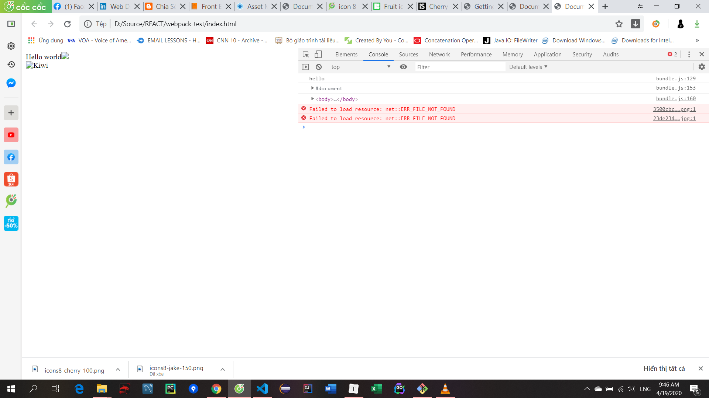  

```js
const path = require("path");

module.exports = {
  entry: "./src/index.js",
  output: {
    filename: "bundle.js",
    path: path.resolve(__dirname, "dist"),
    publicPath: "dist/", // add sau này thay bằng https://..
  },
  mode: "none",
  module: {
    rules: [
      {
        test: /\.css$/,
        use: ["style-loader", "css-loader"],
      },
      {
        test: /\.(png|svg|jpg|gif)$/,
        use: ["file-loader"],
      },
    ],
  },
};

```


### 4. Handling CSS With Webpack

```js
const path = require("path");

module.exports = {
  entry: "./src/index.js",
  output: {
    filename: "bundle.js",
    path: path.resolve(__dirname, "dist"),
    publicPath: "dist/",
  },
  mode: "none",
  module: {
    rules: [
      {
        test: /\.(png|svg|jpg|gif)$/,
        use: ["file-loader"],
      },
        // add
      {
        test: /\.css$/,
        use: ["style-loader", "css-loader"],
      },
      {
        test: /\.scss$/,
        use: ["style-loader", "css-loader", "sass-loader"],
      },
    ],
  },
};

```

npm install --save-dev sass-loader node-sass style-loader css-loader

*hello-world-button.js*

```js
// import './hello-world-button.scss';
import "./hello-world.css";

class HelloWorldButton {
  //   buttonCssClass = "hello-world-button";

  render() {
    const button = document.createElement("button");
    const br = document.createElement("br");

    const body = document.querySelector("body");
    button.innerHTML = "Hello world";
    button.onclick = function () {
      const p = document.createElement("p");
      p.innerHTML = "Hello world";
      p.classList.add("hello-world-text");
      body.appendChild(p);
    };
    button.classList.add("hello-world-button");
    body.appendChild(br);

    body.appendChild(button);
  }
}

export default HelloWorldButton;

```

hello-world.css

```css
.hello-world-button {
  font-size: 20px;
  padding: 7px 15px;
  background: green;
  color: white;
  outline: none;
}

.hello-world-text {
  color: red;
  font-weight: bold;
}

```

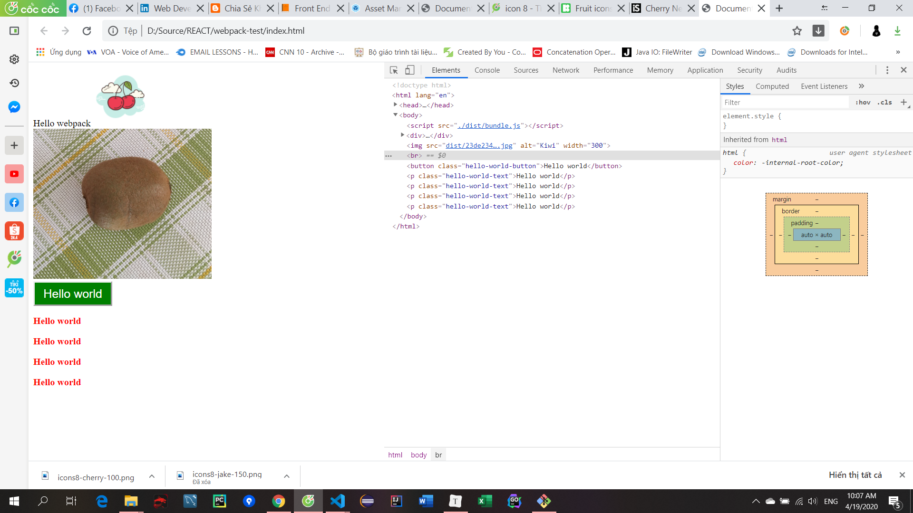

### 5. Handling SASS

Bỏ comment để test

hello-world-button.scss

````scss
$font-size: 20px;
$button-background-color: green;
$button-font-color: white;
$text-font-color: red;

.hello-world-button {
    font-size: $font-size;
    padding: 7px 15px;
    background: $button-background-color;
    color: $button-font-color;
    outline: none;
}

.hello-world-text {
    color: $text-font-color;
    font-weight: bold;
}

````


### 6. Using Latest JavaScript Features With Babel 7

hello-world-button.js

```js

class HelloWorldButton {
    // add props
    buttonCssClass = 'hello-world-button';

```

webpack.config.js

```js
const path = require("path");

module.exports = {
  entry: "./src/index.js",
  output: {
    filename: "bundle.js",
    path: path.resolve(__dirname, "dist"),
    publicPath: "dist/",
  },
  mode: "none",
  module: {
    rules: [
      {
        test: /\.(png|svg|jpg|gif)$/,
        use: ["file-loader"],
      },
      {
        test: /\.css$/,
        use: ["style-loader", "css-loader"],
      },
      {
        test: /\.scss$/,
        use: ["style-loader", "css-loader", "sass-loader"],
      },
        // add
      {
        test: /\.js$/,
        exclude: /node_modules/,
        use: {
          loader: "babel-loader",
          options: {
            presets: ["@babel/env"],
            plugins: ["transform-class-properties"],
          },
        },
      },
    ],
  },
};

```

`npm install @babel/core babel-loader @babel/preset-env babel-plugin-transform-class-properties --save-dev`


## 4. Plugins
### 1. What Is Webpack Plugin

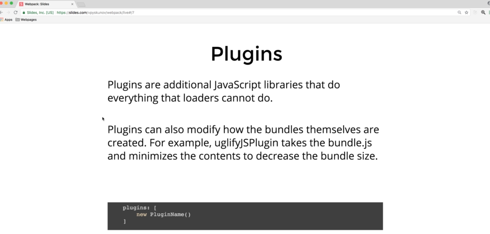

### 2. Minification Of The Resulting Webpack Bundle

https://webpack.js.org/plugins/terser-webpack-plugin/

```shell
$ npm install terser-webpack-plugin --save-dev
```

Làm nhỏ đi file bundle


### 3. Extracting CSS Into a Separate Bundle With mini-css-extract-plugin, Part 1

https://webpack.js.org/plugins/mini-css-extract-plugin/

To begin, you'll need to install `mini-css-extract-plugin`:

```bash
npm install --save-dev mini-css-extract-plugin
```

```js
const path = require("path");
const TerserPlugin = require("terser-webpack-plugin");
const MiniCssExtractPlugin = require('mini-css-extract-plugin');


module.exports = {
  entry: "./src/index.js",
  output: {
    filename: "bundle.js",
    path: path.resolve(__dirname, "dist"),
    publicPath: "dist/",
  },
  mode: "none",
  module: {
    rules: [
      {
        test: /\.(png|svg|jpg|gif)$/,
        use: ["file-loader"],
      },
      {
        test: /\.css$/,
          // add
        use: [MiniCssExtractPlugin.loader, "css-loader"],
      },
      {
        test: /\.scss$/,
        use: [MiniCssExtractPlugin.loader, "css-loader", "sass-loader"],
      },
      {
        test: /\.js$/,
        exclude: /node_modules/,
        use: {
          loader: "babel-loader",
          options: {
            presets: ["@babel/env"],
            plugins: ["transform-class-properties"],
          },
        },
      },
    ],
  },
    // add
  plugins: [
    new TerserPlugin(),
    new MiniCssExtractPlugin({
      // Options similar to the same options in webpackOptions.output
      // both options are optional
      filename: "styles.css",
    }),
  ],
};


```

index.html add link tag

```html
<!DOCTYPE html>
<html lang="en">
  <head>
    <meta charset="UTF-8" />
    <meta name="viewport" content="width=device-width, initial-scale=1.0" />
    <link rel="stylesheet" href="./dist/styles.css" />
    <title>Document</title>
  </head>
  <body>
    <script src="./dist/bundle.js"></script>
  </body>
</html>

```


### 4. Extracting CSS Into a Separate Bundle, Part 2

Thêm heading

### 5. Browser Caching

As you might know, every time your browser loads a website, it downloads all the assets required by this Website. Each Website is different.
However most of them require some javascript and css in order to work properly.
and some Websites require lots of JavaScript. 
Each time the user reloads the page, their browser downloads all those files from the Internet.

With slow internet connection 
Each time they go to a new page they need to wait several minutes until the page is ready.

And it's called browser caching. 
If the file didn't change between the page reloads, your browser can save it in a specific place. This place is called cache.
When you open this page again browser won't download this file again.
It will take this file from cache.
This technique helps to save lots of time and traffic.

What if you fixed a bug on your Website and your javascript file has been changed? If the browser always  takes this file from cache your customers will never get the new version.
Therefore we need a mechanism for updating the cache.
One of the most popular approaches is creating a new file with the new name
each time you make a change. Browsers remember files by name.
Therefore if the name changes browsers will download the new version.
Well it doesn't mean that we need to change the filename manually every time we change our code.
We can do this automatically.
md5 đặt tên file trong dấu []

```js

  output: {
    filename: "bundle.[contenthash].js", // add

        ...
    
    
  plugins: [
    new TerserPlugin(),
    new MiniCssExtractPlugin({
      // Options similar to the same options in webpackOptions.output
      // both options are optional
      filename: "styles.[contenthash].css", // add
    }),
  ],
```


### 6. How To Clean Dist Folder Before Generating New Bundles

```
npm install --save-dev clean-webpack-plugin
```

https://www.npmjs.com/package/clean-webpack-plugin

```js

const { CleanWebpackPlugin } = require("clean-webpack-plugin");

...

  plugins: [
    new CleanWebpackPlugin(),
    new TerserPlugin(),
    new MiniCssExtractPlugin({
      // Options similar to the same options in webpackOptions.output
      // both options are optional
      filename: "styles.[contenthash].css",
    }),
  ],
```

Xóa hết file tring dist/

Để xóa tất cả file trong build folder

```js

  plugins: [
    new CleanWebpackPlugin({
      cleanOnceBeforeBuildPatterns: [
        "**/*",
        path.join(process.cwd(), "build/**/*"),
      ],
    }),
    new TerserPlugin(),
    new MiniCssExtractPlugin({
      // Options similar to the same options in webpackOptions.output
      // both options are optional
      filename: "styles.[contenthash].css",
    }),
  ],
```

### 7. Generating HTML Files Automatically During Webpack Build Process

Lúc load lại file index.html sẽ lỗi vì include không bao gồm md5

https://webpack.js.org/plugins/html-webpack-plugin/

```bash
npm install --save-dev html-webpack-plugin
```

Nếu có publicPath thì file index.html sẽ tự động thêm vào link do đó nên xóa đi để rỗng

Sau đó xóa file html ở ngoài đi

```js
const path = require("path");
const TerserPlugin = require("terser-webpack-plugin");
const MiniCssExtractPlugin = require("mini-css-extract-plugin");
const { CleanWebpackPlugin } = require("clean-webpack-plugin");
const HtmlWebpackPlugin = require("html-webpack-plugin");

module.exports = {
  entry: "./src/index.js",
  output: {
    filename: "bundle.[contenthash].js",
    path: path.resolve(__dirname, "dist"),
    publicPath: "",
  },
  mode: "none",
  module: {
    rules: [
      {
        test: /\.(png|svg|jpg|gif)$/,
        use: ["file-loader"],
      },
      {
        test: /\.css$/,
        use: [MiniCssExtractPlugin.loader, "css-loader"],
      },
      {
        test: /\.scss$/,
        use: [MiniCssExtractPlugin.loader, "css-loader", "sass-loader"],
      },
      {
        test: /\.js$/,
        exclude: /node_modules/,
        use: {
          loader: "babel-loader",
          options: {
            presets: ["@babel/env"],
            plugins: ["transform-class-properties"],
          },
        },
      },
    ],
  },
  plugins: [
    new CleanWebpackPlugin({
      cleanOnceBeforeBuildPatterns: [
        "**/*",
        path.join(process.cwd(), "build/**/*"),
      ],
    }),
    new TerserPlugin(),
    new MiniCssExtractPlugin({
      // Options similar to the same options in webpackOptions.output
      // both options are optional
      filename: "styles.[contenthash].css",
    }),
    new HtmlWebpackPlugin(), // add
  ],
};

```


### 8. Customizing Generated HTML Files

https://www.npmjs.com/package/html-webpack-plugin

```js
new HtmlWebpackPlugin({
      filename: "sub/hello-world.html",
      title: "Hello world",
      meta: {
        description: "description Hello world",
      },
    }),
```

gen ra file html trong thư mục sub

### 9. Integration with Handlebars

https://github.com/jantimon/html-webpack-plugin

https://github.com/jantimon/html-webpack-plugin/blob/master/docs/template-option.md

```js
{
                test: /\.hbs$/,
                use: [
                    'handlebars-loader'
                ]
            }

....


new HtmlWebpackPlugin({
      title: "Hello world",
      description: "description Hello world",
      template: "src/page-template.hbs",
    }),
```

src/page-template.hbs

```js
<!doctype html>

<html lang="en">
<head>
    <meta charset="utf-8">
    <meta name="viewport" content="width=device-width, initial-scale=1">
    <meta name="description" content="{{htmlWebpackPlugin.options.description}}">
    <title>{{htmlWebpackPlugin.options.title}}</title>
</head>
<body>

</body>
</html>

```

`npm install handlebars-loader --save-dev`

`npm install --save handlebars`


### 10. More Webpack Plugins

### 

## 5. Production vs Development Builds
### 1. Introduction
### 2. Mode

index.js

```js

// mode
if (process.env.NODE_ENV === "production") {
  console.log("production mode");
} else if (process.env.NODE_ENV === "development") {
  console.log("developent mode");
}

// check file error position
// helloWorldButton.acb();
```

Sửa mode in webpack

### 3. Managing Webpack Config for Production and Development Use Cases

Tach ra 2 file

ở production mode xóa plugin terser

webpack.dev.config

```js
const path = require("path");
const { CleanWebpackPlugin } = require("clean-webpack-plugin");
const HtmlWebpackPlugin = require("html-webpack-plugin");

module.exports = {
  entry: "./src/index.js",
  output: {
    filename: "bundle.js", // add
    path: path.resolve(__dirname, "dist"),
    publicPath: "",
  },
  mode: "development",
  module: {
    rules: [
      {
        test: /\.(png|svg|jpg|gif)$/,
        use: ["file-loader"],
      },
      {
        test: /\.css$/,
        use: ["style-loader", "css-loader"], // fix
      },
      {
        test: /\.scss$/,
        use: ["style-loader", "css-loader", "sass-loader"],
      },
      {
        test: /\.js$/,
        exclude: /node_modules/,
        use: {
          loader: "babel-loader",
          options: {
            presets: ["@babel/env"],
            plugins: ["transform-class-properties"],
          },
        },
      },
      {
        test: /\.hbs$/,
        use: ["handlebars-loader"],
      },
    ],
  },
  plugins: [
    new CleanWebpackPlugin({
      cleanOnceBeforeBuildPatterns: [
        "**/*",
        path.join(process.cwd(), "build/**/*"),
      ],
    }),
      // remove 2
    new HtmlWebpackPlugin({
      title: "Hello world",
      description: "description Hello world",
      template: "src/page-template.hbs",
    }),
  ],
};

```

webpack.production.config

```js
const path = require("path");
const MiniCssExtractPlugin = require("mini-css-extract-plugin");
const { CleanWebpackPlugin } = require("clean-webpack-plugin");
const HtmlWebpackPlugin = require("html-webpack-plugin");

module.exports = {
  entry: "./src/index.js",
  output: {
    filename: "bundle.[contenthash].js",
    path: path.resolve(__dirname, "dist"),
    publicPath: "",
  },
  mode: "production",
  module: {
    rules: [
      {
        test: /\.(png|svg|jpg|gif)$/,
        use: ["file-loader"],
      },
      {
        test: /\.css$/,
        use: [MiniCssExtractPlugin.loader, "css-loader"],
      },
      {
        test: /\.scss$/,
        use: [MiniCssExtractPlugin.loader, "css-loader", "sass-loader"],
      },
      {
        test: /\.js$/,
        exclude: /node_modules/,
        use: {
          loader: "babel-loader",
          options: {
            presets: ["@babel/env"],
            plugins: ["transform-class-properties"],
          },
        },
      },
      {
        test: /\.hbs$/,
        use: ["handlebars-loader"],
      },
    ],
  },
  plugins: [
    new CleanWebpackPlugin({
      cleanOnceBeforeBuildPatterns: [
        "**/*",
        path.join(process.cwd(), "build/**/*"),
      ],
    }),
    new MiniCssExtractPlugin({
      // Options similar to the same options in webpackOptions.output
      // both options are optional
      filename: "styles.[contenthash].css",
    }),
    new HtmlWebpackPlugin({
      title: "Hello world",
      description: "description Hello world",
      template: "src/page-template.hbs",
    }),
  ],
};

```

package.json

```js

  "scripts": {
    "test": "echo \"Error: no test specified\" && exit 1",
    "build": "webpack --config webpack.production.config.js",
    "dev": "webpack --config webpack.dev.config.js",
    "start": "node src/server.js"
  },
```

Ở mode dev dễ track error

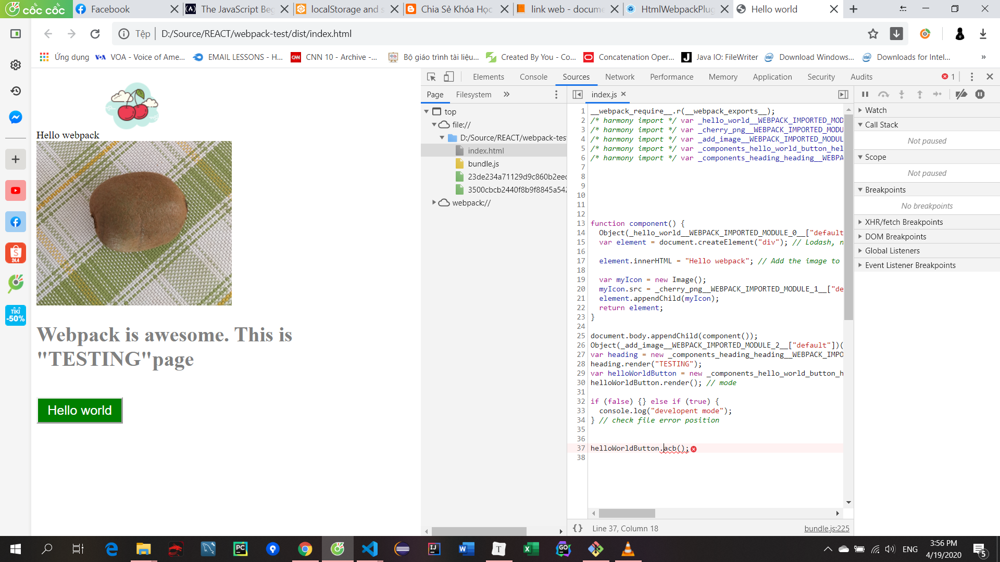

### 4. Faster Development with webpack dev server

```bash
npm install webpack-dev-server --save-dev
```

webpack-dev-config.js

```js
const path = require("path");
const { CleanWebpackPlugin } = require("clean-webpack-plugin");
const HtmlWebpackPlugin = require("html-webpack-plugin");

module.exports = {
  entry: "./src/index.js",
  output: {
    filename: "bundle.js",
    path: path.resolve(__dirname, "dist"),
    publicPath: "",
  },
    // add
  devServer: {
    contentBase: path.resolve(__dirname, "./dist"),
    index: "index.html",
    port: 9000,
  },
  mode: "development",
  module: {
    rules: [
      {
        test: /\.(png|svg|jpg|gif)$/,
        use: ["file-loader"],
      },
      {
        test: /\.css$/,
        use: ["style-loader", "css-loader"],
      },
      {
        test: /\.scss$/,
        use: ["style-loader", "css-loader", "sass-loader"],
      },
      {
        test: /\.js$/,
        exclude: /node_modules/,
        use: {
          loader: "babel-loader",
          options: {
            presets: ["@babel/env"],
            plugins: ["transform-class-properties"],
          },
        },
      },
      {
        test: /\.hbs$/,
        use: ["handlebars-loader"],
      },
    ],
  },
  plugins: [
    new CleanWebpackPlugin({
      cleanOnceBeforeBuildPatterns: [
        "**/*",
        path.join(process.cwd(), "build/**/*"),
      ],
    }),
    new HtmlWebpackPlugin({
      title: "Hello world",
      description: "description Hello world",
      template: "src/page-template.hbs",
    }),
  ],
};

```

package.json

```js

  "scripts": {
    "test": "echo \"Error: no test specified\" && exit 1",
    "build": "webpack --config webpack.production.config.js",
    "dev": "webpack-dev-server --config webpack.dev.config.js --hot", // add
    "start": "node src/server.js"
  },
```

npm run dev :  sửa sẽ load lại on browser

### 5. Cleaning Up A Bit

## 6. Multiple Page Applications
### 1. Introduction
### 2. Creating KiwiImage Component

kiwi-images.js

```js
import Kiwi from './kiwi.jpg';
import './kiwi-image.scss';

class KiwiImage {
    render() {
        const img = document.createElement('img');
        img.src = Kiwi;
        img.alt = 'Kiwi';
        img.classList.add('kiwi-image');

        const bodyDomElement = document.querySelector('body');
        bodyDomElement.appendChild(img);
    }
}

export default KiwiImage;

```

kiwi-images.scss

```scss
.kiwi-image {
    display: block;
    width: 400px;
    height: auto;
}


```

### 3. Code Splitting in Webpack Multiple JS and CSS Bundles

src/kiwi.js

```js
import Heading from './components/heading/heading.js';
import KiwiImage from './components/kiwi-image/kiwi-image.js';

const heading = new Heading();
heading.render('kiwi');
const kiwiImage = new KiwiImage();
kiwiImage.render();

```

webpack.production.config.js

```js
const path = require("path");
const MiniCssExtractPlugin = require("mini-css-extract-plugin");
const { CleanWebpackPlugin } = require("clean-webpack-plugin");
const HtmlWebpackPlugin = require("html-webpack-plugin");

module.exports = {
  // add
  entry: {
    "hello-world": "./src/hello-world.js",
    kiwi: "./src/kiwi.js",
  },
  output: {
    filename: "[name].[contenthash].js", // fix
    path: path.resolve(__dirname, "dist"),
    publicPath: "",
  },
  mode: "production",
  module: {
    rules: [
      {
        test: /\.(png|svg|jpg|gif)$/,
        use: ["file-loader"],
      },
      {
        test: /\.css$/,
        use: [MiniCssExtractPlugin.loader, "css-loader"],
      },
      {
        test: /\.scss$/,
        use: [MiniCssExtractPlugin.loader, "css-loader", "sass-loader"],
      },
      {
        test: /\.js$/,
        exclude: /node_modules/,
        use: {
          loader: "babel-loader",
          options: {
            presets: ["@babel/env"],
            plugins: ["transform-class-properties"],
          },
        },
      },
      {
        test: /\.hbs$/,
        use: ["handlebars-loader"],
      },
    ],
  },
  plugins: [
    new CleanWebpackPlugin({
      cleanOnceBeforeBuildPatterns: [
        "**/*",
        path.join(process.cwd(), "build/**/*"),
      ],
    }),
    new MiniCssExtractPlugin({
      // Options similar to the same options in webpackOptions.output
      // both options are optional
      filename: "[name].[contenthash].css",  // fix
    }),
    new HtmlWebpackPlugin({
      title: "Hello world",
      description: "description Hello world",
      template: "src/page-template.hbs",
    }),
  ],
};

```

Sửa name và entry cho dev

`npm run build`

### 4. How To Generate Multiple HTML Files

file index.html được sinh ra có dạng

```js
<!DOCTYPE html>
<html lang="en">
  <head>
    <meta charset="utf-8" />
    <meta name="viewport" content="width=device-width,initial-scale=1" />
    <meta name="description" content="description Hello world" />
    <title>Hello world</title>
    <link href="kiwi.18009c082a7520ea9379.css" rel="stylesheet" />
  </head>
  <body>
    <script src="hello-world.13c8eb137cbb4147c189.js"></script>
    <script src="kiwi.93c2223e1e05e13a7fa9.js"></script>
  </body>
</html>

```

production

```js
new HtmlWebpackPlugin({
            filename: 'hello-world.html',
            chunks: ['hello-world'],
            title: 'Hello world',
            description: 'Hello world',
            template: 'src/page-template.hbs'
        }),
        new HtmlWebpackPlugin({
            filename: 'kiwi.html',
            chunks: ['kiwi'],
            title: 'Kiwi',
            description: 'Kiwi',
            template: 'src/page-template.hbs'
        })
// chunk có tên trùng với entry
```


### 5. Extracting Common Dependencies While Code Splitting

truyền name vào header

kiwi.js

```js
import Heading from "./components/heading/heading.js";
import KiwiImage from "./components/kiwi-image/kiwi-image.js";
import _ from "lodash"; // add

const heading = new Heading();
heading.render(_.upperFirst("kiwi"));
const kiwiImage = new KiwiImage();
kiwiImage.render();

```

Khi build ra tới 70kb quá lớn vì lodash, mỗi lần lại download về => slow

prodcution

```js

  mode: "production",
  optimization: {
    splitChunks: {
      chunks: "all",
    },
  },
      
      
    // add chunk
  
    new HtmlWebpackPlugin({
      filename: "hello-world.html",
      chunks: ["hello-world", "vendors~hello-world~kiwi"],
      title: "Hello world",
      description: "Hello world",
      template: "src/page-template.hbs",
    }),
    new HtmlWebpackPlugin({
      filename: "kiwi.html",
      chunks: ["kiwi", "vendors~hello-world~kiwi"],
      title: "Kiwi",
      description: "Kiwi",
      template: "src/page-template.hbs",
    }),
```

It is called optimization.
It is an object and inside it we can specify another option which is called splitChunks.
And inside we need to specify yet another option which is called chunks, and here specify the value "all".

And we have now third javascript bundle 
which is called vendors~hello-world~kiwi.<something>.js which consumes around 70 kilobytes. So in this bundle
we have lodash.
This third bundle will be cached separately and now our users don't need to download it when we change something in kiwi.js
or hello-world.js. Since we have a new bundle, how webpack knows where to include it?

Will all html pages include it by default? 
The answer is we should specifically tell webpack to include it for every html page that needs it.
In our case both our pages need this bundle.

So now let's go back to our editor to our webpack configuration and scroll down to the HtmlWebpackPlugin.

And here remember we included chunks.
So now every our html page would need two chunks instead of one
And the second chunk would be this common chunk, common bundle, which includes lodash library. 

Which is called
vendors~hello-world~kiwi.

### 6. Setting Custom Options for Code Splitting

npm install react --save

kiwi.js

```js
import Heading from "./components/heading/heading.js";
import KiwiImage from "./components/kiwi-image/kiwi-image.js";
import React from "react";
// import _ from "lodash";

const heading = new Heading();
// heading.render(_.upperFirst("kiwi"));
heading.render("kiwi");
const kiwiImage = new KiwiImage();
kiwiImage.render();

```

webpack.production.config

```js

    mode: 'production',
    optimization: {
        splitChunks: {
            chunks: 'all',
            minSize: 10000,
            automaticNameDelimiter: '_'
        }
    },
```

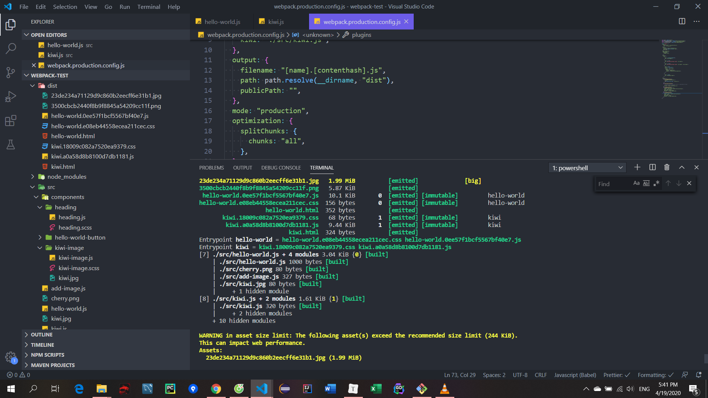  

Vì lodash > 30kb react thì nhỏ hơn nên k hoạt động

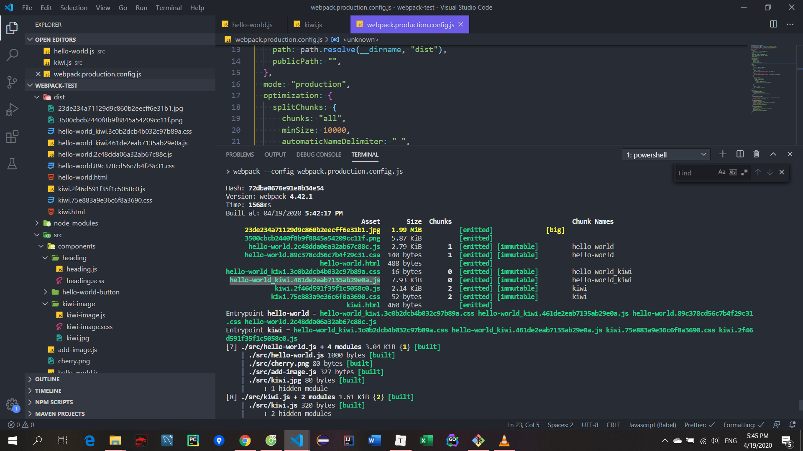

### 7. How To Setup Development Environment For Multiple Page Application

webpack.dev.config

```js
const path = require("path");
const { CleanWebpackPlugin } = require("clean-webpack-plugin");
const HtmlWebpackPlugin = require("html-webpack-plugin");

module.exports = {
  entry: {
    "hello-world": "./src/hello-world.js",
    kiwi: "./src/kiwi.js",
  },
  output: {
    filename: "[name].bundle.js",
    path: path.resolve(__dirname, "dist"),
    publicPath: "",
  },
  devServer: {
    contentBase: path.resolve(__dirname, "./dist"),
    index: "index.html",
    port: 9000,
  },
  mode: "development",
  module: {
    rules: [
      {
        test: /\.(png|svg|jpg|gif)$/,
        use: ["file-loader"],
      },
      {
        test: /\.css$/,
        use: ["style-loader", "css-loader"],
      },
      {
        test: /\.scss$/,
        use: ["style-loader", "css-loader", "sass-loader"],
      },
      {
        test: /\.js$/,
        exclude: /node_modules/,
        use: {
          loader: "babel-loader",
          options: {
            presets: ["@babel/env"],
            plugins: ["transform-class-properties"],
          },
        },
      },
      {
        test: /\.hbs$/,
        use: ["handlebars-loader"],
      },
    ],
  },
  plugins: [
    new CleanWebpackPlugin({
      cleanOnceBeforeBuildPatterns: [
        "**/*",
        path.join(process.cwd(), "build/**/*"),
      ],
    }),
    new HtmlWebpackPlugin({
      title: "Hello world",
      description: "description Hello world",
      template: "src/page-template.hbs",
    }),
  ],
};

```

http://localhost:9000/kiwi.html

## 7. Webpack Integration With Node And Express
### 1. Introduction
### 2. Getting Code for Single Page Application.html

As I said in the previous video, first we will integrate Express framework into a Single Page Application. We will use code from Section 5 as a starting point. You can get this code from the [Github repository](https://github.com/vp-online-courses/webpack-tutorial). Just follow 3 easy steps:

\1. First, you need to clone this repository to your computer.

```bash
git clone https://github.com/vp-online-courses/webpack-tutorial.git
cd webpack-tutorial
```

\2. Then checkout the branch `integrating-express-js-into-a-single-page-application`.

```shell
git checkout -b integrating-express-js-into-a-single-page-application remotes/origin/integrating-express-js-into-a-single-page-application
```

\3. Finally, don't forget to reinstall project dependencies after switching to the new branch.

```bash
rm -rf node_modules
npm install
```

At this point you have all the files you need in order to integrate Express framework into a Single Page Application.

### 3. Integrating Express Into Our Application

npm install --save express

package.json

```js
"start": "node src/server.js"
```

src/server.js

```js
const express = require("express");
const app = express();

app.get("/", function (req, res) {
  res.send("Some dummy content");
});

app.listen(3000, function () {
  console.log("Application is running on http://localhost:3000");
});

```

npm start

### 4. Serving HTML Pages via Express

server.js

```js
const express = require('express');
const app = express();
const path = require('path');
const fs = require('fs');


app.get("/", function (req, res) {
  const pathToHtmlFile = path.resolve(__dirname, "../dist/index.html");
  const contentFromHtmlFile = fs.readFileSync(pathToHtmlFile, "utf-8");
  res.send(contentFromHtmlFile);
});

// phần sau
app.use('/static', express.static(path.resolve(__dirname, '../dist')));

app.listen(3000, function () {
    console.log('Application is running on http://localhost:3000');
});

```

npm run build

npm start

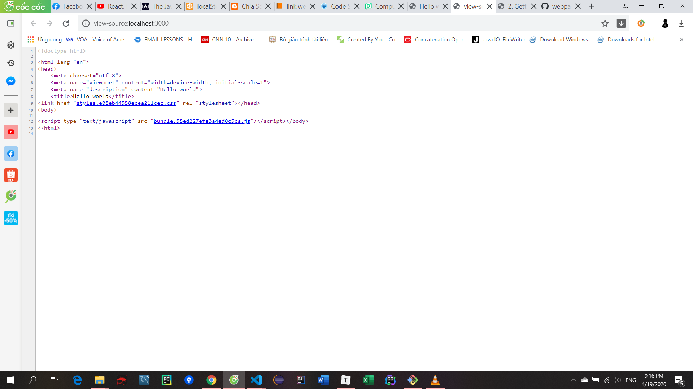  

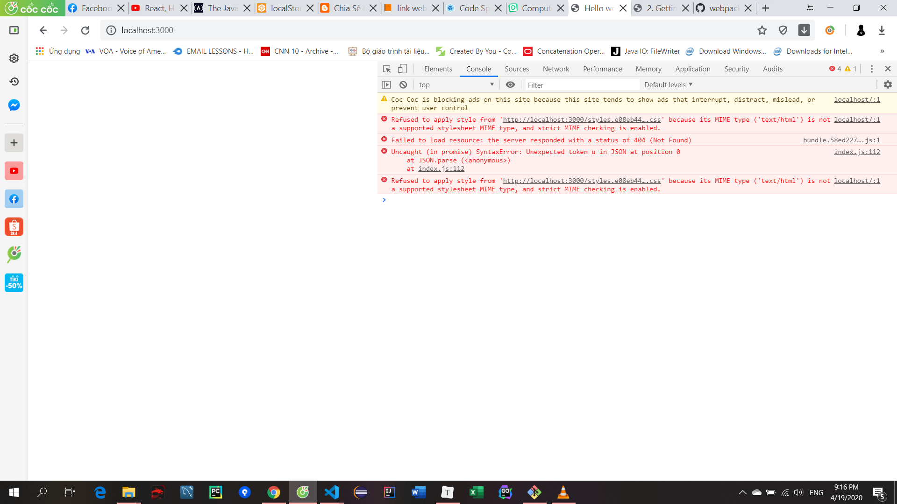

Nếu là static file nó sẽ tìm trong static folder

### 5. Handling JS and CSS via Express

prodcution

```js

module.exports = {
  entry: "./src/index.js",
  output: {
    filename: "bundle.[contenthash].js",
    path: path.resolve(__dirname, "./dist"),
    publicPath: "/static/",  // add thay vì add thủ công từng cái
  },
```


### 6. Getting Code for Multiple Page Application.html

In the next video we will integrate Express framework into a Multiple Page Application. We will use code from Section 6 as a starting point. You can get this code from the Github repository. Just follow 3 easy steps:

\1. First, you need to clone [this repository](https://github.com/vp-online-courses/webpack-tutorial) to your computer.

```
git clone https://github.com/vp-online-courses/webpack-tutorial.git
cd webpack-tutorial
```

\2. Then checkout the branch `integrating-express-js-into-a-multiple-page-application`.

```
git checkout -b integrating-express-js-into-a-multiple-page-application remotes/origin/integrating-express-js-into-a-multiple-page-application
```

\3. Finally, don't forget to reinstall project dependencies after switching to the new branch.

```
rm -rf node_modules
npm install
```

At this point you have all the files you need in order to integrate Express framework into a Multiple Page Application.

### 7. Integrating Express.js Into A Multiple Page Application

server.js

```js
const express = require('express');
const app = express();
const path = require('path');
const fs = require('fs');

app.get('/hello-world/', function (req, res) {
    const pathToHtmlFile = path.resolve(__dirname, '../dist/hello-world.html');
    const contentFromHtmlFile = fs.readFileSync(pathToHtmlFile, 'utf-8');
    res.send(contentFromHtmlFile);
});
app.get('/kiwi/', function (req, res) {
    const pathToHtmlFile = path.resolve(__dirname, '../dist/kiwi.html');
    const contentFromHtmlFile = fs.readFileSync(pathToHtmlFile, 'utf-8');
    res.send(contentFromHtmlFile);
});

app.use('/static', express.static(path.resolve(__dirname, '../dist')));

app.listen(3000, function () {
    console.log('Application is running on http://localhost:3000');
});

```

```shell
npm install
npm run build
npm start
```


## 8. Integration with jQuery
### 1. Getting the Source Code.html

In this section (and in the next sections as well) you would need to use [Github repository](https://github.com/vp-online-courses/webpack-tutorial) associated with this course. We'll use the source code from `starting-point-for-use-cases` branch as a starting point.

Let me show you how you can get the source code:

\1. First, you need to clone the Github repository.

```
git clone https://github.com/vp-online-courses/webpack-tutorial.git
cd webpack-tutorial
```

\2. Second, you need to checkout the branch `starting-point-for-use-cases`.

```
git checkout -b starting-point-for-use-cases remotes/origin/starting-point-for-use-cases
```

\3. Finally, you need to install the project dependencies after switching to the new branch.

```
rm -rf node_modules
npm install
```

Now you are ready to start with this section.


P. S. You would need to repeat these steps every time you start one of the following sections:

\1. Integration with jQuery.

\2. Integration with Bootstrap.

\3. Using FontAwesome with Webpack.

\4. Using ESLint.

### 2. Integration with jQuery
## 9. Using Custom Fonts with Webpack
### 1. Using Custom Fonts with Webpack

npm install jquery --save

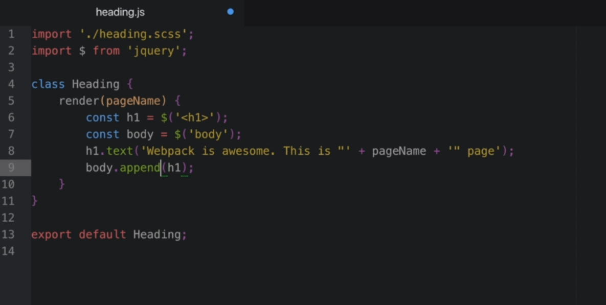  

npm run build

npm start

## 10. Integration with Bootstrap

### 1. Using Bootstrap with Webpack

npm install bootstrap --save

Xài bs 3 bs 4 lỗi

https://github.com/twbs/bootstrap/issues/27353

https://webpack.js.org/configuration/externals/

index.js

```js
import "bootstrap";
import "bootstrap/dist/css/boostrap.min.css";
import "./index.scss
```

page-template.hbs

```html
<!doctype html>

<html lang="en">
<head>
    <meta charset="utf-8">
    <meta name="viewport" content="width=device-width, initial-scale=1">
    <meta name="description" content="{{htmlWebpackPlugin.options.description}}">
    <title>{{htmlWebpackPlugin.options.title}}</title>
</head>
<body>
    <div class="alert alert-primary" role="alert">
        This is a primary alert—check it out!
    </div>

    <div class="dropdown my-dropdown">
        <button class="btn btn-secondary dropdown-toggle" type="button" id="dropdownMenuButton" data-toggle="dropdown" aria-haspopup="true" aria-expanded="false">
            Dropdown button
        </button>
        <div class="dropdown-menu" aria-labelledby="dropdownMenuButton">
            <a class="dropdown-item" href="#">Action</a>
            <a class="dropdown-item" href="#">Another action</a>
            <a class="dropdown-item" href="#">Something else here</a>
        </div>
    </div>
</body>
</html>
```

index.scss

```scss
  
.my-dropdown {
    float: right;
    position: relative;
    top: 7px;
    right: 40px;
}
```

npm run build

npm start

### 2. 2nd Method Of Importing CSS From Bootstrap

```js
{
                test: /\.scss$/,
                use: [
                    MiniCssExtractPlugin.loader,
                    'css-loader',
                    {
                        loader: 'postcss-loader',
                        options: {
                            plugins: function () {
                                return [
                                    require('precss'),
                                    require('autoprefixer')
                                ];
                            }
                        }
                    },
                    'sass-loader'
                ]
            },
```


## 11. Using FontAwesome with Webpack

### 1. Using FontAwesome with Webpack

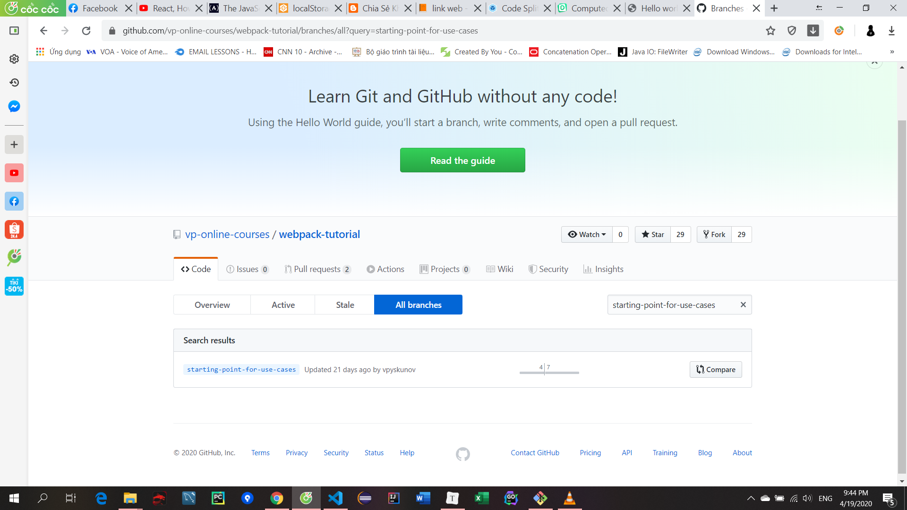  

gg: google font open sans

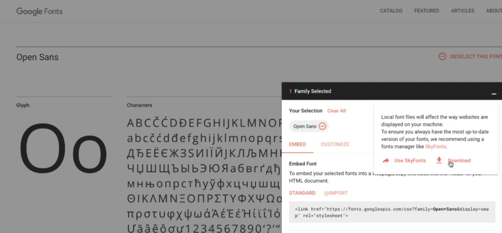  

Sau đó tải về

Xóa chỉ giữ lại 3 cái:

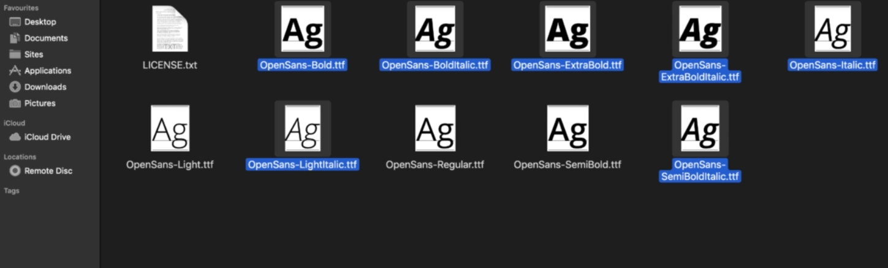  

gg: online font converter rồi chọn

  

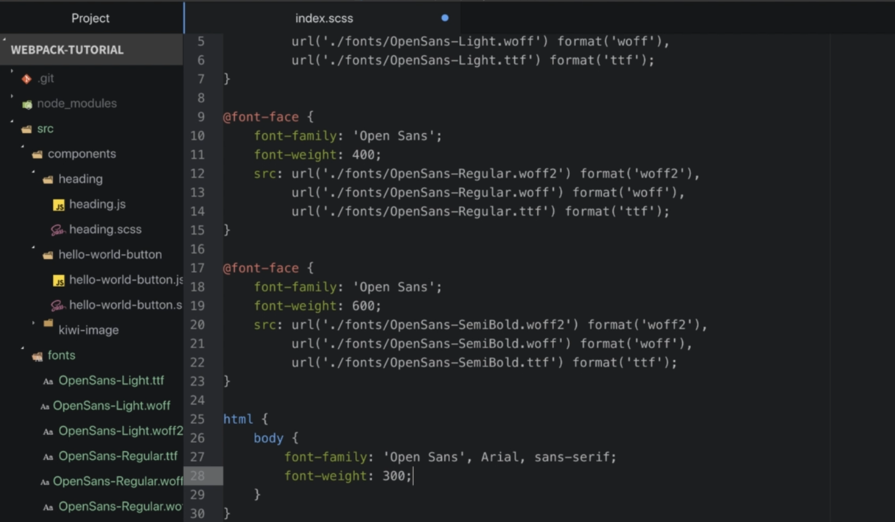  

Vào index.js import "./index.scss" đầu tiên

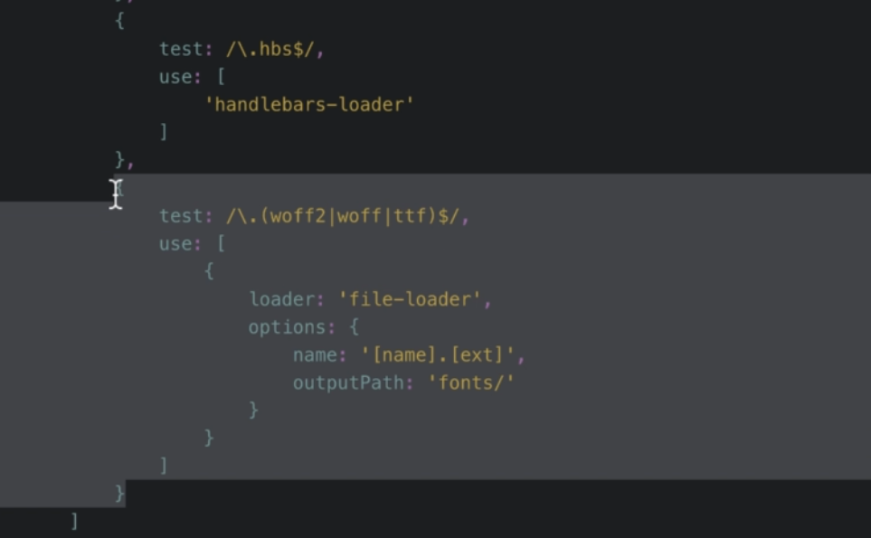  

thay cho 2 file rồi run 

```shell
npm install --save-dev file-loader
npm run dev
```


## 12. Github Repository

### 1. How To Use Github Repository

```shell
git branch -a

```

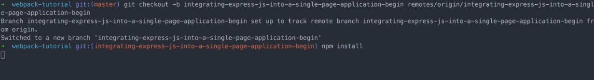  

check out qua end

`git reset --hard HEAD`

### 1.1 Link to the Github repository.html

https://github.com/vp-online-courses/webpack-tutorial

## 13. Using ESLint

### 1. Configuring ESLint

npm install --save-dev eslint

package.json

```js
"lint": "eslint ."
```

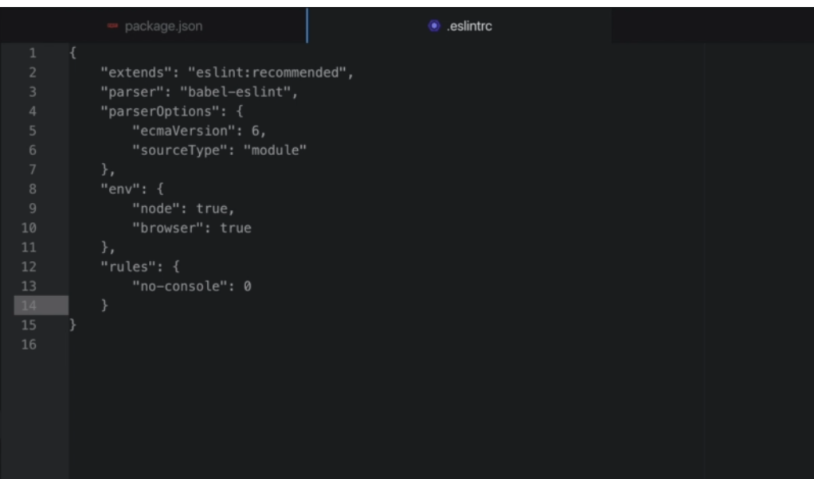

## 14. Summary

### 1. Summary

### 2. Bonus Lecture.html